# Auto Quality Review Automation (Auto QRA) - Solution Architecture and AI Design

Version 1.0 July 2026

## 20. Solution Architecture

### Purpose

This section defines the overall solution architecture for Auto Quality Review Automation, referred to as Auto QRA. The purpose is to show how application services, AI services, data stores, queues, review workflows, security controls, and reporting capabilities work together to automate quality audits at enterprise scale. The architecture is designed for 60,000 audits per month, approximately 30 QA parameters per audit, self-hosted LLM inference through vLLM, strict PII masking, SSO/RBAC access control, and a target audit latency below 60 seconds for normal workloads.

### Description

Auto QRA is a distributed audit automation platform. It ingests audit candidates from enterprise systems, normalizes the input, masks personally identifiable information, retrieves the applicable quality rubric and policy references, calls a self-hosted LLM served by vLLM, applies deterministic business rules, calculates confidence, stores audit outputs, and routes low-confidence or policy-sensitive decisions to human reviewers. The design separates orchestration, AI inference, rule evaluation, storage, and reporting so that each layer can scale and evolve independently.

The solution uses Docker as the current deployment unit and is designed to be future-ready for Kubernetes. The initial production architecture runs containerized services on GCP virtual machines or managed container runtime infrastructure, with GPU nodes dedicated to vLLM. The target architecture uses GKE node pools with NVIDIA L40 48GB or A100 80GB GPUs for model serving, CPU node pools for API and worker services, PostgreSQL for relational audit data, Redis for asynchronous work queues, and GCS for transcripts, evidence payloads, model artifacts, policy files, prompt versions, batch exports, and immutable audit attachments.

The platform intentionally combines probabilistic AI outputs with deterministic controls. The LLM proposes parameter-level ratings, evidence citations, and explanations. The business rules engine enforces contractual rules, compliance rules, escalation rules, and score caps. The confidence scoring layer assesses model confidence, retrieval confidence, rule confidence, data completeness, and disagreement signals. The human override workflow provides accountable review for low-confidence, high-impact, or exception cases.

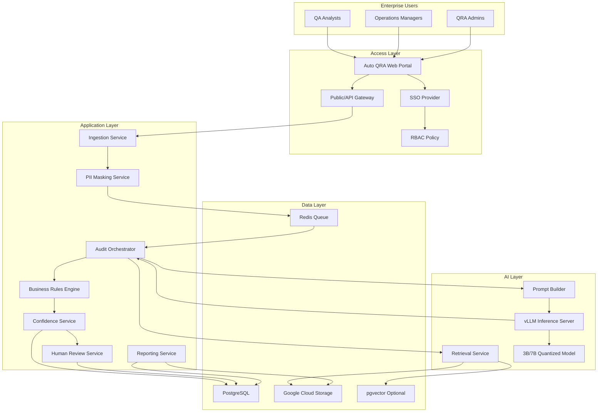

### Business Justification

Auto QRA improves audit throughput, consistency, and traceability. Manual quality reviews are expensive, difficult to calibrate across sites, and slow to respond to changing compliance policies. At 60,000 audits per month, a purely manual model creates operational bottlenecks and inconsistent scoring. Auto QRA automates the first-pass review and reserves human effort for overrides, exceptions, calibration, policy changes, and quality disputes.

Self-hosted LLM inference is justified by enterprise data sensitivity, predictable cost control, and governance. Running 3B or 7B quantized models on vLLM allows the business to avoid sending sensitive audit content to external hosted APIs while still gaining AI-assisted reasoning and natural-language evidence extraction. PII masking further reduces exposure and makes audit artifacts safer to retain, analyze, and share.

The architecture supports measurable business outcomes: reduced cycle time, lower cost per audit, consistent application of the 30 QA parameters, improved manager visibility, and stronger audit defensibility. The architecture also supports phased adoption. Teams can begin with AI-assisted recommendations, then enable auto-scoring for high-confidence cases, and later expand to more policy domains as calibration evidence accumulates.

### Technical Details

The core transaction begins when an audit candidate is submitted through an API, batch job, or integration connector. The ingestion service validates schema, assigns a correlation ID, writes raw references to GCS when needed, and creates a normalized audit request. The PII masking service replaces names, phone numbers, account numbers, email addresses, and other configured identifiers with reversible or irreversible placeholders based on policy. Masked text and metadata are stored separately from restricted raw artifacts.

Redis queues separate ingestion from processing. The audit orchestrator consumes queued work, resolves the active rubric version, retrieves policy snippets or few-shot examples, builds prompts, calls the vLLM server, validates the response schema, applies business rules, computes confidence, and writes results to PostgreSQL. GCS stores large objects, prompt snapshots, masked transcripts, source evidence, generated reports, and export files.

The AI inference tier uses vLLM because it provides efficient continuous batching, paged attention, OpenAI-compatible serving patterns, and strong GPU utilization. Quantized 3B or 7B models are appropriate for the latency target when prompts are controlled, retrieval is compact, and output schemas are bounded. L40 48GB GPUs provide a practical cost-performance balance for 7B quantized inference. A100 80GB GPUs are reserved for higher concurrency, larger context windows, calibration runs, or future model upgrades.

### Best Practices

- Keep the LLM isolated behind an internal service boundary and do not expose vLLM directly to external clients.
- Treat prompts, rubric versions, business rules, and model versions as auditable configuration artifacts.
- Store raw, masked, and derived data in clearly separated domains with explicit access policies.
- Use idempotent queue processing and correlation IDs across logs, database records, and object storage.
- Require structured JSON output from the model and validate it before applying rules or persisting scores.
- Use deterministic business rules to cap, override, or escalate LLM recommendations when policies require consistency.
- Track per-parameter confidence and decision reasons rather than only an aggregate score.
- Design every service for Docker today and Kubernetes scheduling, probes, and scaling tomorrow.

### Risks

The primary risk is overreliance on AI outputs without adequate controls. LLMs can hallucinate evidence, misunderstand policy context, or produce inconsistent interpretations when prompts drift. Another risk is GPU capacity contention, especially during batch peaks or when prompts grow beyond expected token budgets. Data privacy risk is also material because audit inputs may include customer, employee, or account information.

Operationally, Redis queue backlogs could push latency beyond the 60-second target. PostgreSQL can become a bottleneck if parameter-level results, logs, and reporting queries are not indexed and partitioned. Model upgrades may change scoring behavior in subtle ways, creating calibration drift. Retrieval failures may cause the model to score with incomplete policy context.

### Recommendations

Implement Auto QRA as a controlled automation system rather than a single AI service. Start with a reliable orchestration path, strict response validation, high-quality audit logs, and conservative auto-approval thresholds. Establish golden audit sets for regression testing before production rollout. Use L40 GPUs for baseline production inference and reserve A100 capacity for high-volume windows, larger models, or calibration experiments.

Adopt a versioned architecture for rubrics, prompts, retrieval bundles, rules, and models from the beginning. This allows the business to explain exactly why an audit received a score at a specific point in time. Build observability around queue time, inference time, total latency, GPU utilization, confidence distribution, human override rates, and parameter-level disagreement.

## 21. Component Diagram

### Purpose

This section identifies the major software components in Auto QRA and describes their responsibilities, interfaces, dependencies, and operational boundaries. The goal is to support implementation planning, ownership assignment, testing, and production support.

### Description

Auto QRA is decomposed into services that align with business capabilities. The web portal supports administrative configuration, audit review, reporting, and human override. The API gateway centralizes authentication, rate limiting, and request routing. The ingestion service accepts audit candidates from upstream systems. The PII masking service protects sensitive data before AI processing. The audit orchestrator coordinates queue consumption, retrieval, prompting, inference, rules, confidence, and persistence.

The AI subsystem consists of the retrieval service, prompt builder, vLLM inference server, and model registry. The deterministic subsystem consists of the business rules engine, confidence service, exception manager, and human review workflow. Storage components include PostgreSQL, Redis, GCS, and optionally pgvector for semantic retrieval. Observability components include structured logging, metrics, tracing, audit events, and operational dashboards.

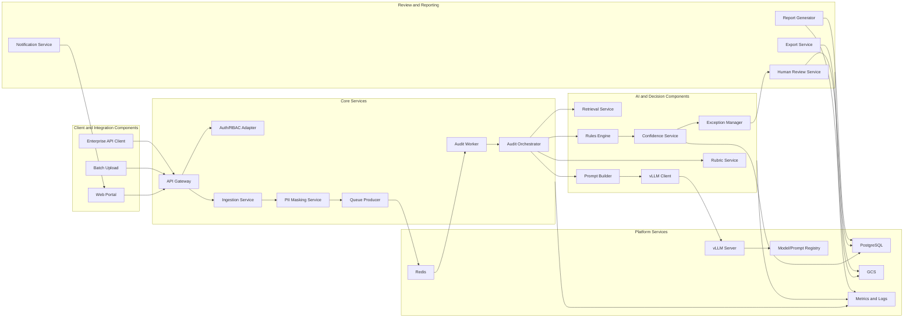

### Business Justification

The component model allows the business to scale audit throughput without turning the system into a monolith. Each capability has a clear control point. Security teams can review the masking boundary. Compliance teams can review rules and exception workflows. AI governance teams can review prompt and model registries. Operations teams can scale workers independently from GPU inference.

This separation also supports phased delivery. A minimal viable release can include ingestion, masking, queueing, orchestration, vLLM inference, scoring, and reporting. Later releases can add richer retrieval, pgvector, calibration dashboards, advanced override workflows, and Kubernetes autoscaling without rewriting the whole system.

### Technical Details

The API gateway should validate authentication tokens from the enterprise SSO provider, apply tenant and role checks, assign request IDs, and route traffic to internal services. The ingestion service should expose synchronous endpoints for small submissions and asynchronous batch endpoints for large audit loads. The PII masking service should run before queue publication so downstream workers never require raw PII for normal scoring.

The audit worker should be stateless and horizontally scalable. It should claim jobs from Redis, obtain idempotency locks, execute orchestration, update job status, and publish retry or dead-letter events when needed. The orchestrator should not embed all scoring logic directly. It should call domain services for rubric resolution, retrieval, prompt construction, inference, rule evaluation, confidence scoring, and exception handling.

The vLLM client should implement request timeouts, retry limits for transient transport failures, token budget controls, schema validation, and circuit-breaker behavior. The vLLM server should be deployed on GPU-capable infrastructure with model artifacts loaded from a controlled model registry or GCS bucket. PostgreSQL should store normalized audit entities, parameter results, override records, rule execution traces, confidence metrics, and reporting dimensions.

### Best Practices

- Define stable service contracts using OpenAPI or protobuf-compatible schemas.
- Make every asynchronous job idempotent by audit ID, source event ID, and prompt version.
- Use clear ownership for components: platform, AI, workflow, reporting, and governance.
- Keep the prompt builder deterministic and testable.
- Store model responses exactly as received, after validation and redaction, to support audits.
- Emit structured events for every major state transition.
- Implement bulkhead limits between ingestion, workers, and GPU inference to avoid cascade failure.
- Keep review workflow changes isolated from core scoring services whenever possible.

### Risks

Component boundaries can create operational complexity if observability is weak. A failed audit may involve API logs, queue state, worker logs, vLLM metrics, database records, and object storage artifacts. Without correlation IDs and dashboards, support teams may struggle to troubleshoot. Another risk is excessive network chatter between small services. Latency must remain below 60 seconds, so service calls should be purposeful and batched where appropriate.

The PII masking component is especially sensitive. False negatives can expose PII to the AI layer. False positives can remove context required for accurate scoring. The rules engine can become difficult to maintain if business users request one-off exceptions without governance.

### Recommendations

Implement components with clear contracts and a shared event model. Establish a central audit execution timeline that records timestamps for ingestion, masking, queue enqueue, queue dequeue, retrieval, prompt build, inference start, inference end, rules, confidence, persistence, and report generation. This timeline should be queryable for each audit and aggregated for operational dashboards.

Start with a small number of independently deployable services: API, worker, vLLM, portal, and reporting. Keep internal domain modules separate even if they initially deploy together. This gives the team implementation speed now and a clean path to split services later when scaling pressure justifies it.

## 22. Infrastructure Architecture

### Purpose

This section defines the target cloud infrastructure for Auto QRA on Google Cloud Platform. It explains how compute, GPU resources, storage, networking, secrets, observability, and future Kubernetes resources support a secure and scalable audit automation platform.

### Description

Auto QRA runs on GCP with containerized workloads. The initial architecture uses Docker-based deployment for application services and vLLM GPU inference. The infrastructure is arranged into separate layers for ingress, application processing, AI inference, data persistence, object storage, and operations. The architecture is Kubernetes-ready, meaning container images, configuration, service boundaries, health checks, secrets, resource requests, and stateless workers are designed so they can move to GKE with limited rework.

The AI inference layer uses NVIDIA L40 48GB or A100 80GB GPUs. L40 GPUs are suitable for cost-efficient 3B and 7B quantized model inference with controlled prompt size. A100 GPUs provide additional memory and throughput headroom for larger batches, bigger context windows, and future model growth. vLLM runs close to the worker tier in private networking to minimize latency and avoid exposing model endpoints to the public internet.

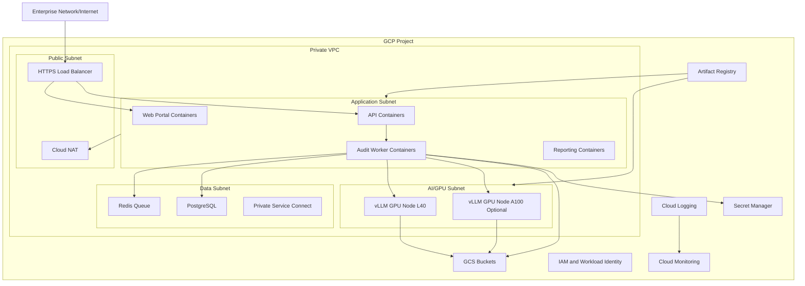

### Business Justification

GCP provides the GPU availability, storage durability, private networking, and operational tooling required by Auto QRA. Using self-hosted GPUs gives the business direct control over model runtime, data residency, cost, and latency. GCS supports low-cost, durable retention of large audit artifacts. PostgreSQL supports strong transactional integrity for audit decisions and review workflows. Redis supports burst absorption and asynchronous processing.

The infrastructure architecture balances near-term delivery with future scale. Docker deployment allows a practical first production release. Kubernetes readiness avoids locking the organization into a manually managed deployment model. As audit volume grows or concurrency patterns become more variable, GKE can provide autoscaling, rolling deployment, scheduling constraints, and stronger workload isolation.

### Technical Details

The recommended infrastructure separates environments into development, staging, and production projects or folders. Each environment should have isolated networks, databases, buckets, Redis instances, secrets, and service accounts. Production should use private subnets for application, data, and AI services. Public ingress should terminate at an HTTPS load balancer or approved enterprise ingress layer. Backend services should communicate over private IP.

PostgreSQL may be implemented with Cloud SQL for PostgreSQL or a managed PostgreSQL service approved by the enterprise. It should use private IP connectivity, automated backups, point-in-time recovery, high availability for production, and read replicas if reporting load becomes material. Redis may be implemented with Memorystore or a containerized Redis for early lower-risk environments; production should prefer managed Redis for availability and operational support.

GCS buckets should be separated by data class. Recommended buckets include raw-audit-ingest, masked-audit-artifacts, policy-rubric-content, model-artifacts, generated-reports, and operational-exports. Each bucket should use lifecycle policies, uniform bucket-level access, CMEK where required, and object versioning for policies and prompts.

### Best Practices

- Use private IP for PostgreSQL, Redis, vLLM, and internal application service communication.
- Store container images in Artifact Registry and scan them before production deployment.
- Use Secret Manager for database credentials, SSO secrets, signing keys, and service tokens.
- Assign least-privilege service accounts per workload.
- Use CMEK for regulated storage classes when enterprise policy requires it.
- Enable Cloud Logging, Cloud Monitoring, uptime checks, alerting, and audit logs.
- Place GPU workloads in dedicated nodes or instances with explicit capacity planning.
- Maintain separate staging infrastructure for model, prompt, and rules regression testing.

### Risks

GPU supply may be constrained in some GCP regions. The architecture must account for regional availability of L40 and A100 instances. GPU cost can grow quickly if vLLM servers are overprovisioned or left idle during low traffic periods. Cloud SQL and Redis sizing may be underestimated if the design stores high-cardinality parameter-level records and detailed traces without partitioning.

Another risk is inconsistent environment configuration. If development, staging, and production differ significantly, prompt behavior, timeout behavior, and queue behavior may diverge. Security risk increases if service accounts have broad permissions to all buckets or if object storage is not separated by data class.

### Recommendations

Start infrastructure sizing with expected monthly volume, peak concurrency, and latency budgets. For 60,000 audits per month, average volume is modest, but business hours and batch uploads can create peaks. Size Redis and worker concurrency for peaks rather than averages. Size vLLM for the 95th percentile prompt and output token budget.

Use infrastructure as code for networks, service accounts, buckets, databases, Redis, monitoring, and firewall rules. Document approved regions and GPU fallback options. Build staging so it mirrors production topology even if it uses smaller instances. This gives the team a trustworthy place to test model upgrades, prompt changes, and rules before release.

## 23. Deployment Architecture

### Purpose

This section explains how Auto QRA is packaged, released, deployed, and operated. It covers the current Docker-based deployment model and the target Kubernetes deployment model. The purpose is to ensure the architecture can move from first production release to scalable enterprise operations without redesign.

### Description

The current deployment model uses Docker containers for the web portal, API service, audit worker, reporting service, Redis, PostgreSQL client connectivity, and vLLM inference. Application containers are built from versioned source code and pushed to Artifact Registry. vLLM containers are built with GPU runtime support and configured with approved quantized model artifacts. Deployment can be performed through a controlled CI/CD pipeline that promotes images from development to staging to production.

The target deployment model uses Kubernetes. In GKE, CPU workloads run in a general node pool and GPU workloads run in dedicated node pools with NVIDIA drivers and device plugin support. Worker pods scale horizontally based on Redis queue depth and processing latency. vLLM pods scale more conservatively because GPU capacity is expensive and model load time is significant. Kubernetes readiness probes, liveness probes, resource limits, node selectors, taints, tolerations, and pod disruption budgets are part of the target design.

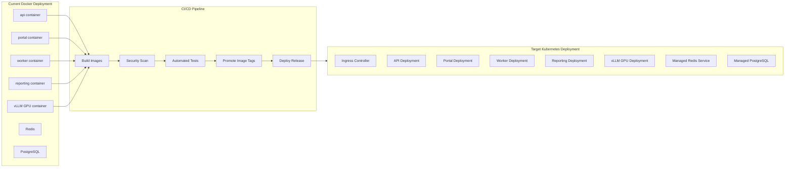

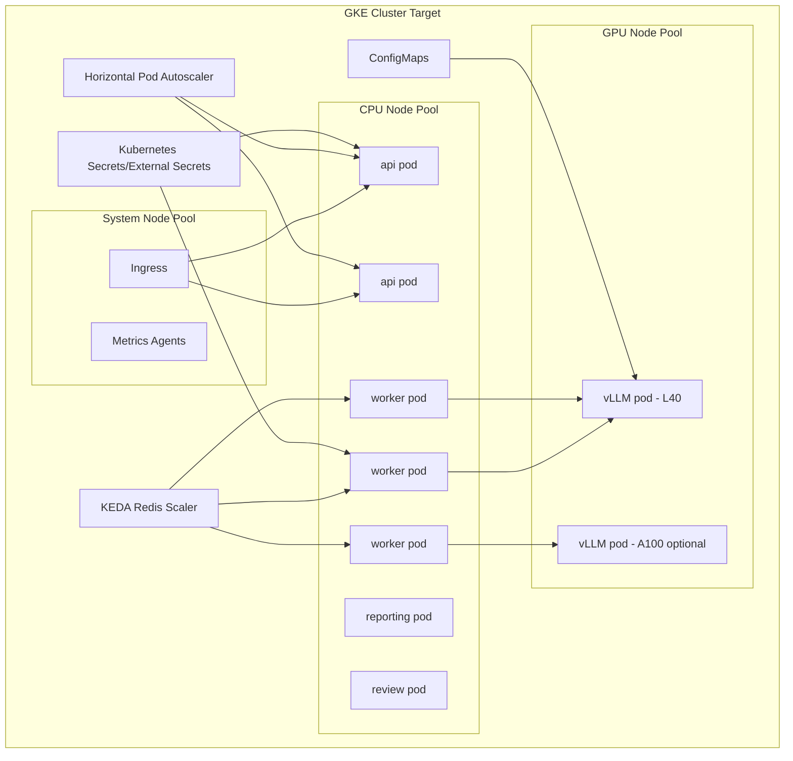

### Business Justification

Docker-first deployment reduces initial implementation friction and supports early production rollout. Kubernetes readiness protects the business from operational limits as usage grows. Auto QRA has a mixed workload profile: APIs require low-latency request handling, workers require queue-driven scaling, reporting requires scheduled or ad hoc batch processing, and vLLM requires GPU-aware scheduling. Kubernetes is well suited for this workload once the system reaches the right scale.

Controlled deployment also supports compliance. Because audit decisions may affect performance management, customer experience, regulatory evidence, or operational scorecards, releases must be traceable. Every production decision should be explainable in terms of code version, model version, prompt version, rubric version, rules version, and deployment version.

### Technical Details

Container images should be immutable and tagged with commit SHA, semantic release version, and environment promotion metadata. Configuration should be externalized through environment variables, mounted files, or Kubernetes ConfigMaps. Secrets should never be baked into images. vLLM containers should load model artifacts from a controlled path, with checksum validation before serving traffic.

The Docker deployment should include health endpoints for API, worker, reporting, and vLLM services. Worker containers should support graceful shutdown by finishing or returning current jobs to the queue. vLLM containers should expose readiness only after the model is loaded and a small validation request succeeds. Deployment automation should use rolling releases for stateless application services and controlled replacement for GPU inference services.

In Kubernetes, API services should use Deployments with multiple replicas. Workers should use Deployments or Jobs depending on workload pattern, with scaling based on Redis queue depth. vLLM should use GPU node selectors and tolerations. A PodDisruptionBudget should protect minimum inference capacity. Readiness probes should prevent traffic to cold or unhealthy model pods. NetworkPolicy should restrict direct access to vLLM to approved worker and orchestration namespaces.

### Best Practices

- Use immutable image tags and prohibit mutable production tags such as latest.
- Promote the same image across environments rather than rebuilding per environment.
- Run smoke tests after deployment and before increasing traffic.
- Separate application configuration from release artifacts.
- Apply blue-green or canary deployment for model and prompt changes when feasible.
- Keep rollback procedures for code, prompts, rules, and models.
- Validate vLLM readiness with a schema-constrained test prompt.
- Document production runbooks for queue backlog, GPU saturation, and database pressure.

### Risks

The largest deployment risk is treating model changes like ordinary code changes. A model or prompt update can change scoring behavior even when the application remains healthy. Another risk is underestimating vLLM startup time. Model loading can take long enough to cause failed readiness windows or temporary capacity loss. Kubernetes GPU scheduling also introduces operational complexity, including driver compatibility, GPU plugin health, and node pool upgrades.

Docker-based production deployments can become fragile if they rely on manual steps, host-specific configuration, or inconsistent environment variables. If Redis and PostgreSQL are also self-managed in Docker for production, availability and backup obligations increase.

### Recommendations

Use Docker for initial controlled deployment, but implement all services as if they will run in Kubernetes. Add health checks, graceful shutdown, structured logs, resource configuration, and stateless worker behavior immediately. For model updates, use a separate release approval path that includes regression testing on golden audits, confidence distribution comparison, and human review sampling.

Define deployment gates: unit tests, integration tests, prompt schema tests, security scan, image provenance, staging smoke test, model checksum validation, and production canary. Maintain a release manifest that records code image, model artifact, prompt bundle, rubric version, rules version, and migration version.

## 24. Networking Architecture

### Purpose

This section defines how Auto QRA services communicate securely across GCP network boundaries, enterprise ingress, private service endpoints, and internal service paths. The purpose is to protect sensitive audit data while preserving low-latency processing between workers, databases, queues, GCS, and vLLM inference.

### Description

Auto QRA uses a private-first networking model. User and integration traffic enters through an enterprise-approved HTTPS endpoint, such as a GCP HTTPS load balancer or corporate ingress gateway. After ingress termination and authentication, service-to-service traffic remains inside the private VPC. PostgreSQL, Redis, and vLLM are not exposed publicly. GCS access is controlled through IAM and private access patterns where available.

The recommended network topology includes a public ingress subnet, application subnet, AI/GPU subnet, data subnet, and operations subnet. Firewall rules and future Kubernetes NetworkPolicies restrict traffic to required paths. The API can reach ingestion, reporting, and review services. Workers can reach Redis, PostgreSQL, GCS, retrieval services, rules services, and vLLM. vLLM only accepts requests from the orchestration or worker tier. Admin access uses bastion, identity-aware proxy, or approved private connectivity.

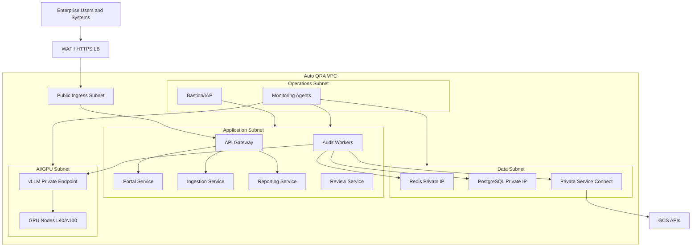

### Business Justification

Network isolation is required because Auto QRA processes audit evidence that may contain customer information, employee information, transaction details, coaching notes, and business-sensitive performance data. A private-first model reduces exposure and supports enterprise compliance reviews. It also keeps inference traffic inside controlled infrastructure, which reinforces the decision to self-host LLMs.

The network design supports operational reliability. By separating ingress, application, AI, and data subnets, the organization can apply specific controls and scaling policies to each tier. For example, GPU nodes can be isolated from public internet traffic, data stores can be restricted to application service accounts, and reporting access can be controlled through the API rather than direct database connections.

### Technical Details

Inbound traffic should use HTTPS with TLS 1.2 or higher. The load balancer should integrate with WAF rules, request size limits, and IP allowlists if enterprise policy requires them. API gateway routes should enforce authentication and authorization before requests reach business services. SSO integration should use OIDC or SAML through an enterprise identity provider, with roles mapped to Auto QRA permissions.

Internal traffic should use private DNS names and private IP addresses. Database and Redis ports should only be open to approved application and worker service accounts or network tags. vLLM should listen on an internal interface only. If the vLLM server exposes an OpenAI-compatible endpoint, it must still be treated as private infrastructure and protected with network controls and service authentication.

GCS access should use service accounts and IAM. When supported by enterprise GCP configuration, private Google access or Private Service Connect should be used so traffic to Google APIs does not require public egress. Cloud NAT can support controlled outbound access for package updates or external integrations, but production runtime dependencies should be minimized and allowlisted.

### Best Practices

- Deny direct public access to vLLM, PostgreSQL, Redis, and internal services.
- Use private DNS for service discovery and avoid hard-coded IP addresses.
- Apply firewall rules by service identity or network tag, not broad CIDR ranges alone.
- Restrict worker-to-vLLM traffic to the minimum required ports and protocols.
- Use mTLS or signed service tokens for high-sensitivity internal calls where required.
- Enable VPC flow logs for production subnets with an appropriate sampling rate.
- Use separate subnets for GPU workloads to simplify cost, access, and capacity controls.
- Periodically test firewall rules and network policies through security validation.

### Risks

Misconfigured firewall rules can expose sensitive services or block critical processing paths. GCS access can become a hidden public egress path if private access is not configured. Overly restrictive network rules may break deployment, image pulls, observability, or model artifact downloads. Conversely, overly permissive rules can undermine the security value of self-hosting the LLM.

Latency can be affected by poor placement of GPU nodes, workers, and data stores. If vLLM runs in a different region or zone from workers, inference calls may consume part of the 60-second latency budget unnecessarily. Network timeouts can create duplicate queue processing if idempotency is weak.

### Recommendations

Use a documented network matrix that lists every approved source, destination, port, protocol, identity, and reason. Treat the matrix as part of release governance. Keep workers, Redis, PostgreSQL, and vLLM in the same region and preferably in low-latency zones. Use private endpoints for managed services wherever available.

For Kubernetes, implement NetworkPolicies from the first GKE release. The default namespace posture should deny ingress and allow only explicitly approved service communication. Include vLLM access tests, database connectivity tests, Redis queue tests, and GCS access tests in deployment smoke checks.

## 25. AI Pipeline

### Purpose

This section defines the end-to-end AI pipeline that converts an audit input into parameter-level quality findings, scores, explanations, confidence values, and review actions. The purpose is to make the AI behavior implementation-ready, testable, governable, and aligned with enterprise risk controls.

### Description

The AI pipeline is not a single prompt call. It is a sequence of controlled stages: input validation, PII masking, rubric resolution, retrieval, prompt construction, token budgeting, vLLM inference, response parsing, schema validation, evidence verification, business rule application, confidence scoring, persistence, and human review routing. Each stage has a defined output and failure behavior.

The model evaluates 30 QA parameters. Each parameter has a name, definition, scoring scale, evidence requirements, policy references, disqualifying conditions, and examples. The LLM is asked to return structured JSON containing parameter ID, rating, evidence spans, rationale, uncertainty notes, and suggested coaching text. The rules engine then enforces deterministic constraints, such as mandatory fails, compliance escalations, score caps, and auto-review thresholds.

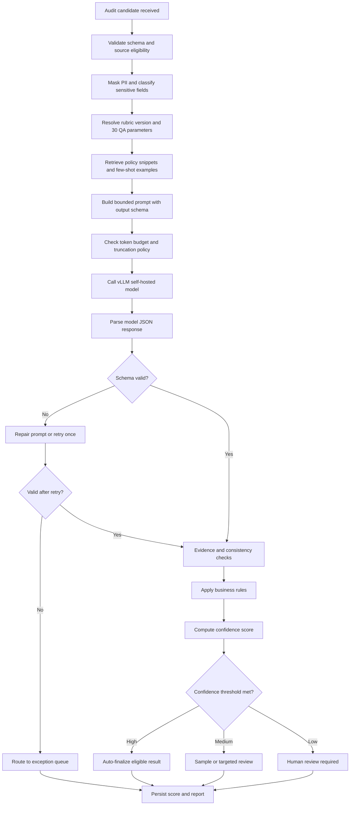

### Business Justification

The pipeline approach makes Auto QRA defensible. Business stakeholders need more than a score; they need evidence, rationale, consistency, and recourse. A structured pipeline gives compliance teams a way to inspect each step. It allows operations leaders to trust high-confidence automation while preserving human judgment for uncertain or high-risk cases.

Using a self-hosted 3B or 7B quantized model provides a practical balance between cost, latency, and data control. The latency target is below 60 seconds, so the pipeline must keep prompts compact and retrieval focused. The model should not read every enterprise policy document on every audit. Instead, it should receive only the active rubric, relevant policy snippets, and examples needed for the audit type.

### Technical Details

The pipeline input should include audit ID, source system, audit type, channel, language, transcript or evidence payload, metadata, and optional existing human labels. Input validation should reject malformed payloads, unsupported channels, missing required fields, or payloads that exceed configured size limits. PII masking should run before any LLM prompt construction.

Rubric resolution should select the effective rubric by tenant, line of business, audit type, date, region, and language. The retrieval service should fetch policy documents, QA rubric sections, and few-shot examples from GCS or pgvector. Retrieval output should be compact and ranked. Prompt construction should assemble system instructions, task instructions, rubric definitions, retrieved context, masked audit content, output schema, and guardrails.

The vLLM request should use deterministic or low-temperature generation for scoring tasks. Recommended settings include temperature between 0.0 and 0.2, bounded max output tokens, stop sequences when supported, and JSON-constrained output if the serving stack supports it. The response parser should reject non-JSON, missing parameter results, invalid score values, unsupported parameter IDs, and explanations without evidence.

### Best Practices

- Use one canonical prompt builder and avoid hand-built prompts in worker code.
- Keep prompt sections ordered consistently across all audit types.
- Use deterministic generation settings for scoring and reserve higher temperature for optional coaching text only.
- Validate that all 30 QA parameters are returned exactly once.
- Require evidence references for non-pass, compliance, and low-score decisions.
- Log token counts, model latency, retry count, schema validity, and confidence inputs.
- Regression test prompts against golden audit sets before release.
- Separate model recommendation from final governed score.

### Risks

The model may produce plausible but unsupported rationales. It may overfit to examples, miss domain-specific exceptions, or assign scores inconsistently across similar audits. Prompt length may grow as teams add policy context, threatening the latency target. Retrieval failures can silently reduce scoring quality if the pipeline does not detect missing context.

Quantized smaller models may struggle with long transcripts or nuanced policy interpretation. A 3B model may meet latency goals but require stricter retrieval and simpler scoring prompts. A 7B model may improve reasoning but consume more GPU memory and inference time. Pipeline retries can protect reliability but also increase tail latency.

### Recommendations

Implement the pipeline as explicit stages with recorded intermediate metadata. Do not store unnecessary raw PII in prompt logs. Maintain a benchmark suite with representative audits, edge cases, compliance failures, and historically disputed audits. Evaluate 3B and 7B quantized models against the same benchmark using accuracy, agreement with expert reviewers, latency, GPU cost, schema validity, and confidence calibration.

Use conservative auto-finalization at launch. For example, only high-confidence audits with no compliance triggers and no major retrieval gaps should be finalized without human review. Expand automation thresholds after monitoring override rates and calibration drift.

## 26. Data Flow

### Purpose

This section documents how data moves through Auto QRA from ingestion through masking, queueing, AI processing, scoring, storage, reporting, and human review. The purpose is to support engineering implementation, privacy review, operational troubleshooting, and auditability.

### Description

Auto QRA data flow is event-driven and traceable. Every audit receives a correlation ID at ingestion. Raw source references, masked artifacts, queue messages, LLM prompt versions, response payloads, business rule traces, confidence metrics, human overrides, and reports are linked by audit ID. The system should be able to reconstruct what happened without exposing raw PII to users who do not need it.

The normal path is ingestion to PII mask to Redis queue to worker orchestration to retrieval to vLLM inference to rule evaluation to score persistence to report generation. Human review and exception flows branch from the confidence and exception stages. Reporting reads governed results from PostgreSQL and large artifacts from GCS.

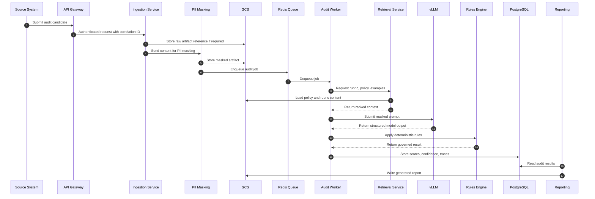

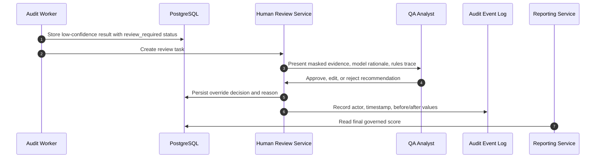

### Business Justification

Traceable data flow is essential for enterprise adoption. Quality scores may influence coaching, incentives, compliance remediation, customer experience reporting, and vendor performance. Stakeholders must be able to answer who submitted the audit, what data was used, how PII was handled, what model and prompt were used, which rules changed the score, why confidence was high or low, and who overrode the decision if applicable.

The data flow also supports operational scalability. Redis absorbs bursts from batch ingestion. Workers process asynchronously so source systems are not blocked by GPU inference. PostgreSQL provides reliable records for reporting and workflow. GCS stores large artifacts without overloading the relational database.

### Technical Details

Data should be classified into raw source data, masked processing data, model input data, model output data, governed decision data, review data, and reporting data. Raw source data should have the most restrictive access and shortest feasible retention. Masked processing data can be used for AI scoring and reviewer workflows. Governed decision data is the system of record for audit outcomes.

Queue messages should be small and contain references rather than full transcripts. A recommended Redis job payload includes audit ID, tenant ID, source event ID, masked artifact URI, rubric version, priority, retry count, creation timestamp, and idempotency key. The worker should fetch large content from GCS as needed. This prevents Redis memory pressure and simplifies retry behavior.

PostgreSQL should store normalized tables such as audits, audit_inputs, parameter_results, rule_executions, confidence_scores, review_tasks, overrides, exception_events, prompt_runs, model_runs, and report_exports. Large text blobs should be stored in GCS with URIs referenced by PostgreSQL. Sensitive fields should be encrypted or tokenized according to enterprise data policy.

### Best Practices

- Assign a correlation ID at the first touchpoint and propagate it everywhere.
- Store queue messages as references and metadata, not large payloads.
- Separate raw PII storage from masked AI processing storage.
- Use immutable prompt and model run records for auditability.
- Keep parameter-level results normalized for reporting and analytics.
- Apply retention policies based on data class.
- Make report generation read from governed final results, not raw model outputs.
- Log state transitions as events, not only final outcomes.

### Risks

Data leakage can occur if raw content is accidentally included in prompts, logs, queue messages, or reports. Incomplete lineage can make it impossible to defend a score. Queue retries may duplicate work if idempotency is not enforced. Large audit payloads can cause Redis memory pressure or slow worker startup if stored directly in queue messages.

Reporting teams may request direct database access, which can bypass application-level RBAC and expose sensitive fields. Another risk is retaining raw data longer than necessary because retention classes are not defined early.

### Recommendations

Create a data classification and retention matrix before production. Enforce storage boundaries in code and infrastructure. Provide reporting views or APIs that expose only governed and authorized fields. Implement idempotency at ingestion and processing. Add automated checks that prevent raw PII fields from entering prompt logs or model request records.

For operational support, build an audit trace page visible to authorized admins. It should show the end-to-end data flow timeline without exposing restricted content. This page will reduce support time and improve confidence during compliance reviews.

## 27. Prompt Engineering Strategy

### Purpose

This section defines how prompts are designed, versioned, tested, governed, and executed for the 30 QA parameters used by Auto QRA. The purpose is to make model behavior consistent, explainable, and maintainable across audit types, policy changes, and model upgrades.

### Description

The prompt strategy uses structured, versioned templates. Each prompt includes system instructions, role framing, audit task, active rubric, retrieved policy context, masked audit evidence, parameter definitions, scoring constraints, output schema, and uncertainty instructions. The prompt should not rely on implicit model behavior. It should explicitly tell the model to score only from provided evidence, cite evidence spans, avoid guessing, and return uncertainty when evidence is incomplete.

Prompt engineering for Auto QRA must support all 30 QA parameters without creating unbounded prompts. The template should include concise parameter definitions and retrieve only the most relevant policy and few-shot examples. Parameters can be grouped by domain, such as greeting, verification, compliance, issue diagnosis, resolution quality, communication quality, documentation, escalation, empathy, closure, and process adherence. The output must include one object per parameter.

### Prompt Template Structure for 30 QA Parameters

```text
SYSTEM:
You are Auto QRA, an enterprise quality review assistant. Score the audit using only the masked audit evidence, active QA rubric, retrieved policy context, and examples provided. Do not infer facts that are not supported by evidence. Return valid JSON only.

MODEL AND GOVERNANCE CONTEXT:
- model_version: {{model_version}}
- prompt_version: {{prompt_version}}
- rubric_version: {{rubric_version}}
- tenant_id: {{tenant_id}}
- audit_type: {{audit_type}}
- channel: {{channel}}
- language: {{language}}

TASK:
Evaluate the interaction against exactly 30 QA parameters. For each parameter, provide:
- parameter_id
- rating: pass | fail | partial | not_applicable
- raw_score
- max_score
- evidence: array of cited masked spans or event references
- rationale: concise explanation grounded in evidence
- uncertainty: none | low | medium | high
- policy_refs: array of provided policy reference IDs
- coaching_note: optional short coaching guidance

RUBRIC:
{{rubric_summary}}

PARAMETERS:
1. {{P01_definition}}
2. {{P02_definition}}
...
30. {{P30_definition}}

RETRIEVED POLICY CONTEXT:
{{ranked_policy_snippets}}

FEW-SHOT EXAMPLES:
{{few_shot_examples}}

MASKED AUDIT EVIDENCE:
{{masked_transcript_or_evidence}}

SCORING RULES:
- Use not_applicable only when the rubric explicitly permits it.
- Use fail when required evidence is absent for a mandatory parameter.
- Do not award points for unsupported behavior.
- Cite evidence for every fail, partial, or compliance-sensitive pass.
- If evidence conflicts, mark uncertainty at least medium.
- If policy context is missing for a policy-dependent parameter, mark uncertainty high.

OUTPUT:
Return JSON matching this schema:
{
  "audit_id": "{{audit_id}}",
  "overall_summary": "string",
  "parameter_results": [
    {
      "parameter_id": "P01",
      "rating": "pass|fail|partial|not_applicable",
      "raw_score": 0,
      "max_score": 0,
      "evidence": [{"span_id": "string", "quote": "string"}],
      "rationale": "string",
      "uncertainty": "none|low|medium|high",
      "policy_refs": ["string"],
      "coaching_note": "string"
    }
  ],
  "global_uncertainty_notes": ["string"],
  "potential_exceptions": ["string"]
}
```

### Business Justification

Prompt consistency directly affects scoring consistency. Without standardized prompts, two audits with similar evidence may receive different scores because instructions, examples, or policy context differ. Versioned templates allow the business to manage prompt changes like controlled product changes. This is especially important when audit scores affect coaching, vendor scorecards, or compliance monitoring.

The prompt template also supports explainability. Parameter-level evidence and rationale help QA analysts understand why the system reached a conclusion. Uncertainty fields help the workflow route ambiguous cases to human review rather than hiding weak model confidence behind a numeric score.

### Technical Details

Prompts should be assembled by a prompt builder service or module, not directly inside business logic. The builder should accept structured inputs: audit metadata, masked content, rubric version, parameter definitions, retrieved context, examples, output schema, and token budget. It should produce a prompt package containing the rendered prompt, prompt hash, token estimate, source references, and truncation decisions.

Prompt versions should be stored in a registry with effective dates, owners, approval state, compatible model versions, compatible rubric versions, and regression test results. Prompt changes should run against golden audits before production release. The prompt builder should fail closed if the active prompt version, rubric version, or output schema is missing.

The 30 QA parameters should be represented as structured configuration rather than hard-coded prose. Each parameter should include ID, name, description, scoring scale, evidence requirements, applicability rules, policy references, and examples. This allows prompt generation, UI display, reporting, and rules to use the same source of truth.

### Best Practices

- Use low-temperature inference for scoring tasks.
- Require valid JSON and validate the response against a schema.
- Keep the output schema stable and versioned.
- Include only relevant retrieved context to protect latency.
- Use concise few-shot examples that demonstrate scoring boundaries.
- Include explicit uncertainty instructions.
- Use prompt hashes to prove which prompt generated each result.
- Run prompt regression tests before any production prompt promotion.

### Risks

Prompt drift can introduce scoring drift. Business users may ask to add more instructions, examples, and policy snippets until the prompt becomes too long or contradictory. Few-shot examples can bias the model toward patterns that do not apply to the current audit. If prompt versions are not tied to results, historical scores may become difficult to explain.

Another risk is prompt injection through audit content. A transcript may contain text that looks like instructions to the model. The prompt must clearly identify audit evidence as data, not instructions. The parser and rules engine must reject output that does not match the requested schema.

### Recommendations

Create a prompt governance process with owners from QA operations, compliance, AI engineering, and product. Treat prompt changes as controlled releases. Maintain a prompt test suite with passing, failing, partial, not applicable, compliance, multilingual, noisy transcript, and edge-case audits. Measure schema validity, score agreement, evidence quality, latency, and confidence calibration for each prompt release.

Keep parameter definitions modular. If the 30 parameters differ by business line, resolve them through rubric configuration rather than separate prompt code. Use a prompt injection test set that includes malicious or confusing transcript content and verify that the model ignores it as instruction.

## 28. Retrieval Strategy

### Purpose

This section defines how Auto QRA retrieves QA rubrics, policy documents, reference procedures, and few-shot examples to support accurate model scoring. The purpose is to provide the LLM with enough context to make grounded decisions while maintaining latency, governance, and explainability.

### Description

The retrieval strategy is intentionally lightweight at first and extensible over time. The baseline implementation retrieves structured QA rubric content and policy snippets from GCS based on audit metadata. Optional semantic retrieval with pgvector can be added when policy volume, audit variety, or example matching requires more flexible search. Retrieval output should be ranked, bounded, versioned, and cited in model outputs.

Auto QRA should not send an entire policy library to the model. Instead, it should resolve the active rubric and retrieve the minimum relevant context for the audit type, channel, region, tenant, and parameter set. Few-shot examples should be curated and approved. They should demonstrate boundary cases, such as pass versus partial, partial versus fail, not applicable conditions, and compliance-sensitive failures.

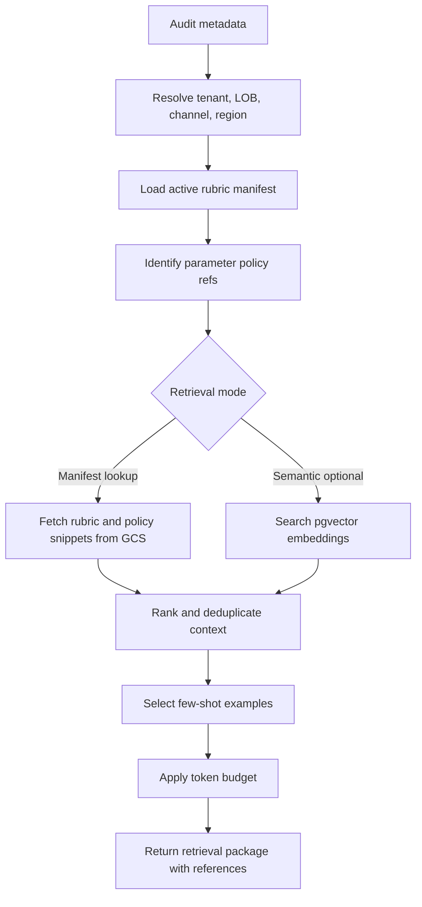

### RAG/Retrieval Approach

The recommended release-one approach is manifest-based retrieval. A rubric manifest maps audit type and parameter IDs to approved policy snippets, examples, and scoring notes. Each snippet has a stable reference ID, version, effective date, owner, and source URI. The retrieval service reads the manifest, fetches the relevant snippets from GCS, and returns a bounded retrieval package.

The release-two approach can add pgvector. Policy snippets and few-shot examples are embedded and stored in PostgreSQL with pgvector. Retrieval can then combine metadata filters with vector similarity. For example, it can filter by tenant, channel, language, effective date, and parameter IDs, then rank semantically similar snippets based on the audit issue type or transcript summary. This hybrid approach keeps governance while improving context matching.

GCS remains the source of truth for approved documents, rubrics, examples, and prompt bundles. pgvector stores derived embeddings and searchable chunks. Each retrieved chunk must reference the source document version in GCS so model outputs can be traced to approved content.

### Business Justification

Retrieval improves quality by grounding the model in current enterprise policy rather than relying on general model knowledge. This is critical because QA standards vary by product, region, channel, customer segment, and time. A policy that was correct last quarter may be wrong after an operational change. Retrieval also helps smaller 3B or 7B models perform better by placing the relevant policy in context.

A lightweight retrieval design avoids unnecessary complexity at launch. Manifest-based retrieval is easier to govern and explain. pgvector can be introduced when evidence shows that static mappings are not enough.

### Technical Details

The retrieval package should include rubric summary, parameter definitions, policy snippets, example snippets, source IDs, document versions, effective dates, and confidence metadata. Retrieval should reject expired policy content unless explicitly requested for historical audits. Historical audits should use the policy and rubric versions effective at the time of the audited interaction.

Chunks should be concise and parameter-scoped. A target chunk size of 200 to 600 tokens is reasonable for policy snippets. Few-shot examples should be shorter than full transcripts and should focus on the decision boundary. Retrieval should deduplicate overlapping snippets and apply a maximum context budget before prompt construction.

If pgvector is used, embeddings should be generated through an approved internal embedding model or controlled service. Embedding refresh jobs should run when source documents change. The vector table should include source_uri, source_hash, chunk_id, parameter_ids, tenant_id, language, effective_start, effective_end, approval_status, and embedding_version.

### Best Practices

- Keep GCS as the governed source of truth for policy and rubric artifacts.
- Use metadata filters before vector similarity search.
- Version every retrieved document and include references in audit records.
- Bound retrieval output by token budget.
- Curate few-shot examples through QA governance, not ad hoc developer selection.
- Exclude draft or unapproved policy content from production retrieval.
- Use historical effective dates for historical audit reprocessing.
- Monitor retrieval misses and policy reference usage by parameter.

### Risks

Poor retrieval can be worse than no retrieval. If irrelevant snippets are included, the model may follow the wrong policy. If required snippets are missing, the model may guess or mark uncertainty. Vector search may retrieve semantically similar but policy-inapplicable content unless metadata filters are strict. Stale embeddings can point to outdated policy.

Few-shot examples can create hidden bias. If examples overrepresent certain failure types, the model may become too strict. If examples include PII or unapproved content, they can create privacy and governance risk.

### Recommendations

Begin with manifest-based retrieval for the first production release. Add retrieval telemetry: snippets retrieved, snippets cited, retrieval latency, missing references, token budget truncation, and parameter-level policy coverage. Use this telemetry to decide where pgvector adds value.

When pgvector is introduced, use hybrid retrieval with strict metadata filters and source version references. Build an approval workflow for policy chunks and few-shot examples. Include retrieval regression tests that verify expected snippets are returned for representative audit types.

## 29. Business Rules Engine

### Purpose

This section defines the deterministic business rules engine that governs final Auto QRA outcomes after the LLM produces recommendations. The purpose is to ensure contractual, compliance, scoring, escalation, and workflow requirements are enforced consistently.

### Description

The business rules engine is the deterministic control layer between model recommendation and final audit result. It applies rules that should not depend on probabilistic interpretation. Examples include mandatory fail conditions, compliance escalation, score caps, not-applicable restrictions, evidence requirements, audit eligibility, sampling requirements, human review routing, and finalization constraints.

The rules engine should be versioned and auditable. Every rule execution should record rule ID, version, input facts, output action, reason, and whether it changed the model recommendation. Rules should be configured in structured form where possible and reviewed through governance. The engine can be implemented with code-based rules for release one and evolve toward a decision table or rules DSL as business complexity grows.

### Business Rules Decision Tables

| Rule Area | Condition | Deterministic Action | Review Impact | Example Rule ID |
| --- | --- | --- | --- | --- |
| Mandatory compliance | Compliance parameter fails with cited evidence | Set compliance_flag true and require human review | Required review | BR-COMP-001 |
| Missing evidence | Required evidence absent for mandatory parameter | Cap parameter score at zero | Review if confidence below medium | BR-EVID-002 |
| Not applicable | Model returns not_applicable for non-eligible parameter | Replace with fail or partial per rubric | Required review | BR-NA-003 |
| Score cap | Critical process step failed | Cap overall score at configured maximum | Review if cap changes grade | BR-CAP-004 |
| PII masking | Masking service reports unresolved PII risk | Block LLM processing and route exception | Exception review | BR-PII-005 |
| Retrieval gap | Required policy reference not retrieved | Disable auto-finalization | Human review | BR-RET-006 |
| Low confidence | Aggregate confidence below threshold | Create review task | Required review | BR-CONF-007 |
| High-value audit | Account or interaction marked high impact | Require review sample even if high confidence | Sampled review | BR-RISK-008 |
| Duplicate source | Same source event already processed | Return existing result or reject duplicate | No review | BR-IDEM-009 |
| Language unsupported | Audit language outside approved model/rubric support | Route exception | Exception review | BR-LANG-010 |

| Finalization Decision | Required Conditions | Final Status |
| --- | --- | --- |
| Auto-finalize | High confidence, no compliance trigger, no unresolved exception, complete rubric, schema valid, retrieval sufficient | final_auto |
| Targeted review | Medium confidence, score cap applied, sampled high-impact audit, or moderate disagreement | pending_review |
| Mandatory review | Low confidence, compliance trigger, missing required evidence, unsupported not_applicable, or reviewer dispute | pending_review_required |
| Exception | PII risk, model unavailable after retry, invalid schema after retry, unsupported language, corrupt input | exception_open |

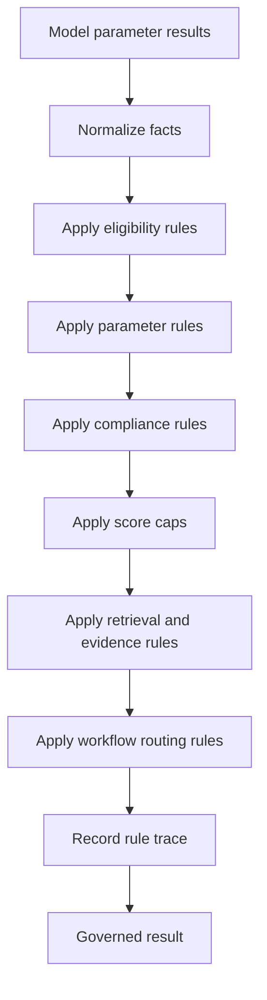

### Business Justification

The business rules engine protects the enterprise from inconsistent or noncompliant AI decisions. Some QA outcomes must follow policy exactly. For example, a mandatory verification failure may require a fail regardless of the model's overall positive assessment. A compliance trigger may require review even when confidence is high. Deterministic rules make these outcomes consistent and auditable.

Rules also help build business trust. Managers and QA leaders can see which rules changed a recommendation and why. This makes the system easier to calibrate and easier to defend during disputes.

### Technical Details

The rules engine should consume structured facts: audit metadata, model parameter results, evidence completeness, retrieval metadata, PII status, confidence inputs, historical flags, and tenant configuration. It should output governed parameter results, score adjustments, flags, review routing, and rule execution traces.

Rules should be executed in a defined order. Eligibility and blocking rules run first. Parameter normalization rules run second. Compliance and mandatory failure rules run third. Score caps and aggregate scoring rules run fourth. Workflow routing rules run last. This order prevents downstream scoring from acting on invalid or blocked inputs.

Rule definitions should include ID, name, description, owner, version, effective date, priority, condition, action, and severity. Rule execution traces should be persisted in PostgreSQL. If a rule changes a model recommendation, both before and after values should be stored.

### Best Practices

- Keep rules deterministic and side-effect free during evaluation.
- Version rules and store rule execution traces.
- Use decision tables for business review.
- Define rule priority and conflict resolution explicitly.
- Separate scoring rules from workflow routing rules.
- Test rules with boundary cases and historical disputes.
- Provide admin read-only visibility into active rules.
- Require governance approval for production rule changes.

### Risks

Rules can become overly complex if every exception is encoded as a special case. Conflicting rules can create unexpected outcomes. Business teams may request immediate rule changes without understanding scoring impact. If rule traces are incomplete, reviewers may see a final score but not understand why it differs from the model recommendation.

Another risk is duplicating rubric logic in both prompts and rules. The model should understand the rubric, while the rules engine should enforce deterministic constraints. When the same logic exists in two places, drift can occur.

### Recommendations

Start with a small, high-value rule set focused on compliance, eligibility, evidence, confidence routing, and score caps. Expand only when there is a clear business need. Maintain a rules catalog and require impact analysis for changes. Include rule regression tests in CI and staging.

Build a rule trace viewer for QA admins. It should show model recommendation, applied rules, score changes, final result, and review routing. This improves transparency and shortens dispute resolution.

## 30. Confidence Scoring

### Purpose

This section defines how Auto QRA calculates confidence for parameter-level and audit-level outcomes. The purpose is to decide which audits can be auto-finalized, which require human review, and which should be treated as exceptions or calibration candidates.

### Description

Confidence scoring combines multiple signals. It should not rely only on the LLM's self-reported uncertainty. The confidence model should include schema validity, model response quality, evidence coverage, retrieval quality, rule impact, parameter uncertainty, transcript completeness, PII masking quality, historical agreement, and disagreement between model output and deterministic rules.

Confidence is calculated at two levels. Parameter confidence evaluates whether a specific QA parameter result is trustworthy. Audit confidence aggregates parameter confidence, weighting compliance-sensitive and high-value parameters more heavily. The confidence service produces a score from 0 to 1, a threshold band, review routing recommendation, and explanatory factors.

### Confidence Score Formula and Thresholds

Recommended audit-level formula:

```text
audit_confidence =
  (0.25 * model_output_quality) +
  (0.20 * evidence_coverage) +
  (0.15 * retrieval_quality) +
  (0.15 * parameter_consistency) +
  (0.10 * rule_alignment) +
  (0.10 * data_completeness) +
  (0.05 * historical_calibration)

blocking_adjustments:
- subtract 0.20 if required policy context is missing
- subtract 0.15 if any mandatory parameter has high uncertainty
- subtract 0.10 if prompt truncation removed relevant evidence
- set max confidence to 0.60 if schema required repair
- set max confidence to 0.50 if unresolved PII masking warning exists
- set max confidence to 0.40 if model/rule disagreement affects final grade
```

| Band | Score Range | Automation Decision | Human Review Requirement |
| --- | --- | --- | --- |
| High | 0.85 to 1.00 | Eligible for auto-finalization | No review unless sampled or compliance-triggered |
| Medium | 0.70 to 0.84 | Governed result can be prepared | Targeted review or sampling |
| Low | 0.50 to 0.69 | Not eligible for auto-finalization | Human review required |
| Critical | 0.00 to 0.49 | Unreliable automation result | Exception or mandatory review |

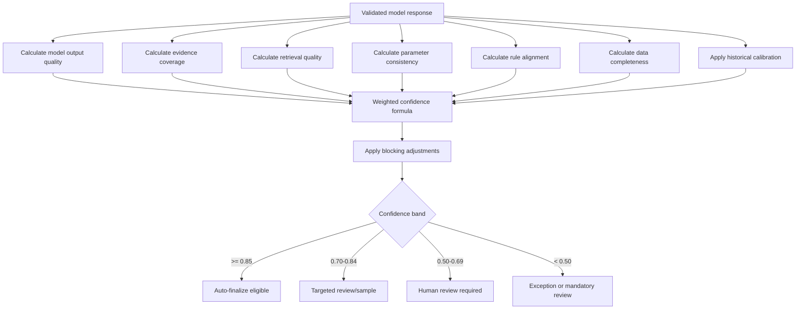

### Business Justification

Confidence scoring enables risk-based automation. The business does not need every audit to be manually reviewed if the system can identify reliable cases. At the same time, the business should not auto-finalize uncertain or high-risk cases merely to increase automation rates. Confidence bands create a transparent operating model for balancing efficiency and quality.

Confidence metrics also support continuous improvement. If confidence is low because retrieval quality is weak, the team can improve retrieval. If confidence is low because evidence is incomplete, upstream integrations can be improved. If confidence is low because model/rule disagreement is frequent, the prompt, rubric, or rules may need calibration.

### Technical Details

Model output quality includes schema validity, completeness of all 30 parameters, valid score ranges, rationale quality, and absence of unsupported fields. Evidence coverage measures whether required parameters include cited evidence, whether evidence spans are present in the masked transcript, and whether fail or partial ratings are supported. Retrieval quality measures required policy availability, snippet relevance, citation coverage, and token truncation impact.

Parameter consistency measures contradictions across parameter results. For example, a transcript cannot both fully satisfy and completely fail the same required verification behavior without explanation. Rule alignment measures whether deterministic rules substantially changed the model recommendation. Data completeness measures transcript availability, metadata completeness, channel support, language support, and PII masking status. Historical calibration compares model predictions to known reviewer agreement for similar audits, if available.

The confidence service should return detailed factors, not only a number. Example fields include score, band, auto_finalization_eligible, review_required, top_negative_factors, parameter_confidence, threshold_version, and calibration_version.

### Best Practices

- Use confidence as a routing tool, not a claim of objective truth.
- Combine model, retrieval, evidence, rule, and data quality signals.
- Cap confidence when critical control failures occur.
- Store confidence factors for every audit.
- Calibrate thresholds using human-reviewed audit sets.
- Track override rates by confidence band.
- Review confidence drift after model, prompt, rubric, or rule changes.
- Keep launch thresholds conservative and adjust with evidence.

### Risks

The confidence score can create false reassurance if poorly calibrated. A high score does not guarantee correctness. If the formula is too complex, stakeholders may not understand routing decisions. If thresholds are too aggressive, automation may finalize bad audits. If thresholds are too conservative, the business may not realize efficiency benefits.

Historical calibration can encode past human inconsistency. If prior reviews were biased or poorly calibrated, using them as a confidence factor may reinforce errors. Model self-reported uncertainty should be treated as one weak signal among stronger objective checks.

### Recommendations

Launch with conservative thresholds and mandatory review for compliance-sensitive cases. Use a calibration period where high-confidence auto decisions are shadow-reviewed to measure actual agreement. Adjust formula weights only through governance and with measured impact. Report confidence distribution, override rate, false auto-finalization rate, and parameter-level disagreement monthly.

Design the UI to explain confidence clearly. Reviewers should see why an audit was routed: missing policy, weak evidence, schema repair, model/rule disagreement, or low parameter confidence. This improves trust and gives teams actionable improvement signals.

## 31. Human Override Workflow

### Purpose

This section defines how humans review, approve, edit, reject, override, and audit Auto QRA recommendations. The purpose is to preserve accountable human judgment where automation is uncertain, high impact, disputed, or compliance-sensitive.

### Description

The human override workflow begins when confidence scoring, business rules, sampling policy, or exception handling routes an audit to review. A QA analyst or authorized reviewer sees the masked audit evidence, model recommendation, parameter-level scores, evidence citations, rationale, rule trace, confidence factors, and prior reviewer notes if available. The reviewer can approve the recommendation, edit parameter results, change final score within policy, mark the audit not applicable, request more information, or escalate.

All overrides must be reason-coded and auditable. The system records reviewer identity from SSO, role, timestamp, original model output, governed pre-review result, final reviewer decision, reason code, free-text explanation, and any attachments. Overrides can be sampled for calibration and used to improve prompts, retrieval, rules, or training data only after privacy and governance review.

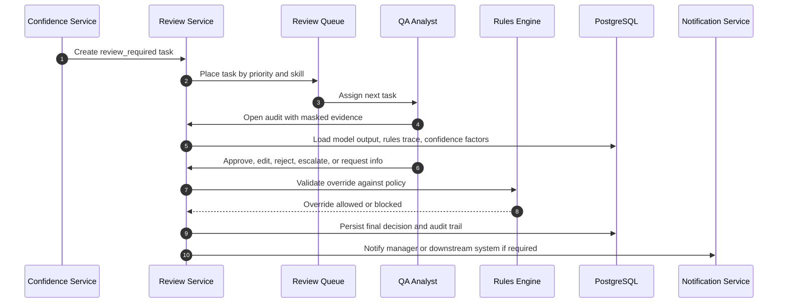

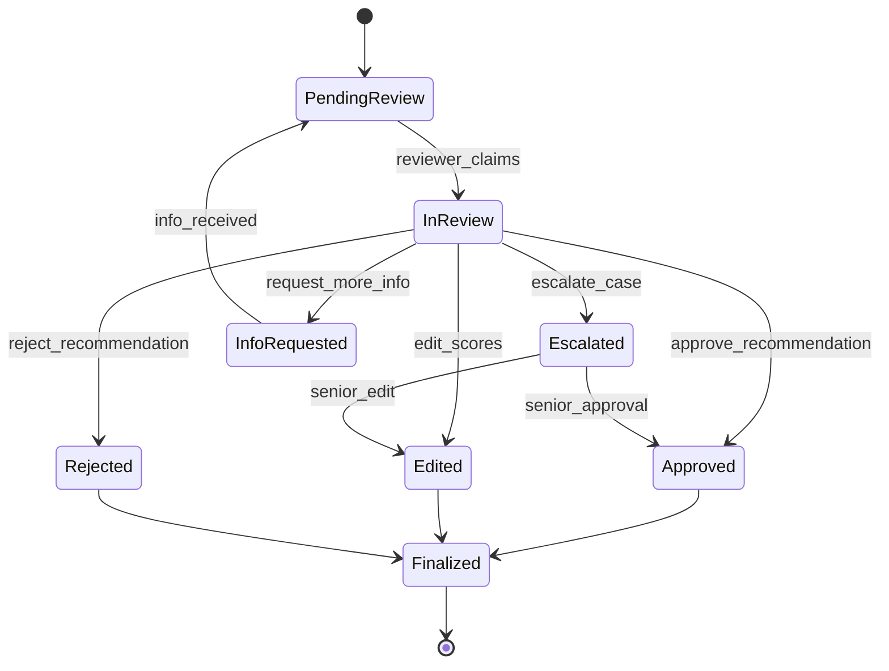

### Business Justification

Human override is essential for trust and regulatory defensibility. Auto QRA should reduce manual workload, not remove accountability. Reviewers provide judgment in ambiguous cases, protect against AI mistakes, and create feedback for continuous improvement. A structured override workflow also helps the organization manage disputes and demonstrate that automation is governed.

Human review capacity can be focused where it matters most. High-confidence, low-risk audits can be finalized automatically or sampled. Low-confidence, compliance-triggered, high-impact, or disputed audits receive human attention. This improves efficiency while maintaining quality.

### Technical Details

Review tasks should include audit ID, priority, required reviewer role, due time, reason for review, confidence band, exception flags, and assignment status. Task priority can be calculated from compliance flags, customer impact, SLA age, confidence score, and source priority. RBAC should restrict who can view raw or masked artifacts, who can override scores, and who can approve escalated decisions.

The review UI should show parameter-level model output and final governed output side by side. Reviewers should see evidence citations and be able to jump to masked transcript spans. If raw PII access is necessary for a limited role, it should be separately permissioned, logged, and avoided by default. Override actions should be validated against rules. For example, a reviewer may not remove a mandatory compliance flag without senior approval and a required reason code.

Override records should be immutable. Corrections should create a new version rather than modifying history. Downstream reports should read the latest finalized decision while audit history remains available to authorized users.

### Best Practices

- Require reason codes for every override.
- Show model recommendation, rule changes, and confidence factors transparently.
- Enforce RBAC for review, senior approval, and raw PII access.
- Use assignment queues based on skill, tenant, language, and priority.
- Prevent silent edits by preserving before and after values.
- Use reviewer overrides for calibration only through approved governance.
- Track reviewer agreement and override rates by parameter.
- Provide escalation paths for compliance-sensitive changes.

### Risks

Reviewers may rubber-stamp AI recommendations if the UI encourages fast approval without evidence review. Conversely, reviewers may distrust automation and override too often, reducing business value. Inconsistent human overrides can create calibration noise. If override reason codes are too vague, improvement teams cannot learn from them.

There is also privacy risk if review screens expose raw PII unnecessarily. Workflow backlogs can occur if too many audits route to review or if staffing does not match peak ingestion.

### Recommendations

Design the review experience to encourage evidence-based decisions. Require reviewers to inspect cited evidence for certain actions, especially compliance changes and score increases. Monitor review queue age, override rate, reviewer agreement, and reason code distribution. Use these metrics to tune confidence thresholds and identify prompt or rubric weaknesses.

Implement a calibration program. Sample auto-finalized audits, medium-confidence audits, and reviewer overrides. Review findings monthly with QA leadership, compliance, and AI engineering. Feed approved lessons into prompt examples, retrieval content, rules, and training benchmarks.

## 32. Exception Handling

### Purpose

This section defines how Auto QRA detects, classifies, routes, retries, resolves, and reports exceptions. The purpose is to protect audit integrity, prevent silent failures, meet operational service levels, and give support teams clear remediation paths.

### Description

Exception handling covers failures that prevent reliable automated scoring or finalization. Exceptions may occur during ingestion, validation, PII masking, queueing, retrieval, prompt building, vLLM inference, schema parsing, rules evaluation, confidence scoring, persistence, reporting, or human review. Each exception should have a taxonomy, severity, owner, retry policy, user-visible status, and remediation path.

Auto QRA should fail closed for privacy and compliance-sensitive conditions. For example, unresolved PII masking risk should block LLM processing. Missing required policy context should block auto-finalization. Invalid model output after retry should route to exception review. The system should distinguish transient infrastructure failures from business-data exceptions.

### Exception Taxonomy Table

| Category | Example | Severity | Retry Policy | Owner | User Status |
| --- | --- | --- | --- | --- | --- |
| Ingestion validation | Missing audit type or corrupt payload | Medium | No retry until corrected | Integration team | rejected_input |
| PII masking | Unresolved account number or name detected | High | No LLM retry; manual privacy review | Privacy/QA ops | privacy_exception |
| Queue processing | Redis timeout or worker crash | Medium | Retry with backoff | Platform team | processing_delayed |
| Retrieval | Required rubric or policy missing | High | Retry after config refresh, then review | QA governance | policy_exception |
| Prompt build | Token budget exceeded with no safe truncation | Medium | Retry with summarization if approved | AI engineering | prompt_exception |
| vLLM inference | GPU unavailable or request timeout | Medium/High | Retry limited; failover if available | Platform/AI ops | ai_processing_delayed |
| Model response | Invalid JSON or missing parameters | Medium | One repair retry, then exception | AI engineering | model_output_exception |
| Rules engine | Rule conflict or missing rule version | High | No auto-finalization | QA governance | rule_exception |
| Confidence | Confidence formula version unavailable | High | No auto-finalization | AI engineering | confidence_exception |
| Persistence | PostgreSQL write failure | High | Retry idempotently | Platform team | persistence_delayed |
| Reporting | Report export failed | Low/Medium | Retry scheduled job | Reporting team | report_delayed |
| Review workflow | No eligible reviewer or SLA breach | Medium | Escalate queue | QA operations | review_delayed |

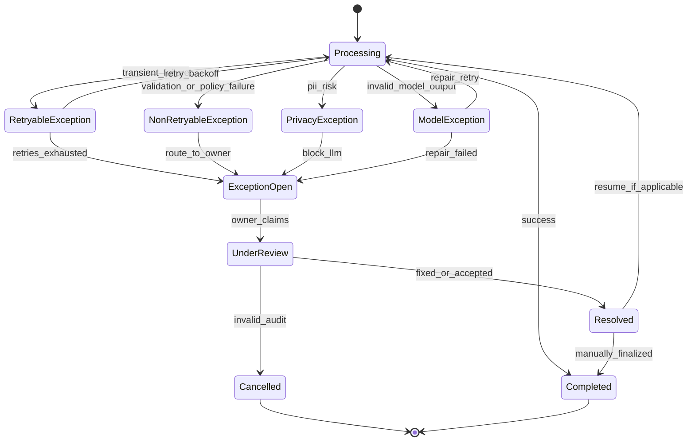

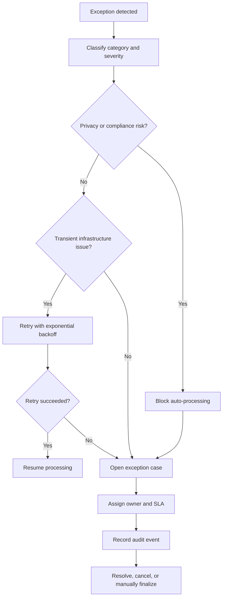

### Business Justification

Exception handling protects the credibility of Auto QRA. Users will trust automation only if failures are visible, explainable, and recoverable. Silent scoring failures, hidden privacy issues, or untracked retries can damage confidence and create compliance exposure. A clear exception taxonomy allows operations teams to manage workload and service levels.

Exception metrics also guide investment. Frequent retrieval exceptions may indicate governance process gaps. Frequent vLLM timeouts may indicate GPU undercapacity. Frequent schema failures may indicate prompt or model issues. Frequent PII exceptions may indicate masking rules need improvement.

### Technical Details

Every exception should be represented as a structured record with exception ID, audit ID, category, severity, message, root cause code, retryable flag, retry count, next retry time, owner group, SLA due time, status, and resolution. Exception records should link to logs, rule traces, model run records, and queue attempts through correlation ID.

Retry policies should be category-specific. Redis timeouts, vLLM transport errors, and PostgreSQL transient failures can be retried with exponential backoff and jitter. Invalid input, unsupported language, unresolved PII, missing required rubric, and rule conflicts should not be retried blindly. Model response repair should be limited, typically one retry with a stricter repair instruction, because repeated retries can consume latency and GPU capacity without solving the issue.

Dead-letter handling should preserve enough context for diagnosis without storing raw PII in unsafe locations. Dead-letter queues should be monitored with alerts. Exception dashboards should show open exceptions by category, age, owner, severity, and affected audit volume.

### Best Practices

- Fail closed for privacy, compliance, and governance exceptions.
- Use category-specific retry policies.
- Add jitter to retries to avoid retry storms.
- Preserve idempotency across retries.
- Route unrecoverable exceptions to named owner groups.
- Record user-visible statuses that are understandable but do not leak sensitive details.
- Alert on exception rates, not only individual failures.
- Include exception scenarios in integration and disaster recovery testing.

### Risks

Poor exception handling can create duplicate audits, lost audits, delayed reports, or unreviewed compliance cases. Aggressive retries can overload vLLM, Redis, or PostgreSQL. Weak classification can route issues to the wrong team. User-facing error messages may expose sensitive internal details if not designed carefully.

Another risk is exception backlog normalization. If teams become accustomed to large open backlogs, exceptions stop functioning as quality signals. SLA breaches in review or exception queues can undermine the 60-second processing target for normal cases and create operational debt.

### Recommendations

Implement exception handling as a first-class workflow rather than log-only behavior. Define exception owners and SLAs before production. Build dashboards for exception volume, retry success rate, mean time to resolution, and top root causes. Include exception cases in release smoke tests, especially PII block, missing policy, invalid model JSON, vLLM timeout, Redis retry, and PostgreSQL idempotent write.

Use exception trends as product feedback. A mature Auto QRA program should reduce exceptions over time by improving integrations, masking, retrieval, prompt design, model serving, rules governance, and reviewer staffing. Treat unresolved privacy and compliance exceptions as launch blockers for affected audit domains.
