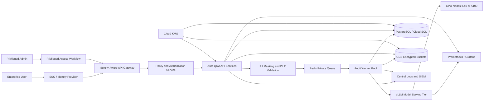
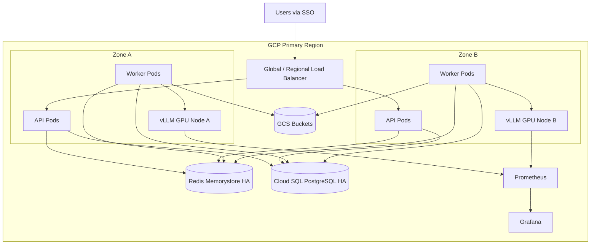
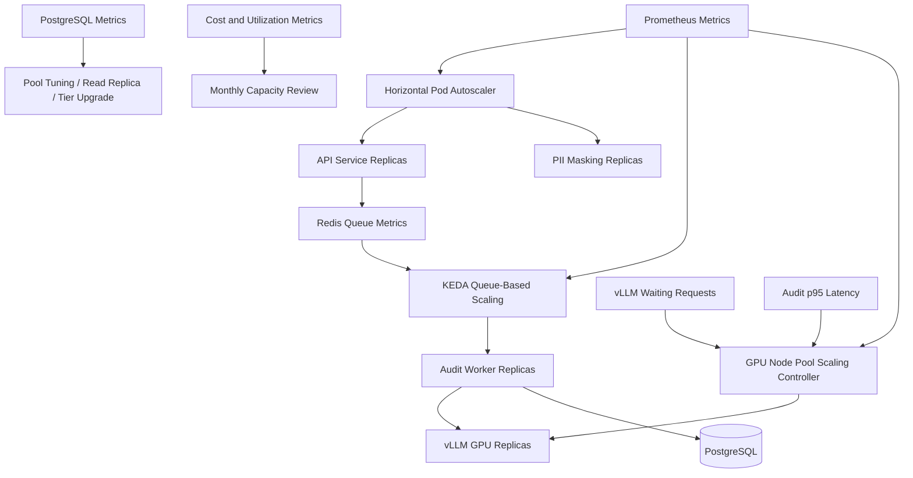

# Auto Quality Review Automation (Auto QRA)

Product & Technical Design Package - Operations, Security, and Capacity

Version: 1.0  
Date: July 2026  
Scope: Sections 33-46

## 33. Monitoring Strategy

### Purpose

The purpose of the monitoring strategy is to define how Auto Quality Review Automation (Auto QRA) will be measured, operated, and governed in production. Auto QRA is expected to process 60,000 audits per month, with an average of approximately 2,000 audits per day. Each audit is estimated to consume 3,200 tokens, based on 2,500 input tokens and 700 output tokens. This produces an expected monthly inference volume of 192,000,000 tokens and a daily inference volume of approximately 6,400,000 tokens. Because the automation supports enterprise quality review decisions, monitoring must cover service health, inference performance, model behavior, data protection, workflow completion, cost, and human escalation.

Monitoring must also prove that service-level expectations are being met. The target latency is less than 60 seconds per audit, and the target availability is 99.9%. These targets require operational visibility across application services, vLLM inference endpoints, Redis queues, PostgreSQL persistence, GCS object storage, SSO integrations, PII masking controls, encryption boundaries, and user-facing review workflows. The monitoring strategy therefore uses Prometheus for metric collection, Grafana for visualization, and alerting policies that separate customer-impacting incidents from early warning conditions.

### Description

Auto QRA monitoring is organized around four operating questions. First, is the platform available and able to accept audit work? Second, is the platform processing audits within the expected latency, throughput, and quality boundaries? Third, are data protection controls working as designed, including PII masking and encryption? Fourth, is the system operating within planned capacity and cost assumptions?

The system will expose metrics from every major component. Application APIs will publish request counts, error rates, latency distributions, queue depth, audit state transitions, and dependency timing. vLLM workers will publish model throughput, GPU utilization, GPU memory consumption, batch size, prefill latency, decode latency, time to first token, and tokens per second. Redis will publish memory, eviction, latency, connected clients, blocked clients, and queue length. PostgreSQL will publish connection count, transaction latency, lock waits, deadlocks, replication lag where applicable, and table growth. GCS access will be monitored through storage metrics, object operation counts, and access logs. SSO, authorization, PII masking, and encryption events will be monitored through security and audit metrics.

Monitoring will be implemented as a layered program rather than a dashboard-only activity. The first layer is service-level monitoring, focused on availability, latency, error rate, throughput, and saturation. The second layer is workflow monitoring, focused on the audit lifecycle from ingestion to completion. The third layer is model and GPU monitoring, focused on inference throughput and hardware saturation. The fourth layer is security monitoring, focused on identity, access, data masking, and anomalous behavior. The fifth layer is business monitoring, focused on audit volume, automation coverage, reviewer escalations, and cost per audit.

### Business Justification

Auto QRA will be used to improve quality review consistency, throughput, and cost efficiency. Monitoring protects that investment by detecting failures before they become broad business disruption. A 99.9% availability target allows approximately 43.2 minutes of unplanned downtime per month. Without strong monitoring, a small issue such as a saturated Redis queue, an overloaded vLLM worker, or a failed PII masking step could silently delay audit processing or expose sensitive data. The business consequence would be missed review deadlines, loss of trust in automated decisions, increased manual work, and potential compliance risk.

Monitoring also supports capacity and financial governance. At 60,000 audits per month, each audit carries compute, storage, and review workflow cost. A small regression in token output length, inference efficiency, retry rate, or cache behavior can materially change monthly spend. Monitoring token volume, GPU efficiency, and cost per audit provides finance and operations stakeholders with a factual basis for scaling decisions. It also supports enterprise service reviews, vendor governance, compliance reporting, and executive reporting on automation value.

### Technical Details

The monitoring architecture uses Prometheus-compatible instrumentation and exporters. Application services will expose `/metrics` endpoints. vLLM workers will expose inference metrics and GPU exporters will expose device-level metrics through NVIDIA DCGM Exporter. Redis and PostgreSQL will use managed service metrics and exporters where available. Grafana will read Prometheus time series and cloud provider metrics through configured data sources. Alertmanager will route alerts by severity and ownership.

Core service-level indicators are availability, latency, error rate, throughput, and saturation. For Auto QRA, the primary service-level indicator is successful audit completion within 60 seconds. Supporting indicators include API request success, queue wait time, vLLM inference latency, database latency, and storage latency. The recommended SLO is that at least 99.5% of audits complete within 60 seconds during normal operating periods and 99.9% of public API requests avoid 5xx responses over a rolling 30-day window.

The expected average audit arrival rate is:

| Formula | Result |
| --- | ---: |
| Monthly audits | 60,000 audits/month |
| Average daily audits | 60,000 / 30 = 2,000 audits/day |
| Average hourly audits | 2,000 / 24 = 83.3 audits/hour |
| Average per-minute audits | 83.3 / 60 = 1.39 audits/minute |
| Average per-second audits | 1.39 / 60 = 0.023 audits/second |
| Peak multiplier assumption | 3x average |
| Peak hourly audits | 83.3 x 3 = 250 audits/hour |
| Peak per-minute audits | 250 / 60 = 4.17 audits/minute |
| Peak per-second audits | 4.17 / 60 = 0.069 audits/second |

This average rate is modest, but inference bursts and dependency failures can still create queue backlogs. Monitoring therefore must track both request rate and backlog clearance rate. If the system receives 250 audits per hour at peak and each audit must complete within 60 seconds, the minimum steady-state throughput requirement is 4.17 completed audits per minute, with additional headroom for retries, maintenance, and N+1 high availability.

Prometheus metric catalog for platform health:

| Metric name | Type | Labels | Source | Purpose | Warning threshold | Critical threshold |
| --- | --- | --- | --- | --- | ---: | ---: |
| `auto_qra_api_requests_total` | Counter | `service`, `route`, `method`, `status` | API | Request volume and status mix | 5xx > 1% for 10m | 5xx > 5% for 5m |
| `auto_qra_api_request_duration_seconds` | Histogram | `service`, `route`, `method` | API | API latency | p95 > 2s for 15m | p95 > 5s for 5m |
| `auto_qra_audit_submitted_total` | Counter | `source`, `tenant` | Workflow | Audit intake volume | 30% below forecast | 60% below forecast |
| `auto_qra_audit_completed_total` | Counter | `tenant`, `model`, `result` | Workflow | Completed audits | Completion rate below intake for 30m | No completions for 10m |
| `auto_qra_audit_duration_seconds` | Histogram | `tenant`, `model`, `priority` | Workflow | End-to-end audit latency | p95 > 60s for 15m | p99 > 120s for 10m |
| `auto_qra_audit_queue_depth` | Gauge | `queue`, `priority` | Redis/App | Backlog monitoring | > 100 for 15m | > 500 for 10m |
| `auto_qra_audit_queue_age_seconds` | Gauge | `queue`, `priority` | Redis/App | Oldest queued item age | > 60s | > 300s |
| `auto_qra_dependency_duration_seconds` | Histogram | `dependency`, `operation` | App | Dependency latency | p95 > baseline x 2 | p95 > baseline x 5 |
| `auto_qra_dependency_errors_total` | Counter | `dependency`, `operation`, `error` | App | Dependency failures | > 1% for 15m | > 5% for 5m |
| `auto_qra_worker_active_jobs` | Gauge | `worker_pool`, `node` | Worker | Worker saturation | > 80% capacity | > 95% capacity |
| `auto_qra_worker_retries_total` | Counter | `worker_pool`, `reason` | Worker | Retry rate | > 3% audits | > 10% audits |
| `auto_qra_slo_audit_success_ratio` | Gauge | `window` | Recording rule | SLO tracking | < 99.5% | < 99.0% |

Prometheus metric catalog for vLLM and GPU health:

| Metric name | Type | Labels | Source | Purpose | Warning threshold | Critical threshold |
| --- | --- | --- | --- | --- | ---: | ---: |
| `vllm:num_requests_running` | Gauge | `model`, `instance` | vLLM | Active inference requests | > 80% configured limit | > 95% configured limit |
| `vllm:num_requests_waiting` | Gauge | `model`, `instance` | vLLM | Inference queue pressure | > 20 for 10m | > 100 for 5m |
| `vllm:prompt_tokens_total` | Counter | `model`, `instance` | vLLM | Input token volume | Forecast + 20% | Forecast + 50% |
| `vllm:generation_tokens_total` | Counter | `model`, `instance` | vLLM | Output token volume | Forecast + 20% | Forecast + 50% |
| `vllm:time_to_first_token_seconds` | Histogram | `model`, `instance` | vLLM | User-perceived inference start | p95 > 10s | p95 > 25s |
| `vllm:e2e_request_latency_seconds` | Histogram | `model`, `instance` | vLLM | Inference latency | p95 > 45s | p99 > 60s |
| `vllm:request_success_total` | Counter | `model`, `instance` | vLLM | Successful model calls | Drop > 20% | Drop > 50% |
| `vllm:request_failure_total` | Counter | `model`, `instance`, `reason` | vLLM | Failed model calls | > 1% | > 5% |
| `DCGM_FI_DEV_GPU_UTIL` | Gauge | `gpu`, `node` | DCGM | GPU utilization | < 30% or > 85% for 30m | > 95% for 10m |
| `DCGM_FI_DEV_FB_USED` | Gauge | `gpu`, `node` | DCGM | GPU memory used | > 85% | > 95% |
| `DCGM_FI_DEV_POWER_USAGE` | Gauge | `gpu`, `node` | DCGM | Power draw | > baseline + 20% | Hardware limit |
| `DCGM_FI_DEV_XID_ERRORS` | Counter | `gpu`, `node` | DCGM | GPU hardware faults | Any event | Repeated event |

Prometheus metric catalog for data and security controls:

| Metric name | Type | Labels | Source | Purpose | Warning threshold | Critical threshold |
| --- | --- | --- | --- | --- | ---: | ---: |
| `auto_qra_pii_masking_requests_total` | Counter | `tenant`, `result` | PII service | PII masking volume | Failure > 0.5% | Failure > 2% |
| `auto_qra_pii_unmasked_tokens_detected_total` | Counter | `tenant`, `field`, `severity` | DLP validation | Masking escape detection | Any medium event | Any high event |
| `auto_qra_auth_login_total` | Counter | `idp`, `result` | SSO | Authentication events | Failure spike x 3 | Failure spike x 10 |
| `auto_qra_authz_denied_total` | Counter | `role`, `resource`, `reason` | App | Authorization denials | Baseline x 3 | Baseline x 10 |
| `auto_qra_secret_rotation_age_days` | Gauge | `secret_type` | Security job | Secret age | > 60 days | > 90 days |
| `auto_qra_encryption_failures_total` | Counter | `component` | App/KMS | Encryption failures | Any event | Any repeated event |
| `auto_qra_audit_log_write_failures_total` | Counter | `component` | App | Audit log integrity | Any event | Repeated event |
| `auto_qra_policy_violation_total` | Counter | `policy`, `severity` | Policy engine | Zero-trust policy violations | Medium > 0 | High > 0 |

### Best Practices

Monitoring should be designed from the user journey backward. The most important measured outcome is not whether a container is running; it is whether an audit submitted by an authorized user is completed accurately, securely, and within the target latency. For this reason, every audit should carry a correlation ID from ingestion through PII masking, queueing, inference, post-processing, persistence, and user presentation. Metrics should use bounded-cardinality labels. Tenant, model family, environment, and priority are acceptable labels; raw user IDs, free-text fields, document names, and audit content must not be labels.

Prometheus recording rules should be used for SLO calculations and expensive percentile queries. Grafana dashboards should distinguish real-time operations from executive reporting. On-call dashboards should prioritize latency, error rate, queue depth, and GPU health. Leadership dashboards should prioritize audit volume, automation coverage, SLO attainment, quality outcomes, and cost per audit. Alert thresholds should be reviewed after the first 30 days of production traffic, because forecasted rates may differ from actual enterprise usage patterns.

### Risks

The main risk is under-monitoring workflow failure modes. A system can appear healthy at the container level while audits are delayed in Redis, blocked on database locks, failing PII masking, or retrying inference. Another risk is high-cardinality metric design, which can increase monitoring cost and reduce Prometheus performance. GPU metrics can also be misleading if they are reviewed without vLLM queue metrics; high utilization can be healthy during batch inference, while low utilization can indicate either idle capacity or a bottleneck before inference.

Security monitoring introduces a separate risk. Logging or labeling sensitive values can leak PII into observability systems. All logs and metrics must be reviewed under the same data minimization rules as production data. The monitoring system itself must be treated as a sensitive system because it contains operational metadata, incident traces, and potentially tenant-level activity patterns.

### Recommendations

Implement monitoring as a required production readiness gate before any enterprise rollout. Configure Prometheus, Grafana, Alertmanager, DCGM Exporter, Redis exporter, PostgreSQL exporter, and application metrics in the first production environment. Establish SLO dashboards for audit completion within 60 seconds and API 5xx-free availability. Add synthetic audit probes that run every five minutes using a safe test payload with no PII, and verify the complete path through masking, queueing, vLLM, persistence, and GCS artifact retrieval.

The initial operating target should be 99.9% API availability and at least 99.5% audit completion under 60 seconds. The first 90 days should include weekly review of monitoring noise, missing signals, and threshold accuracy. After traffic stabilizes, the organization should formalize error budgets, escalation policies, and capacity review cadences.

## 34. Observability

### Purpose

The purpose of observability is to make Auto QRA diagnosable, explainable, and governable under real production conditions. Monitoring tells operators when known failure modes occur; observability allows engineers and support teams to investigate unknown or complex behavior. Auto QRA has several sources of operational complexity: asynchronous audit workflows, inference queues, GPU-backed model serving, enterprise identity, PII masking, encrypted storage, and structured quality outputs. Observability must connect these elements into a coherent view of each audit transaction.

### Description

Observability for Auto QRA is based on three pillars: metrics, logs, and traces. Metrics provide numerical indicators of health and performance. Logs provide structured event records for state changes, decisions, exceptions, and security-relevant actions. Traces connect distributed operations across services and dependencies. A fourth practical pillar, audit evidence, is also required because Auto QRA produces quality review decisions that may need to be explained to business stakeholders, internal auditors, and compliance teams.

Each submitted audit will receive a stable `audit_id` and `correlation_id`. The `audit_id` identifies the business object. The `correlation_id` identifies a specific processing attempt or request chain. Retry attempts will add an `attempt_id` while preserving the parent identifiers. These identifiers will be included in logs, traces, database records, object metadata, and support tooling. The system will not use PII or customer-provided text as identifiers.

### Business Justification

Enterprise users need confidence that Auto QRA decisions are repeatable and supportable. When a reviewer asks why an audit was delayed, escalated, or scored a certain way, the support team must be able to reconstruct the workflow without exposing protected data. Observability shortens mean time to detect and mean time to resolve incidents. It also reduces the amount of engineering time required to investigate production issues.

Observability is also a control for model operations. vLLM performance varies based on model size, quantization, sequence length, batching, GPU type, and concurrent demand. Without observability, the organization cannot distinguish between prompt growth, model degradation, hardware saturation, queueing, database contention, and downstream workflow issues. Strong observability protects service quality while enabling iterative model improvements.

### Technical Details

OpenTelemetry should be used for distributed tracing across application services. Traces should include spans for API ingestion, authentication, authorization, PII masking, prompt construction, queue enqueue, worker pickup, vLLM request, post-processing, persistence, GCS write, notification, and UI retrieval. Span attributes should be carefully controlled. Safe attributes include environment, service name, model family, model size, quantization mode, tenant ID if approved for operational use, audit type, queue name, priority, token counts, and status codes. Unsafe attributes include raw prompt text, model output text, names, emails, phone numbers, addresses, account numbers, and free-form customer notes.

Recommended trace model:

| Span name | Parent | Key attributes | Error conditions |
| --- | --- | --- | --- |
| `audit.submit` | Root | `audit_id`, `tenant_id`, `source`, `priority` | Invalid payload, auth failure |
| `auth.sso.validate` | `audit.submit` | `idp`, `auth_method`, `role_count` | Token invalid, SSO timeout |
| `authz.policy.evaluate` | `audit.submit` | `resource`, `action`, `decision` | Denied, policy service unavailable |
| `pii.mask` | `audit.submit` | `masking_version`, `fields_masked`, `risk_level` | Masking failure, DLP hit |
| `prompt.build` | `audit.submit` | `prompt_version`, `input_tokens_estimated` | Template missing, token limit exceeded |
| `queue.enqueue` | `audit.submit` | `queue`, `priority`, `queue_depth` | Redis unavailable |
| `worker.process` | Root or linked | `attempt_id`, `worker_pool`, `node` | Worker timeout |
| `vllm.generate` | `worker.process` | `model`, `gpu_type`, `input_tokens`, `output_tokens` | Timeout, OOM, invalid response |
| `result.validate` | `worker.process` | `schema_version`, `validation_result` | JSON schema failure |
| `result.persist` | `worker.process` | `postgres_table`, `gcs_bucket`, `object_class` | DB or GCS write failure |
| `review.publish` | `worker.process` | `destination`, `notification_type` | Notification failure |

Grafana dashboard definitions should be managed as code and stored with the deployment configuration. Dashboards must support drill-down from executive status to service dependency and audit-level troubleshooting. The following dashboard set is recommended:

| Dashboard | Audience | Panels | Primary data sources | Refresh |
| --- | --- | --- | --- | --- |
| Auto QRA Executive Health | Product, Operations | Monthly audits, daily audits, SLO attainment, completion under 60s, escalations, cost per audit | Prometheus, billing export, PostgreSQL aggregate views | 15m |
| Auto QRA Operations Overview | On-call, SRE | API availability, p95/p99 latency, error rate, queue depth, oldest audit age, worker utilization | Prometheus | 1m |
| Audit Workflow Funnel | Support, Engineering | Submitted, masked, queued, processing, completed, failed, retried, escalated | Prometheus, PostgreSQL | 5m |
| vLLM Inference Health | ML Platform, SRE | Time to first token, request latency, tokens/sec, waiting requests, running requests, model errors | vLLM metrics, DCGM | 30s |
| GPU Fleet | ML Platform | GPU utilization, memory, temperature, power, XID errors, node status | DCGM, GCP metrics | 30s |
| Data Layer Health | DBAs, SRE | PostgreSQL CPU, connections, locks, deadlocks, slow queries, Redis memory, evictions | PostgreSQL exporter, Redis metrics | 1m |
| Security and Compliance | Security, Compliance | SSO failures, authorization denials, PII masking failures, DLP findings, audit log failures | App metrics, SIEM export | 5m |
| Capacity and Cost | FinOps, Platform | Token volume, GPU hours, cost per audit, utilization by model, storage growth | Prometheus, billing export | 1h |

Example Grafana dashboard-as-code definition summary:

| Field | Value |
| --- | --- |
| Dashboard UID | `auto-qra-ops-overview` |
| Title | Auto QRA Operations Overview |
| Tags | `auto-qra`, `production`, `slo`, `operations` |
| Variables | `environment`, `tenant`, `model`, `worker_pool`, `gpu_type` |
| Row 1 | SLO: audit completion under 60s, API availability, error budget burn |
| Row 2 | Intake: submitted audits, completed audits, failed audits, retry rate |
| Row 3 | Queues: queue depth, queue age, worker active jobs, worker saturation |
| Row 4 | Inference: vLLM latency, waiting requests, tokens/sec, GPU utilization |
| Row 5 | Dependencies: PostgreSQL latency, Redis latency, GCS errors, SSO errors |

### Best Practices

Observability should be designed as a product capability, not as a troubleshooting afterthought. Every audit state transition should be emitted as a structured event. Every retry should preserve the original context and record the reason for retry. Every model call should record token counts, model version, quantization mode, latency, and validation result. Every security control should emit a success or failure event that can be audited without exposing sensitive payloads.

Sampling decisions must reflect business risk. High-volume low-risk spans can be sampled, but error traces, PII masking failures, authorization denials, schema validation failures, and audit result publication failures should be retained at or near 100%. Trace retention should be long enough to support incident review and customer support investigations, typically 30 days for detailed traces and 90 days for aggregated operational data.

### Risks

The primary observability risk is accidental data exposure. Auto QRA processes business records that may contain PII or confidential quality evidence. Logs, traces, metric labels, dashboard variables, and support tools must not store raw audit text or unmasked prompts. A second risk is incomplete correlation. If one service emits `audit_id` and another emits only request IDs, support teams will struggle to reconstruct incidents. A third risk is dashboard sprawl, where many dashboards exist but none clearly answer operational questions.

### Recommendations

Adopt an observability contract for every service. The contract should define required metrics, required log fields, required trace attributes, safe labels, redacted fields, retention, and ownership. Add automated checks to prevent unsafe log keys and metric labels. Implement Grafana dashboards as version-controlled JSON or Jsonnet. Establish a weekly operational review during the first quarter to evaluate whether dashboards support real incidents and whether any recurring manual investigation should become a metric, alert, or support view.

## 35. Logging Strategy

### Purpose

The purpose of the logging strategy is to define what Auto QRA records, how it structures records, how long it retains them, and how it protects sensitive information. Logs must support production troubleshooting, auditability, security investigations, compliance reviews, cost analysis, and product improvement. Because Auto QRA processes potentially sensitive audit inputs and model outputs, logging must be structured, minimal, masked, and access-controlled.

### Description

Auto QRA will use structured JSON logs across all application services, workers, model gateway components, security controls, and administrative jobs. Logs will be emitted to standard output from containers, collected by the platform logging agent, and routed to a centralized log backend and SIEM integration. The application will never log raw prompts, raw model outputs, unmasked PII, authentication tokens, secrets, encryption keys, or full request bodies. Instead, it will log stable identifiers, status, timing, counts, versions, and policy outcomes.

Logging is divided into operational logs, security logs, audit logs, model operation logs, data access logs, and administrative logs. Operational logs support incident response. Security logs support detection and investigation. Audit logs establish a record of user and system actions. Model operation logs capture inference metadata. Data access logs record read and write actions against PostgreSQL and GCS. Administrative logs record configuration changes, deployments, secret rotations, and access policy updates.

### Business Justification

Enterprise customers expect transparent and controlled operation of automated decision systems. Logging provides the evidence required to answer support questions, investigate incidents, and demonstrate compliance with internal controls. Well-designed logs reduce incident duration because engineers can find the failed stage, dependency, and correlation ID quickly. They also reduce privacy risk because teams are not tempted to add ad hoc debugging statements that expose sensitive data.

Retention policy is a cost and compliance issue. Retaining every detailed log indefinitely would be expensive and risky. Retaining too little would impair investigations. The strategy balances these needs by separating short-lived detailed operational logs from longer-lived immutable audit logs and aggregated metrics.

### Technical Details

All application logs should follow a common schema. The schema should be enforced through shared logging libraries or middleware so services do not invent incompatible fields.

Core log schema:

| Field | Type | Required | Example | Notes |
| --- | --- | --- | --- | --- |
| `timestamp` | RFC3339 string | Yes | `2026-07-17T09:00:00Z` | UTC only |
| `severity` | Enum | Yes | `INFO`, `WARN`, `ERROR`, `SECURITY` | Mapped to backend severity |
| `service` | String | Yes | `audit-worker` | Stable service name |
| `environment` | String | Yes | `prod` | `dev`, `stage`, `prod` |
| `version` | String | Yes | `2026.07.1` | Application version |
| `correlation_id` | String | Yes | `corr_...` | Request or workflow chain |
| `audit_id` | String | Conditional | `aud_...` | Required for audit workflow events |
| `attempt_id` | String | Conditional | `att_...` | Required for retries and worker attempts |
| `tenant_id` | String | Conditional | `tenant_...` | Use approved non-PII tenant identifier |
| `user_id_hash` | String | Conditional | `sha256:...` | Hash only; no raw username or email |
| `event_name` | String | Yes | `audit.inference.completed` | Controlled vocabulary |
| `event_category` | Enum | Yes | `workflow`, `security`, `model`, `data` | Used for routing |
| `status` | Enum | Yes | `success`, `failure`, `denied` | Consistent status values |
| `duration_ms` | Number | Conditional | `1275` | Required for timed operations |
| `dependency` | String | Conditional | `postgres`, `redis`, `vllm`, `gcs` | For dependency events |
| `error_code` | String | Conditional | `VLLM_TIMEOUT` | Controlled error code |
| `error_class` | String | Conditional | `TimeoutError` | No full stack at INFO |
| `retryable` | Boolean | Conditional | `true` | For failures |
| `input_tokens` | Number | Conditional | `2500` | Model metadata only |
| `output_tokens` | Number | Conditional | `700` | Model metadata only |
| `model_name` | String | Conditional | `auto-qra-7b-q4` | No dynamic free text |
| `prompt_version` | String | Conditional | `quality-v12` | Supports model auditability |
| `masking_version` | String | Conditional | `pii-masker-v4` | Supports privacy auditability |
| `fields_masked` | Number | Conditional | `18` | Count only |
| `policy_decision` | Enum | Conditional | `allow`, `deny`, `step_up` | Authorization and security |
| `message` | String | Yes | `Audit inference completed` | No sensitive values |

Logging retention table:

| Log category | Examples | Retention hot | Retention archive | Storage target | Access model |
| --- | --- | ---: | ---: | --- | --- |
| Operational application logs | API events, worker events, dependency failures | 30 days | 180 days | Central logging, GCS archive | SRE, engineering support |
| Security logs | SSO failures, authorization denials, policy violations | 90 days | 1 year | SIEM, immutable GCS bucket | Security, compliance |
| Audit logs | User actions, system decisions, approvals, overrides | 1 year | 7 years where policy requires | PostgreSQL plus immutable GCS | Compliance, limited admins |
| Model operation logs | Model version, token counts, latency, validation result | 90 days | 1 year | Central logging, analytics tables | ML platform, SRE |
| Data access logs | GCS object access, DB administrative access | 90 days | 1 year | Cloud audit logs, SIEM | Security, platform |
| Debug logs | Temporary elevated diagnostics | 7 days | None unless incident attached | Central logging | Break-glass only |

Event taxonomy:

| Category | Event examples | Required controls |
| --- | --- | --- |
| Workflow | `audit.submitted`, `audit.masked`, `audit.queued`, `audit.completed`, `audit.failed` | Include correlation and state transition |
| Security | `auth.login.failed`, `authz.denied`, `policy.violation`, `secret.rotated` | Route to SIEM |
| Model | `inference.started`, `inference.completed`, `schema.validation.failed` | Include token counts and model version |
| Data | `result.persisted`, `gcs.object.written`, `db.query.slow` | No payload data |
| Admin | `config.changed`, `model.deployed`, `dashboard.updated` | Require actor hash and change ID |

### Best Practices

Logs should be deterministic and machine-readable. Free-form messages can exist for humans, but the operational meaning must be captured in structured fields. Every error should have a stable error code. Every retry should log the reason, attempt number, and next action. Every security denial should log the policy name and decision without logging sensitive resource values. Stack traces should be restricted to error logs and scrubbed for secrets.

PII masking must occur before any prompt or derived content can be logged. The logging library should provide safe helper functions and reject unsafe keys. Production debug logging should require time-bound approval and should automatically expire. Access to logs should use SSO, role-based access control, least privilege, and periodic access review.

### Risks

The highest logging risk is sensitive data leakage. Model prompts and outputs may contain customer records or review evidence. Even partial fields can be sensitive when combined. Another risk is poor retention discipline. Keeping detailed logs too long increases exposure, while deleting audit logs too early creates compliance gaps. A third risk is unstructured logs, which make incident response slower and reduce confidence in automated alerting.

### Recommendations

Implement a shared logging package and schema validation in CI. Add automated tests that fail when unsafe log fields such as `prompt`, `raw_text`, `email`, `phone`, `token`, `secret`, or `authorization` are introduced. Route security and audit events to the SIEM and immutable GCS storage. Configure retention by log category rather than by service alone. Review log samples during production readiness to confirm that PII masking, token redaction, and correlation IDs are working.

## 36. Alerting

### Purpose

The purpose of alerting is to convert monitoring signals into timely, actionable operational response. Auto QRA must meet a target latency of less than 60 seconds and a target availability of 99.9%. Alerting must therefore detect conditions that threaten availability, audit completion, inference latency, data protection, and capacity before they produce large-scale business impact.

### Description

Alerting will use Prometheus Alertmanager integrated with incident management, chat operations, email distribution groups, and security tooling. Alerts will be grouped by service, tenant impact, severity, and environment. The alerting model will distinguish symptoms from causes. For example, an audit latency SLO burn alert is a symptom alert and should page on-call when user impact is real. A rising GPU utilization alert is a cause or early warning alert and should usually route as a ticket or low-severity notification unless it is already causing latency failures.

Alert severity is divided into four levels: Sev1, Sev2, Sev3, and Sev4. Sev1 represents broad production impact, data exposure, or complete inability to process audits. Sev2 represents material degradation, such as sustained latency above target or partial regional capacity loss. Sev3 represents degraded redundancy, elevated error rates, or early capacity pressure. Sev4 represents informational conditions that require follow-up but not immediate interruption.

### Business Justification

Effective alerting protects business operations without exhausting the teams responsible for the service. Over-alerting creates fatigue and causes real incidents to be missed. Under-alerting allows customer impact to continue silently. Auto QRA needs alerts that are tied to service outcomes and risk. Because the platform automates quality review work, delayed or failed audits can affect operational deadlines, customer commitments, and compliance reporting. Security alerts are even more important because PII masking failures or unauthorized access attempts require rapid investigation.

### Technical Details

Alert severity matrix:

| Severity | Definition | Examples | Response target | Notification |
| --- | --- | --- | --- | --- |
| Sev1 | Major production outage, data exposure, or broad inability to process audits | API unavailable, audit completion stopped, PII unmasked high finding, database unavailable | Acknowledge within 5 minutes, restore or mitigate within 60 minutes | Page primary and secondary on-call, incident bridge, leadership notification |
| Sev2 | Material customer-impacting degradation | p99 audit latency > 120s, vLLM failures > 5%, Redis queue age > 300s, one HA node down with load risk | Acknowledge within 15 minutes, mitigate within 4 hours | Page primary on-call, notify service channel |
| Sev3 | Elevated risk or partial degradation with limited impact | p95 audit latency > 60s, GPU memory > 85%, DB connections > 80%, retry rate > 3% | Acknowledge within business day or on-call policy | Ticket plus channel notification |
| Sev4 | Informational or trend-based alert | forecast overrun, low GPU utilization, upcoming certificate expiry | Review in weekly operations | Ticket or dashboard annotation |

Detailed alert threshold catalog:

| Alert name | Expression concept | Severity | Threshold | Duration | Runbook action |
| --- | --- | --- | --- | ---: | --- |
| `AutoQRAApiDown` | API health probe failure | Sev1 | Probe failures from 2 regions | 5m | Check ingress, deployment, auth gateway, rollback if needed |
| `AutoQRAHigh5xxRate` | 5xx / total requests | Sev2 | > 5% | 5m | Inspect release, dependencies, error logs |
| `AutoQRAAuditCompletionStopped` | Completed audit rate | Sev1 | Zero completions while intake > 0 | 10m | Inspect Redis, workers, vLLM, DB |
| `AutoQRAAuditLatencySLOBurn` | Audit duration p95 | Sev3 | p95 > 60s | 15m | Check queue age and inference latency |
| `AutoQRAAuditLatencyCritical` | Audit duration p99 | Sev2 | p99 > 120s | 10m | Scale workers or route traffic |
| `AutoQRAQueueBacklogCritical` | Oldest queued audit age | Sev2 | > 300s | 10m | Add workers, check Redis, check vLLM |
| `AutoQRAVLLMWaitingRequestsHigh` | vLLM waiting requests | Sev3 | > 20 | 10m | Check GPU saturation and batching |
| `AutoQRAVLLMFailureRateHigh` | vLLM failures / total | Sev2 | > 5% | 5m | Inspect model server logs and GPU errors |
| `AutoQRAGPUXidError` | DCGM XID error | Sev2 | Any repeated error | 1m | Drain node and replace GPU VM |
| `AutoQRAGPUMemoryCritical` | GPU memory used | Sev2 | > 95% | 5m | Reduce max batch or scale GPU workers |
| `AutoQRAPostgresUnavailable` | DB health check | Sev1 | Primary unavailable | 2m | Failover Cloud SQL, pause writes if needed |
| `AutoQRAPostgresConnectionSaturation` | Connections / max | Sev3 | > 80% | 15m | Check pool size and slow queries |
| `AutoQRARedisEvictions` | Redis evictions | Sev2 | > 0 in production queue DB | 5m | Increase memory, inspect key TTLs |
| `AutoQRAPIIMaskingFailure` | Masking failures / attempts | Sev1 | > 2% or any high-risk failure | 5m | Stop processing affected workflow and investigate |
| `AutoQRAAuditLogWriteFailure` | Audit log write errors | Sev1 | Any repeated event | 5m | Fail closed for regulated actions |
| `AutoQRASecretRotationOverdue` | Secret age | Sev4/Sev3 | > 60 days warning, > 90 days critical | 1d | Rotate secret |

Example Prometheus alert rule definitions:

| Rule | PromQL concept |
| --- | --- |
| Audit p95 latency | `histogram_quantile(0.95, sum(rate(auto_qra_audit_duration_seconds_bucket[5m])) by (le)) > 60` |
| API 5xx rate | `sum(rate(auto_qra_api_requests_total{status=~"5.."}[5m])) / sum(rate(auto_qra_api_requests_total[5m])) > 0.05` |
| Queue age critical | `max(auto_qra_audit_queue_age_seconds) > 300` |
| vLLM failure rate | `sum(rate(vllm:request_failure_total[5m])) / (sum(rate(vllm:request_failure_total[5m])) + sum(rate(vllm:request_success_total[5m]))) > 0.05` |
| GPU memory critical | `max(DCGM_FI_DEV_FB_USED / DCGM_FI_DEV_FB_TOTAL) > 0.95` |

### Best Practices

Alerts should be actionable, owned, and documented. Every paging alert should have a runbook, dashboard link, likely causes, mitigation steps, rollback guidance, and escalation path. Alerts should page on symptoms when customer impact is likely and create tickets for early warning signals. Multi-window burn-rate alerts should be used for SLOs so the team detects both fast outages and slow error-budget consumption.

Alert grouping should prevent storms during dependency failures. If PostgreSQL is unavailable, dozens of application errors may occur; Alertmanager should group related alerts and highlight the database root condition. Maintenance windows, deployments, and load tests should annotate dashboards and suppress known noisy alerts only through controlled change records.

### Risks

Alert fatigue is a significant risk. If GPU utilization, queue depth, or latency alerts are tuned too aggressively before real traffic is understood, on-call teams may ignore alerts. The opposite risk is thresholds that are too loose, allowing the 60-second latency target to be missed for many audits. Security alert handling carries additional risk because delayed response to PII masking failures can increase compliance exposure.

### Recommendations

Start with a small number of high-confidence paging alerts: API down, audit completion stopped, critical audit latency, database unavailable, Redis evictions, vLLM failure rate, PII masking failure, and audit log write failure. Add warning alerts for queue age, GPU saturation, connection saturation, and cost trend. Review alerts weekly for the first 60 days. Require every Sev1 and Sev2 incident to produce an alert quality review: did the alert fire, did it fire at the right time, was it actionable, and should it be changed?

## 37. Security Architecture

### Purpose

The purpose of the security architecture is to protect Auto QRA data, models, infrastructure, identities, and audit decisions. Auto QRA processes enterprise audit inputs, intermediate prompts, model outputs, quality scores, reviewer actions, and operational metadata. These assets may include PII and confidential business information. The architecture must enforce least privilege, zero trust, encryption, masking, auditability, and defense in depth.

### Description

Auto QRA security is built around identity-aware access, network segmentation, encrypted data paths, controlled model serving, PII masking, and immutable audit records. Users authenticate through enterprise SSO. Application services validate identity and authorization for each action. Service-to-service communication uses workload identity and mutual authentication where supported. Sensitive data is masked before model inference. Data is encrypted in transit and at rest. Administrative access uses privileged access workflows, short-lived credentials, and complete audit logging.

The system uses a zero-trust model. No network location, service, user, or workload is trusted implicitly. Every request is authenticated, authorized, logged, and evaluated against policy. The model serving tier is isolated from direct user access. vLLM endpoints are reachable only from approved application workers. GCS buckets, PostgreSQL databases, Redis instances, and monitoring systems are private and protected by IAM, VPC controls, and encryption policies.

### Business Justification

Security is a prerequisite for enterprise adoption. Auto QRA is likely to handle regulated or sensitive operational data. A breach, PII exposure, or unauthorized model access would harm customers, create regulatory and contractual risk, and undermine confidence in automation. Strong security architecture also enables broader deployment because legal, compliance, security, and procurement teams can review clear controls rather than relying on informal operational practices.

### Technical Details

Security architecture:

Security control matrix:

| Control domain | Required control | Implementation | Evidence |
| --- | --- | --- | --- |
| Identity | SSO required | SAML/OIDC through enterprise IdP | Login logs, IdP policy |
| Authorization | Least privilege RBAC/ABAC | Role and tenant scoped policies | Authorization decision logs |
| Service identity | Workload identity | GCP service accounts with minimal IAM | IAM inventory |
| Network | Private service access | VPC, firewall rules, private endpoints | Network policy export |
| Transport encryption | TLS everywhere | TLS 1.2+ external, mTLS or workload identity internal | TLS scan, config |
| At-rest encryption | Encrypted databases and buckets | Cloud KMS-managed keys where required | KMS key policy |
| PII protection | Mask before inference | PII masking service and DLP validation | Masking metrics and logs |
| Secrets | Managed secrets | Secret Manager, no secrets in code | Secret access logs |
| Auditability | Immutable audit trail | PostgreSQL audit table plus GCS retention lock | Audit records |
| Model isolation | No direct model access | vLLM private endpoint only | Firewall and IAM |
| Admin access | Privileged access management | Just-in-time access, MFA, break-glass logs | PAM records |
| Monitoring | Security event routing | SIEM integration | Alert history |

Zero-trust recommendations:

| Principle | Auto QRA recommendation |
| --- | --- |
| Verify explicitly | Validate user identity, device posture where available, tenant authorization, service identity, and request policy on every action. |
| Use least privilege | Separate roles for reviewer, auditor, administrator, ML operator, SRE, and security investigator. Grant data access by tenant and purpose. |
| Assume breach | Segment vLLM, Redis, PostgreSQL, and GCS. Rotate credentials. Monitor anomalous access. Keep immutable audit records. |
| Minimize data | Mask PII before prompts, store only required evidence, and avoid sensitive data in logs or metrics. |
| Continuous evaluation | Route security events to SIEM, review access quarterly, and use automated policy checks in CI/CD. |

### Best Practices

Security design should fail closed for regulated or sensitive workflows. If PII masking fails, the audit should not proceed to model inference. If audit logging fails for an action that must be recorded, the action should be blocked or queued for controlled recovery. If authorization cannot be evaluated, access should be denied. Administrative access should be time-bound and reviewed.

Encryption should use managed services and centralized key control. GCS buckets should use uniform bucket-level access, public access prevention, retention policies where audit records require immutability, and object versioning where appropriate. PostgreSQL backups should be encrypted. Redis should be private, encrypted in transit where supported, and protected from eviction for durable queue metadata. Secrets should be rotated and never mounted broadly into containers.

### Risks

The largest security risk is PII entering the model or observability layers without masking. Another risk is excessive service account privileges, especially for workers that access queues, databases, buckets, and model endpoints. Misconfigured GCS permissions can expose stored review artifacts. Model-serving endpoints can become an exfiltration or abuse path if they are reachable outside the trusted worker tier. Logging systems can also become a secondary data exposure channel.

### Recommendations

Implement a security readiness checklist before production. Require threat modeling for the audit workflow, model serving path, data storage path, and administrative path. Deploy PII masking as a hard gate before inference. Use private networking for Redis, PostgreSQL, GCS access paths, and vLLM. Configure SSO, MFA, role-based access, and tenant scoping. Route security logs to SIEM and require quarterly access reviews. Add automated policy checks for IAM, bucket public access, encryption settings, and logging redaction.

## 38. Disaster Recovery

### Purpose

The purpose of disaster recovery is to define how Auto QRA will restore service after severe failures such as regional infrastructure outages, database corruption, accidental deletion, security incidents, failed deployments, or widespread dependency outages. Disaster recovery planning ensures that quality review operations can continue or resume within agreed business tolerances.

### Description

Auto QRA has a target availability of 99.9%, but disaster recovery addresses events that exceed normal high-availability mechanisms. DR planning covers recovery time objective, recovery point objective, failover process, backup restoration, data integrity verification, security validation, and business communication. The architecture should support recovery of application services, PostgreSQL data, Redis queue state where feasible, GCS artifacts, model serving configuration, observability data, and audit logs.

Not every component requires the same recovery objective. Completed audit records and audit logs require strong durability and low data loss tolerance. Redis queues are operationally important, but queued work can often be reconstructed from PostgreSQL audit state if enqueue operations are persisted. vLLM model servers are stateless apart from model artifacts and configuration. Application containers can be redeployed from images and infrastructure-as-code.

### Business Justification

Quality review operations may be tied to customer commitments, regulatory workflows, and operational deadlines. A prolonged outage could force manual processing, delay decisions, and reduce trust in automation. Data loss would be more serious because it could compromise audit evidence, reviewer actions, and compliance records. DR planning reduces business interruption, defines recovery priorities, and provides confidence that the system can be restored under pressure.

### Technical Details

RTO/RPO table:

| Component | Business role | RTO target | RPO target | Recovery method | Priority |
| --- | --- | ---: | ---: | --- | --- |
| Public API and UI services | Intake and review access | 1 hour | 15 minutes for in-flight state | Redeploy to healthy zone/region using IaC | P1 |
| Audit workflow state in PostgreSQL | Source of truth for audits | 1 hour | <= 5 minutes | Cloud SQL PITR, HA failover, cross-region backup | P1 |
| Immutable audit logs | Compliance evidence | 4 hours | Near zero after write | GCS versioning, retention lock, replicated archive | P1 |
| GCS result artifacts | Stored model outputs and evidence | 4 hours | <= 15 minutes | Bucket versioning and replication | P1 |
| Redis queues | Work dispatch | 30 minutes | <= 15 minutes where persistence supported | Rebuild from PostgreSQL pending states | P2 |
| vLLM serving tier | Inference execution | 1 hour | None for stateless runtime | Recreate GPU nodes, reload model artifacts | P1 |
| Model artifacts | Required inference assets | 4 hours | <= 24 hours for model releases | Store in versioned GCS artifact bucket | P1 |
| Observability stack | Operations visibility | 4 hours | <= 1 hour | Managed metrics retention, dashboard-as-code restore | P2 |
| Billing and cost exports | Cost governance | 24 hours | <= 24 hours | Cloud billing export retention | P3 |
| Superset or analytics | Reporting and analysis | 24 hours | <= 24 hours | Database backups, IaC redeploy | P3 |

Disaster scenarios and response:

| Scenario | Expected impact | DR response |
| --- | --- | --- |
| Single zone outage | Reduced capacity, possible worker interruption | HA topology shifts workload to remaining zones; autoscaler replaces nodes |
| Regional outage | API, workers, GPU, and database in region unavailable | Activate regional DR runbook, restore services in secondary region, promote replicated data |
| Database corruption | Audit state unreliable | Stop writes, restore PITR to clean timestamp, reconcile GCS artifacts |
| GCS object deletion | Missing result artifacts | Restore object versions or replicated archive |
| Failed deployment | Elevated errors or stopped processing | Roll back application version and model config |
| Security incident | Potential data exposure | Isolate affected services, revoke credentials, preserve logs, restore from trusted images |
| GPU capacity shortage | Inference degraded | Shift to alternate GPU type, reduce model size, prioritize queues |

### Best Practices

DR must be tested, not just documented. At minimum, the team should conduct quarterly tabletop exercises and semiannual technical recovery tests. Recovery tests should include PostgreSQL point-in-time restore, GCS object restore, vLLM redeployment, Redis queue reconstruction from PostgreSQL, and full synthetic audit processing in the recovered environment. Runbooks should be version controlled and include validation steps, rollback criteria, and communication templates.

The system should maintain clear source-of-truth boundaries. PostgreSQL should record durable audit states so Redis can be treated as a dispatch mechanism rather than the only copy of pending work. GCS should store immutable artifacts with versioning and retention. Infrastructure should be reproducible from code. Model artifacts and prompt templates should be versioned so recovered inference behavior matches the intended release.

### Risks

The main DR risk is assuming managed service high availability is the same as disaster recovery. HA protects against many local failures, but it does not automatically solve accidental deletion, application-level corruption, bad deployments, or regional outages. Another risk is unrecoverable queue state if pending audits exist only in Redis. A third risk is model artifact drift, where the restored environment loads a different model or prompt version than the original workflow expected.

### Recommendations

Set formal DR targets of RTO 1 hour and RPO 5 minutes for PostgreSQL-backed audit state, RTO 4 hours and RPO 15 minutes for GCS artifacts, and RTO 1 hour for vLLM serving capacity. Persist audit state transitions in PostgreSQL before queue dispatch. Enable Cloud SQL high availability and point-in-time recovery. Enable GCS versioning and retention for audit artifacts. Keep deployment manifests, Grafana dashboards, Prometheus rules, and model-serving configuration in version control. Run a full DR exercise before production launch and repeat at least twice per year.

## 39. Backup Strategy

### Purpose

The purpose of the backup strategy is to preserve Auto QRA data, configuration, and evidence so the system can recover from data loss, corruption, accidental deletion, failed deployments, and compliance review needs. The backup strategy covers PostgreSQL databases, GCS artifacts, model artifacts, configuration, audit logs, dashboards, alert rules, and operational metadata.

### Description

Backups will use a combination of managed service backups, versioned object storage, infrastructure-as-code repositories, configuration exports, and immutable audit archives. PostgreSQL will use automated backups and point-in-time recovery. GCS buckets will use object versioning, lifecycle rules, and retention policies. Redis queue state will not be treated as the primary durable store; instead, pending and in-progress audit states will be reconstructable from PostgreSQL. Grafana dashboards, Prometheus rules, and deployment configuration will be backed up through source control.

Backup design must consider confidentiality. Backups contain sensitive audit records and must be encrypted, access-controlled, logged, and retained according to policy. Backup restoration must also be controlled; restoring sensitive data into non-production environments should require masking or explicit approval.

### Business Justification

Backups protect the continuity and integrity of quality review operations. Completed audits, reviewer decisions, and audit logs may be needed for contractual, compliance, or internal governance reasons. Losing these records could be more damaging than a temporary outage. Backups also protect the organization from operational mistakes such as accidental deletion, schema migration defects, or incorrect lifecycle policies.

### Technical Details

Backup schedule:

| Asset | Backup mechanism | Frequency | Retention | Encryption | Restore test |
| --- | --- | ---: | ---: | --- | --- |
| PostgreSQL primary database | Cloud SQL automated backup plus PITR | Continuous WAL, daily full | 35 days PITR, monthly snapshots 1 year | Cloud KMS where required | Monthly PITR test |
| PostgreSQL logical export | `pg_dump` or managed export for selected schemas | Weekly | 13 weeks | Encrypted GCS bucket | Quarterly |
| GCS audit artifacts | Versioning, retention lock, optional cross-region replication | Continuous on write | 1-7 years by policy | CMEK where required | Quarterly object restore |
| GCS model artifacts | Versioned model registry bucket | On release | Keep all production releases, archive retired models | CMEK where required | Semiannual |
| Audit logs | Immutable GCS archive and SIEM retention | Continuous | 7 years where required | CMEK and retention lock | Quarterly sample retrieval |
| Redis operational queue | Reconstruct from PostgreSQL pending states | Not primary backup | Not applicable | Private encrypted service | Monthly queue rebuild drill |
| Grafana dashboards | Git repository JSON/Jsonnet | On change | Full Git history | Repository controls | On environment rebuild |
| Prometheus rules | Git repository YAML | On change | Full Git history | Repository controls | On environment rebuild |
| Secrets metadata | Secret Manager versions and rotation records | On change | Per security policy | Managed encryption | Quarterly access review |
| Infrastructure configuration | Terraform or equivalent IaC | On change | Full Git history | Repository controls | Semiannual rebuild |

Backup classification:

| Data class | Examples | Backup requirement | Restore restriction |
| --- | --- | --- | --- |
| Critical regulated data | Audit logs, reviewer actions, completed audit records | Immutable, long retention, access reviewed | Production or approved compliance environment only |
| Business operational data | Audit state, workflow metadata, reports | PITR and periodic snapshots | Mask before lower environment restore |
| Model assets | Quantized 3B/7B model files, tokenizer, prompt templates | Versioned and reproducible | Restore only approved versions |
| Observability data | Metrics, logs, traces | Retain per operational policy | Redacted access only |
| Configuration | Dashboards, alert rules, deployment manifests | Git history and release tags | Standard change management |

### Best Practices

Backups should be automated, monitored, and tested. A backup that has not been restored is only an assumption. Backup jobs should emit metrics for success, failure, duration, size, and age. Backup failures should alert. Restore tests should verify not only that data can be loaded, but also that applications can use the restored data correctly.

Backup access must follow least privilege. Operators who can restore backups should not automatically have broad access to read sensitive contents. Backup buckets should block public access, use retention policies where applicable, and log access. Restoration into development or testing environments should use masked or synthetic data unless a formal exception is approved.

### Risks

The main backup risk is silent failure. If backup failures are not monitored, the organization may discover missing backups only during an incident. Another risk is incomplete backup scope, especially missing dashboards, alert rules, model artifacts, prompt templates, or configuration needed to recreate production behavior. Sensitive backup exposure is also a major risk because backup stores often become broad-access convenience repositories if not governed.

### Recommendations

Adopt a backup control framework with defined asset owners, retention schedules, restore procedures, and test evidence. Enable Cloud SQL PITR, daily backups, and monthly retained snapshots. Enable GCS versioning and retention for audit artifacts. Store model artifacts in versioned GCS buckets. Treat Redis as reconstructable from durable audit state. Add backup age and success metrics to Prometheus and Grafana. Conduct monthly database restore tests and quarterly full workflow recovery tests.

## 40. High Availability

### Purpose

The purpose of high availability is to keep Auto QRA operational during common infrastructure failures such as node loss, zone degradation, application crashes, rolling deployments, and individual GPU worker failure. The target availability is 99.9%, which requires architecture choices that avoid single points of failure across API services, workers, queues, databases, storage, identity integration, and inference.

### Description

Auto QRA high availability is implemented through redundant stateless services, managed HA data services, durable workflow state, multiple worker replicas, N+1 GPU capacity, private networking, health checks, and controlled failover. API services and workers run across multiple zones. Redis is deployed using a managed high-availability configuration where available. PostgreSQL uses Cloud SQL high availability with automated failover. GCS provides durable multi-zone object storage. vLLM GPU workers are deployed as a pool with at least one spare unit above calculated peak requirement.

### Business Justification

Auto QRA supports operational quality processes that may have daily deadlines. Even though the average load is approximately 2,000 audits per day, enterprise traffic will not arrive evenly. Business users may submit batches during working hours, after upstream data loads, or near reporting deadlines. HA prevents routine infrastructure events from causing missed review windows. It also supports planned maintenance and deployments without requiring downtime.

### Technical Details

Recommended HA topology:

HA design by component:

| Component | HA design | Failure behavior |
| --- | --- | --- |
| API services | Minimum 2 replicas across zones, readiness/liveness checks | Load balancer routes to healthy pods |
| Audit workers | Minimum 2 replicas across zones, idempotent processing | Failed job retried from durable state |
| vLLM GPU workers | N+1 GPU nodes, private endpoint, health probes | Scheduler routes to healthy model endpoint |
| Redis | Managed HA tier, persistence where applicable | Failover to replica; rebuild queue from PostgreSQL if needed |
| PostgreSQL | Cloud SQL HA primary/standby, PITR | Automated failover; application reconnects |
| GCS | Regional or dual-region bucket based on DR policy | Storage remains available through zone failures |
| SSO | Enterprise IdP plus token caching policy | Existing sessions continue within risk limits |
| Monitoring | Redundant collectors where feasible | Alerts on observability impairment |

Concurrency calculation for HA:

| Item | Formula | Result |
| --- | --- | ---: |
| Peak audit arrival rate | 2,000 audits/day x 3 / 24 / 60 | 4.17 audits/minute |
| Target completion time | Given | 60 seconds |
| Average concurrent audits at peak | 4.17 audits/minute x 1 minute | 4.17 audits |
| Retry and burst factor | Assumption | 2x |
| Design concurrent audit target | 4.17 x 2 | 8.34, rounded to 10 audits |
| HA requirement | Operate after losing one GPU node | N+1 |

The system should therefore be designed to process at least 10 concurrent audit workflows while still meeting the 60-second target. This is not a high application concurrency requirement, but GPU model serving and batch arrival behavior can create short bursts. The GPU sizing section provides detailed inference capacity calculations.

### Best Practices

HA should be tested through failure injection and controlled maintenance events. Application services should be stateless. Workers should be idempotent so retrying an audit attempt does not create duplicate final records. Database writes should use transactions around state changes. Queue operations should be paired with durable state in PostgreSQL. Readiness probes should verify actual dependency readiness rather than only process liveness.

Deployment strategies should use rolling updates or blue-green releases. vLLM model rollouts should avoid replacing all model servers simultaneously. Model version changes should be canaried with a small percentage of traffic or internal test audits before full rollout. GPU nodes should be drained before maintenance so in-flight inference can complete or be retried cleanly.

### Risks

The main HA risk is hidden single points of failure. A single Redis instance, single GPU node, single NAT path, single service account, or single database connection pool can reduce practical availability. Another risk is retry amplification. If a dependency slows down, aggressive retries can increase load and make the outage worse. Model-serving HA has a special risk because GPU capacity is expensive; cost pressure can lead teams to run without N+1 headroom.

### Recommendations

Run at least two API replicas, two worker replicas, and two vLLM GPU nodes in production, even if average load could fit on one node. Use N+1 GPU capacity so the platform can absorb a single GPU node failure during peak. Use Cloud SQL HA, Redis HA, private networking, and GCS versioning. Implement idempotent workers and durable audit state. Conduct quarterly HA tests, including killing one application pod, draining one GPU node, simulating Redis failover, and validating Cloud SQL failover behavior.

## 41. Capacity Planning

### Purpose

The purpose of capacity planning is to translate business volume, token usage, latency targets, and availability requirements into compute, memory, storage, database, queue, network, and GPU capacity. Auto QRA must support 60,000 audits per month, approximately 2,000 audits per day, 192,000,000 tokens per month, and a latency target of less than 60 seconds per audit.

### Description

Capacity planning for Auto QRA uses average load, peak load, burst load, retry load, and HA headroom. Average load is useful for cost estimation, but peak and burst assumptions drive infrastructure sizing. The baseline assumption is a 3x peak over daily average. A separate 2x burst and retry factor is applied to concurrent workflow sizing. GPU capacity is sized using assumed throughput per GPU for quantized 3B and 7B models on L40 48GB and A100 80GB GPU instances on GCP. Application, Redis, PostgreSQL, GCS, and Superset capacity are sized based on workflow volume and retention.

### Business Justification

Capacity planning prevents two expensive outcomes: under-provisioning and over-provisioning. Under-provisioning would cause audit delays, SLO misses, customer dissatisfaction, and manual fallback. Over-provisioning would waste GPU and database spend. Because GPU resources are the dominant cost driver, capacity planning must use explicit math and conservative assumptions. The planned average volume is not large, but enterprise usage patterns can create bursts, and N+1 HA is required for a professional production service.

### Technical Details

Token and audit volume math:

| Metric | Formula | Result |
| --- | --- | ---: |
| Audits per month | Given | 60,000 |
| Average audits per day | 60,000 / 30 | 2,000 |
| Average audits per hour | 2,000 / 24 | 83.3 |
| Average audits per minute | 83.3 / 60 | 1.39 |
| Tokens per audit | 2,500 input + 700 output | 3,200 |
| Monthly tokens | 60,000 x 3,200 | 192,000,000 |
| Daily tokens | 2,000 x 3,200 | 6,400,000 |
| Hourly average tokens | 6,400,000 / 24 | 266,667 |
| Peak multiplier | Assumption | 3x |
| Peak hourly tokens | 266,667 x 3 | 800,000 |
| Peak minute tokens | 800,000 / 60 | 13,333 |
| Peak second tokens | 13,333 / 60 | 222 |

Concurrent audit math:

| Metric | Formula | Result |
| --- | --- | ---: |
| Peak audits/hour | 83.3 x 3 | 250 |
| Peak audits/minute | 250 / 60 | 4.17 |
| Target latency | Given | 60 seconds |
| Concurrent audits at target | 4.17 audits/min x 1 min | 4.17 |
| Burst/retry factor | Assumption | 2x |
| Design concurrency | 4.17 x 2 | 8.34 |
| Rounded workflow concurrency | Engineering target | 10 concurrent audits |
| Recommended queue buffer | 30 minutes at peak | 250 / 2 = 125 queued audits |
| Stress queue buffer | 2 hours at peak | 250 x 2 = 500 queued audits |

Storage capacity math:

| Item | Assumption | Monthly estimate | Annual estimate |
| --- | ---: | ---: | ---: |
| Audit metadata in PostgreSQL | 10 KB/audit | 60,000 x 10 KB = 600 MB | 7.2 GB |
| Structured model result | 25 KB/audit | 1.5 GB | 18 GB |
| Masked prompt and response artifact in GCS | 50 KB/audit | 3.0 GB | 36 GB |
| Audit logs and workflow events | 20 events x 1 KB x 60,000 | 1.2 GB | 14.4 GB |
| Trace/log overhead | 5 KB/audit sampled average | 300 MB | 3.6 GB |
| Index and database overhead | 2x data estimate | 4.2 GB/month effective DB growth | 50 GB/year effective |

Capacity sizing baseline:

| Layer | Baseline capacity | Production recommendation |
| --- | --- | --- |
| API | 2-4 vCPU, 8-16 GB RAM per replica | 2 replicas minimum, autoscale to 6 |
| Workers | 4-8 vCPU, 16-32 GB RAM per replica | 2 replicas minimum, autoscale to 8 |
| vLLM | 1 GPU per model-serving node | 2 GPU nodes minimum for N+1 |
| Redis | 5-10 GB memory | HA tier, no eviction for queues |
| PostgreSQL | 4-8 vCPU, 16-32 GB RAM | Cloud SQL HA, 100-250 GB SSD initial |
| GCS | Versioned bucket | Lifecycle to archive after retention window |
| Superset | 2-4 vCPU, 8-16 GB RAM | 2 replicas if business critical |
| Prometheus | 4 vCPU, 16 GB RAM | Retention tuned by cardinality |

### Best Practices

Capacity planning should be reviewed monthly during the first quarter and quarterly after traffic stabilizes. The plan should compare forecasted audits, actual audits, token volume, p95 latency, GPU utilization, queue age, database growth, storage growth, and cost per audit. Token counts must be tracked because prompt growth can silently increase GPU cost and latency. The organization should define soft limits for prompt length and output length to protect the latency target.

Capacity planning should also include operational headroom. Running at 95% GPU utilization may look financially efficient but leaves little room for bursts, retries, or node failure. A production system with 99.9% availability should target 50-70% average utilization during business peaks when N+1 capacity is included. This allows one node to fail without immediate SLO violation.

### Risks

The main capacity risk is workload burstiness. Although the average rate is only 1.39 audits per minute, upstream batch submissions can produce higher short-term demand. Another risk is token creep. If prompt templates grow from 2,500 input tokens to 5,000 input tokens, monthly token volume nearly doubles. Retry storms can also multiply demand during dependency issues. Database growth can become a long-term risk if audit artifacts are stored in PostgreSQL rather than GCS.

### Recommendations

Use 3x average as the initial peak assumption and 2x additional factor for burst/retry concurrency. Size production for at least 10 concurrent audit workflows and 500 queued audits without degradation. Start with two GPU nodes for N+1 HA, two API replicas, two worker replicas, Redis HA, and Cloud SQL HA. Track actual tokens per audit and use it as a scaling input. Keep large artifacts in GCS and store structured metadata in PostgreSQL. Review capacity after 30, 60, and 90 days of production traffic.

## 42. Performance Estimation

### Purpose

The purpose of performance estimation is to predict whether Auto QRA can meet the target latency of less than 60 seconds per audit under average, peak, and failure-mode conditions. Performance estimation connects audit volume, token counts, queueing, inference throughput, database writes, storage operations, and post-processing into an end-to-end latency model.

### Description

Auto QRA performance is dominated by model inference but also includes PII masking, prompt assembly, queue wait time, result validation, database persistence, GCS writes, and notification. The target latency is measured from accepted audit submission to completed audit availability. For synchronous user workflows, the same target applies to the user-visible completion path. For asynchronous batch workflows, the target applies to workflow completion after intake.

The baseline audit contains 2,500 input tokens and 700 output tokens, for 3,200 total tokens. Input tokens affect prefill latency and memory pressure. Output tokens affect decode latency. vLLM improves throughput through batching and efficient KV cache management, but latency still depends on model size, quantization, GPU type, batch shape, and concurrency.

### Business Justification

Performance directly affects user trust and operational adoption. If audits complete in less than 60 seconds, users can integrate Auto QRA into daily review workflows. If latency becomes unpredictable, teams may revert to manual review or create workarounds. Performance estimation also supports cost planning because larger models and lower latency targets often require more GPU capacity.

### Technical Details

End-to-end latency budget:

| Stage | Target p95 | Notes |
| --- | ---: | --- |
| API authentication and intake | 1.5s | Includes SSO token validation and request validation |
| PII masking and DLP validation | 5s | Depends on document length and detector configuration |
| Prompt construction and token estimation | 1s | Template and policy lookup |
| Queue wait | 5s | Should remain low under normal peak |
| vLLM inference | 40s | Dominant stage; varies by model and GPU |
| Result validation and scoring | 2s | JSON schema and business rules |
| PostgreSQL and GCS persistence | 3s | Includes audit state and artifact write |
| Notification or UI availability | 2s | Event publication and cache update |
| Total target | < 60s | p95 operating target |

Throughput assumptions for performance modeling:

| Model | GPU | Quantization | Assumed effective tokens/sec per GPU | Assumed audits/min per GPU | Basis |
| --- | --- | --- | ---: | ---: | --- |
| 3B | L40 48GB | 4-bit or 8-bit | 1,200-1,800 tok/s | 22.5-33.8 | Conservative sustained vLLM batching estimate |
| 3B | A100 80GB | 4-bit or 8-bit | 2,000-3,000 tok/s | 37.5-56.3 | Higher memory bandwidth and tensor throughput |
| 7B | L40 48GB | 4-bit or 8-bit | 500-900 tok/s | 9.4-16.9 | Conservative for longer prompts and decode |
| 7B | A100 80GB | 4-bit or 8-bit | 900-1,600 tok/s | 16.9-30.0 | Better batching and memory headroom |

The audits per minute calculation uses:

`audits_per_minute = (effective_tokens_per_second x 60) / 3,200 tokens_per_audit`

For the lowest assumed 7B L40 case:

| Formula | Result |
| --- | ---: |
| Effective tokens/sec | 500 |
| Tokens/min | 500 x 60 = 30,000 |
| Tokens/audit | 3,200 |
| Audits/min per GPU | 30,000 / 3,200 = 9.375 |
| Peak required audits/min | 4.17 |
| Headroom before HA | 9.375 / 4.17 = 2.25x |

Queueing estimate:

| Condition | Arrival rate | Service rate per GPU | Utilization with 1 GPU | Utilization with 2 GPUs |
| --- | ---: | ---: | ---: | ---: |
| Average load | 1.39 audits/min | 9.4 audits/min lowest case | 15% | 7% |
| 3x peak | 4.17 audits/min | 9.4 audits/min lowest case | 44% | 22% |
| 3x peak plus 2x burst | 8.34 audits/min | 9.4 audits/min lowest case | 89% | 44% |
| One node failed with 2-node N+1 | 4.17 audits/min | 9.4 audits/min remaining | 44% | Not applicable |

This math shows that even the conservative 7B-on-L40 assumption can satisfy the planned peak on one GPU, but a single GPU would not provide HA. Two GPU nodes provide N+1 availability and support burst/retry conditions with much lower queueing risk.

### Best Practices

Performance should be measured using realistic prompts, realistic output constraints, and production-like batching. Synthetic token-only benchmarks are useful for early sizing but can overstate real throughput. Test data should include short audits, average audits, long audits, and malformed inputs. Performance tests should report p50, p95, p99, queue wait, time to first token, total inference latency, output token count, schema validation failures, retry rate, and GPU utilization.

Prompt and output governance is a performance control. The product should enforce maximum input length, structured output schemas, and concise response requirements. Longer outputs increase decode time and can threaten the 60-second target. vLLM configuration should be tuned for expected sequence length, maximum concurrent requests, GPU memory utilization, and batching behavior.

### Risks

Performance estimates can be wrong if model prompts change, if quantization quality requires a larger model, if output length grows, or if traffic is burstier than expected. A 7B model with a long context and unconstrained output could exceed the latency budget on L40 under concurrency. Database or GCS latency could also become visible if the inference path becomes faster. Another risk is cold-start behavior if GPU nodes are scaled to zero; model loading can take minutes and is incompatible with a 60-second audit target.

### Recommendations

Do not scale production GPU serving to zero. Keep at least two warm GPU nodes. Use the 7B L40 conservative case for initial capacity planning because it is the lowest-throughput supported option. Benchmark both 3B and 7B quantized models on L40 and A100 using representative prompts before final hardware commitment. Set performance gates for each model release: p95 audit latency < 60 seconds, p99 inference latency < 60 seconds, schema validation failure < 1%, and retry rate < 3%.

## 43. GPU Sizing

### Purpose

The purpose of GPU sizing is to determine the number and type of GPU instances required to serve Auto QRA inference using vLLM with quantized 3B and 7B models on GCP. The sizing must meet the target latency of less than 60 seconds, support 60,000 audits per month, provide N+1 high availability, and leave headroom for peak traffic and retries.

### Description

Auto QRA inference will use vLLM and quantized 3B or 7B models. Candidate GPUs are L40 48GB and A100 80GB. L40 is cost-effective for moderate inference workloads and can support quantized 3B and 7B models with sufficient memory. A100 provides higher memory bandwidth, more memory headroom, and higher throughput, especially for larger batch sizes and longer contexts. Because the planned workload is moderate, the initial recommendation is two L40 GPU nodes for production N+1 HA, with A100 reserved for higher-latency sensitivity, larger models, heavier concurrency, or consolidation across additional workloads.

### Business Justification

GPU sizing is the largest direct infrastructure cost decision for Auto QRA. The difference between one GPU, two L40 GPUs, and two A100 GPUs can materially change monthly spend. However, undersizing GPU capacity can cause missed latency targets and force manual operations. A professional enterprise architecture must balance cost efficiency with resilience and service commitments. N+1 GPU capacity is justified because the service target is 99.9% availability and model serving is mission-critical to audit completion.

### Technical Details

Baseline workload:

| Item | Value |
| --- | ---: |
| Audits/month | 60,000 |
| Audits/day average | 2,000 |
| Tokens/audit | 3,200 |
| Tokens/month | 192,000,000 |
| Tokens/day | 6,400,000 |
| Peak multiplier | 3x |
| Peak audits/minute | 4.17 |
| Burst/retry design audits/minute | 8.34 |
| Target latency | < 60 seconds |

GPU throughput assumptions are deliberately conservative and represent effective end-to-end serving throughput under vLLM with quantized models, moderate batching, 3,200-token audits, and enterprise safety overhead. Actual throughput must be benchmarked before production commitment.

GPU sizing table:

| Model | GPU | Effective tok/s per GPU | Audits/min per GPU formula | Audits/min per GPU | GPUs for 3x peak | GPUs for 3x peak + burst | Recommended prod GPUs with N+1 |
| --- | --- | ---: | --- | ---: | ---: | ---: | ---: |
| 3B quantized | L40 48GB | 1,200 low / 1,800 high | tok/s x 60 / 3,200 | 22.5-33.8 | 1 | 1 | 2 |
| 3B quantized | A100 80GB | 2,000 low / 3,000 high | tok/s x 60 / 3,200 | 37.5-56.3 | 1 | 1 | 2 |
| 7B quantized | L40 48GB | 500 low / 900 high | tok/s x 60 / 3,200 | 9.4-16.9 | 1 | 1 | 2 |
| 7B quantized | A100 80GB | 900 low / 1,600 high | tok/s x 60 / 3,200 | 16.9-30.0 | 1 | 1 | 2 |

Detailed formula for required GPUs:

`required_gpus = ceil(required_audits_per_minute / audits_per_minute_per_gpu)`

For conservative 7B L40 at 3x peak:

| Step | Formula | Result |
| --- | --- | ---: |
| Required audits/min | 250 audits/hour / 60 | 4.17 |
| Per-GPU throughput | 500 tok/s x 60 / 3,200 | 9.375 audits/min |
| GPUs before HA | ceil(4.17 / 9.375) | 1 |
| N+1 production GPUs | 1 + 1 spare | 2 |

For conservative 7B L40 at 3x peak plus 2x burst/retry:

| Step | Formula | Result |
| --- | --- | ---: |
| Required audits/min | 4.17 x 2 | 8.34 |
| Per-GPU throughput | 9.375 audits/min | 9.375 |
| GPUs before HA | ceil(8.34 / 9.375) | 1 |
| N+1 production GPUs | 1 + 1 spare | 2 |
| Utilization with 2 GPUs | 8.34 / (9.375 x 2) | 44.5% |

Memory assumptions:

| Model | Quantization | Estimated model memory | KV/cache and overhead | L40 48GB fit | A100 80GB fit |
| --- | --- | ---: | ---: | --- | --- |
| 3B | 4-bit | 2-4 GB | 8-20 GB depending batch/context | Yes | Yes |
| 3B | 8-bit | 4-8 GB | 8-20 GB depending batch/context | Yes | Yes |
| 7B | 4-bit | 5-8 GB | 12-30 GB depending batch/context | Yes | Yes |
| 7B | 8-bit | 8-14 GB | 12-30 GB depending batch/context | Yes | Yes |

Recommended vLLM configuration starting points:

| Parameter | 3B L40 | 7B L40 | 3B A100 | 7B A100 |
| --- | ---: | ---: | ---: | ---: |
| `gpu_memory_utilization` | 0.80 | 0.80 | 0.85 | 0.85 |
| `max_model_len` | 4,096-8,192 | 4,096-8,192 | 8,192 | 8,192 |
| `max_num_seqs` | 16-32 | 8-16 | 32-64 | 16-32 |
| Initial replicas | 2 | 2 | 2 | 2 |
| Scale-out trigger | Waiting requests or p95 latency | Waiting requests or p95 latency | Waiting requests or p95 latency | Waiting requests or p95 latency |

### Best Practices

GPU sizing should be validated with representative performance tests. Each candidate model and GPU combination should be benchmarked using real prompt templates, expected output schemas, and production-like concurrency. Tests should include average audits, long audits, and burst submissions. GPU memory utilization should leave room for KV cache growth, request variance, and framework overhead.

Separate model-serving autoscaling from application autoscaling. Application pods can scale quickly, but GPU nodes are slower and more expensive. Keep minimum warm GPU capacity and scale additional GPU workers based on queue age, vLLM waiting requests, and latency. Use canary model deployments to avoid fleet-wide regressions.

### Risks

The main GPU sizing risk is relying on theoretical tokens per second. Real throughput can be lower because of prompt length, output constraints, safety validation, JSON formatting retries, and batch inefficiency at low traffic. Another risk is using L40 when A100 is needed for future larger models or stricter latency requirements. Conversely, choosing A100 too early can produce unnecessary cost if L40 meets the target comfortably.

### Recommendations

Use two L40 48GB GPU nodes for the initial production deployment if benchmark results confirm p95 audit latency below 60 seconds for the selected 7B quantized model. Keep A100 80GB as the performance upgrade path for larger models, heavier batch windows, or stricter latency. Maintain N+1 GPU capacity at all times. Revisit GPU sizing when monthly audits exceed 150,000, average tokens per audit exceed 5,000, p95 inference latency exceeds 40 seconds, or GPU utilization exceeds 70% during peak windows with N+1 included.

## 44. Infrastructure Sizing

### Purpose

The purpose of infrastructure sizing is to define the CPU, memory, disk, network, and managed service capacity required for Auto QRA beyond GPU inference. This includes application APIs, audit workers, Redis, PostgreSQL, GCS, Superset or analytics, observability, and supporting services.

### Description

Auto QRA has moderate transaction volume but strict reliability, security, and latency expectations. The non-GPU infrastructure must handle audit intake, PII masking, workflow orchestration, queueing, database persistence, object storage, reporting, monitoring, and administrative access. Sizing should support average traffic, 3x peak traffic, 2x burst/retry conditions, and N+1 high availability for critical components.

### Business Justification

Infrastructure sizing ensures the platform does not become bottlenecked outside the model-serving layer. A common failure pattern in AI automation systems is focusing on GPU capacity while undersizing Redis, database connection pools, object storage paths, or application workers. Balanced sizing prevents avoidable latency and reduces incident risk. It also gives finance and platform teams a transparent starting point for monthly cost management.

### Technical Details

Recommended production infrastructure:

| Component | Minimum production size | Recommended initial size | Scale trigger | Notes |
| --- | --- | --- | --- | --- |
| API service pods | 2 replicas, 2 vCPU, 4 GB RAM | 2-3 replicas, 2 vCPU, 8 GB RAM | CPU > 60%, p95 API > 2s, request queueing | Stateless; autoscale to 6 |
| Audit worker pods | 2 replicas, 4 vCPU, 8 GB RAM | 2-4 replicas, 4 vCPU, 16 GB RAM | Queue age > 60s, active jobs > 80% | CPU-heavy masking and validation |
| PII masking service | 2 replicas, 4 vCPU, 8 GB RAM | 2-4 replicas, 4-8 vCPU, 16 GB RAM | Masking p95 > 5s | May need more CPU for DLP |
| vLLM GPU nodes | 2 nodes, 1 GPU each | 2 L40 nodes initially | vLLM waiting requests > 20 or p95 inference > 40s | N+1 HA |
| Redis Memorystore | HA, 5 GB | HA, 10-16 GB | Memory > 70%, queue > 500, evictions > 0 | No eviction for queue keys |
| PostgreSQL Cloud SQL | HA, 4 vCPU, 16 GB RAM, 100 GB SSD | HA, 8 vCPU, 32 GB RAM, 250 GB SSD | CPU > 60%, connections > 70%, storage > 70% | PITR enabled |
| GCS buckets | Regional/dual-region | Versioned, lifecycle managed | Storage growth > forecast x 1.5 | Store artifacts outside DB |
| Superset | 1 replica, 2 vCPU, 8 GB RAM | 2 replicas, 4 vCPU, 16 GB RAM | Dashboard p95 > 5s | Can be lower priority |
| Prometheus | 2 vCPU, 8 GB RAM | 4 vCPU, 16 GB RAM, 200 GB disk | Query latency, disk > 70% | Cardinality controls |
| Grafana | 1 replica, 1 vCPU, 2 GB RAM | 2 replicas, 2 vCPU, 4 GB RAM | User demand | Dashboards as code |

Database sizing detail:

| Database concern | Initial recommendation | Rationale |
| --- | --- | --- |
| CPU | 8 vCPU | Supports workflow writes, reporting queries, indexes, and growth |
| RAM | 32 GB | Keeps hot indexes and recent audit records cached |
| Storage | 250 GB SSD | Allows first-year growth, indexes, WAL, and backup overhead |
| Connections | 200 max with pooling | Prevents connection storms from API and workers |
| Read replicas | Optional initially | Add if Superset/reporting impacts primary |
| PITR | 35 days | Supports operational recovery |
| Maintenance | Controlled windows | Avoid peak business hours |

Redis sizing detail:

| Redis concern | Initial recommendation | Rationale |
| --- | --- | --- |
| Memory | 10-16 GB HA | Queue data is small, but headroom prevents evictions |
| Eviction policy | No eviction for workflow queue DB | Audit dispatch must not lose items silently |
| Persistence | Managed HA capabilities plus durable PostgreSQL state | Redis is not the source of truth |
| Queue capacity | 500+ pending audits | Supports 2-hour peak backlog |
| Connection limit | Sized for workers, API, dashboards | Prevent connection exhaustion |

Superset sizing detail:

| Layer | Recommendation |
| --- | --- |
| Web workers | 2 replicas, 4 vCPU, 16 GB RAM |
| Metadata database | Use managed PostgreSQL or separate schema |
| Cache | Redis or managed cache, separate from production queue |
| Query model | Prefer aggregate tables over live operational tables |
| Access | SSO and role-based dashboard permissions |

### Best Practices

Separate operational workloads from analytical workloads. Superset dashboards should query aggregate tables or replicas, not the primary audit workflow tables during peak operations. Redis used for queues should not be shared with analytics caches. Prometheus retention and label cardinality should be tuned to avoid runaway disk usage. PostgreSQL should use connection pooling to protect the database from autoscaling application pods.

Infrastructure should be provisioned through code. Resource requests and limits should be set for every Kubernetes workload. Autoscaling should use meaningful signals such as queue age, request latency, CPU, and vLLM waiting requests. Storage lifecycle policies should move older artifacts to lower-cost storage when allowed by compliance requirements.

### Risks

The main infrastructure risk is cross-workload interference. Reporting queries can slow audit writes. Shared Redis can evict queue keys. Excessive metrics cardinality can overload Prometheus. Another risk is scaling application pods without scaling database connections or GPU serving, which can create pressure on downstream systems without increasing actual throughput.

### Recommendations

Start with the recommended initial sizes rather than minimum sizes for production. Use Cloud SQL HA with 8 vCPU, 32 GB RAM, and 250 GB SSD. Use Redis Memorystore HA with 10-16 GB. Run two L40 GPU nodes for vLLM. Keep API and worker services horizontally scalable. Isolate Superset and analytics from operational tables through replicas or aggregates. Review CPU, memory, disk, connection, and queue metrics monthly.

## 45. Cost Estimation

### Purpose

The purpose of cost estimation is to provide a transparent monthly GCP cost model for Auto QRA infrastructure. The estimate includes GPU VMs, application compute, Cloud SQL/PostgreSQL, Redis Memorystore, GCS, networking, monitoring, logging, and supporting services. Costs are presented as ranges because final pricing depends on region, committed use discounts, sustained use discounts, machine families, storage classes, logging volume, and operational policies.

### Description

Auto QRA cost is dominated by GPU serving. Even though monthly token volume is 192,000,000 tokens, the average throughput requirement is modest. The main cost decision is whether to keep two warm L40 nodes or two warm A100 nodes for N+1 HA. Application compute, Redis, PostgreSQL, GCS, and monitoring are smaller but still material. Logging and observability costs can grow if high-cardinality metrics or verbose logs are not controlled.

The estimates below assume continuous production operation for approximately 730 hours per month. They assume two warm GPU nodes, managed database and cache services, production observability, moderate log retention, and GCS storage for audit artifacts. Figures are planning ranges, not quotes.

### Business Justification

Cost estimation allows product, finance, and engineering stakeholders to evaluate the unit economics of Auto QRA. At 60,000 audits per month, a monthly infrastructure cost of $8,000 implies approximately $0.13 per audit; a monthly cost of $30,000 implies approximately $0.50 per audit. These unit economics may still be attractive compared with manual quality review, but the organization needs explicit assumptions to make informed decisions.

### Technical Details

Primary monthly cost estimate:

| Cost category | Assumption | Low monthly estimate | High monthly estimate | Notes |
| --- | --- | ---: | ---: | --- |
| GPU VMs - L40 option | 2 L40 48GB nodes, 730 hrs, on-demand or discounted range | $3,500 | $9,000 | Dominant cost; region and machine type sensitive |
| GPU VMs - A100 option | 2 A100 80GB nodes, 730 hrs, on-demand or discounted range | $8,000 | $20,000 | Use if L40 latency insufficient |
| Application GKE/VM compute | API, workers, PII service, support pods | $600 | $2,000 | Depends on node pool and HA |
| Cloud SQL PostgreSQL | HA, 8 vCPU, 32 GB RAM, 250 GB SSD, backups | $900 | $2,500 | Includes HA and storage range |
| Redis Memorystore | HA, 10-16 GB | $300 | $1,000 | Tier and region dependent |
| GCS storage | Artifacts, backups, logs archive, versioning | $100 | $600 | Current volume is small; retention drives cost |
| Networking | Load balancing, egress, NAT, private connectivity | $200 | $1,000 | Higher if cross-region replication or egress |
| Monitoring and logging | Metrics, logs, traces, dashboards | $500 | $2,000 | Strongly affected by log volume and cardinality |
| Security services | KMS, Secret Manager, audit logs, DLP usage | $200 | $1,500 | DLP cost depends on scanning volume |
| Superset/analytics | Compute and metadata storage | $200 | $800 | Can be lower in early deployment |

Scenario totals:

| Scenario | Included GPU option | Estimated monthly total | Estimated cost per audit at 60,000/month |
| --- | --- | ---: | ---: |
| Cost-optimized production | 2 L40 nodes, conservative managed services | $6,500-$12,000 | $0.11-$0.20 |
| Balanced enterprise production | 2 L40 nodes, stronger observability and HA | $10,000-$18,000 | $0.17-$0.30 |
| Performance-oriented production | 2 A100 nodes, stronger headroom | $16,000-$32,000 | $0.27-$0.53 |
| Expanded production with DR warm standby | L40 or A100 plus partial secondary region | Add 30%-80% | Depends on standby design |

Token-based unit math:

| Item | Formula | Result |
| --- | --- | ---: |
| Monthly audits | Given | 60,000 |
| Monthly tokens | 60,000 x 3,200 | 192,000,000 |
| Cost per 1M tokens at $10,000/month | $10,000 / 192 | $52.08 |
| Cost per audit at $10,000/month | $10,000 / 60,000 | $0.17 |
| Cost per audit at $18,000/month | $18,000 / 60,000 | $0.30 |
| Cost per audit at $32,000/month | $32,000 / 60,000 | $0.53 |

Cost sensitivity table:

| Driver | Change | Cost impact | Operational impact |
| --- | --- | --- | --- |
| GPU type | L40 to A100 | Large increase | Higher throughput and memory headroom |
| Minimum GPU replicas | 2 to 3 | Large increase | More HA and burst capacity |
| Token count | 3,200 to 6,400 tokens/audit | GPU utilization roughly doubles | May require more GPUs or stricter prompts |
| Logging volume | 1 KB/event to 5 KB/event | Moderate increase | Better detail but higher cost and privacy risk |
| Retention | 30 days to 1 year hot logs | Moderate to large increase | Easier investigation but more exposure |
| Cross-region DR | Backup only to warm standby | Large increase | Lower regional RTO |
| Superset live queries | Aggregates to live primary DB | Possible DB cost increase | Operational risk if primary is loaded |

### Best Practices

Cost should be managed through explicit unit metrics. Grafana should show cost per audit, cost per 1 million tokens, GPU utilization, idle GPU hours, log ingestion volume, GCS growth, database storage growth, and retry cost. GPU commitments should be considered only after benchmark and traffic stability. If traffic is predictable and steady, committed use discounts may materially reduce cost. If traffic is seasonal or uncertain, on-demand or shorter commitments may be safer.

Logging and tracing should be governed because observability spend can grow quietly. Use sampling for successful traces, retention tiers for logs, and cardinality reviews for metrics. Store large artifacts in GCS rather than PostgreSQL. Use lifecycle policies for older GCS objects where retention rules allow.

### Risks

The largest cost risk is paying for idle GPU capacity. N+1 HA requires spare capacity, but the team should still monitor utilization and consider whether one GPU node can serve active traffic while the second is maintained as warm standby. Another risk is prompt and output growth. Doubling tokens per audit doubles inference demand and can increase latency or require additional GPUs. Observability cost overruns are also common if raw payloads or high-cardinality labels are emitted.

### Recommendations

Budget the initial production deployment using the balanced L40 scenario: $10,000-$18,000 per month, or approximately $0.17-$0.30 per audit at 60,000 audits per month. Keep the A100 scenario as an approved upgrade path if benchmarks show L40 cannot meet p95 latency under the selected model. Implement FinOps dashboards before launch. Review cost after 30 days of production traffic and compare actual cost per audit with forecast. Use committed use discounts only after model choice, GPU type, and traffic shape stabilize.

## 46. Scaling Strategy

### Purpose

The purpose of the scaling strategy is to define how Auto QRA will increase or decrease capacity while preserving latency, availability, cost control, and security. Scaling must address application services, workers, Redis, PostgreSQL, vLLM GPU serving, observability, and storage. It must support average load, 3x peak load, burst/retry behavior, business growth, and node failure.

### Description

Auto QRA uses horizontal scaling for stateless application services and workers, managed scaling for data services, and controlled scaling for GPU-backed vLLM nodes. The platform should scale application pods based on CPU, request latency, and queue signals. Workers should scale based on queue depth, queue age, and active job count. GPU nodes should scale more conservatively because model loading is slower and costs are high. Redis and PostgreSQL should scale through managed tier upgrades, read replicas, connection pooling, and query optimization rather than frequent reactive changes.

Scaling must preserve N+1 HA. If the calculated requirement is one GPU node, production should run two. If growth increases the calculated requirement to two GPU nodes, production should run three. The same principle applies to critical application tiers: capacity should remain sufficient after one replica or zone fails.

### Business Justification

Scaling strategy protects service quality as adoption grows. Auto QRA may begin with 60,000 audits per month but expand to additional teams, tenants, audit types, and stricter quality workflows. Without a scaling strategy, growth can produce sudden performance incidents and emergency infrastructure changes. With a scaling strategy, the organization can plan capacity, cost, and operational readiness ahead of demand.

### Technical Details

Autoscaling strategy:

Scaling triggers:

| Layer | Scale-out trigger | Scale-in trigger | Minimum | Maximum initial |
| --- | --- | --- | ---: | ---: |
| API service | CPU > 60%, p95 API latency > 2s, request backlog | CPU < 30% and latency stable for 30m | 2 | 6 |
| PII masking | p95 masking > 5s, CPU > 60% | CPU < 30% and p95 < 2s | 2 | 8 |
| Audit workers | Queue age > 60s, queue depth > 100, active jobs > 80% | Queue age < 10s for 30m | 2 | 8 |
| vLLM GPU nodes | Waiting requests > 20, p95 inference > 40s, GPU util > 70% at peak | Sustained util < 25% outside minimum HA | 2 | 4 initially |
| Redis | Memory > 70%, latency > 5ms, evictions > 0 | Manual downsize only | HA 10 GB | 32 GB initial plan |
| PostgreSQL | CPU > 60%, connections > 70%, p95 query latency > baseline x 2 | Manual downsize only | HA 8 vCPU | 16 vCPU initial plan |
| Superset | Dashboard p95 > 5s, CPU > 60% | Low usage for 7 days | 1-2 | 4 |

Growth thresholds:

| Growth condition | Action |
| --- | --- |
| Monthly audits exceed 100,000 | Re-run capacity model and benchmark peak windows |
| Monthly audits exceed 150,000 | Consider third GPU node for N+1 if using 7B L40 |
| Tokens per audit exceed 5,000 | Review prompt governance and GPU throughput |
| p95 audit latency exceeds 60s for 3 days | Scale GPU or optimize model path |
| Queue age exceeds 60s during normal peak | Add workers or GPU capacity based on bottleneck |
| PostgreSQL storage exceeds 70% | Increase storage and review retention |
| Redis memory exceeds 70% | Increase tier and review queue TTLs |
| GPU utilization exceeds 70% at peak with N+1 | Add GPU node or move to A100 |

Scaling math for future growth:

| Scenario | Audits/month | Peak audits/min at 3x | Conservative 7B L40 capacity per GPU | GPUs before HA | GPUs with N+1 |
| --- | ---: | ---: | ---: | ---: | ---: |
| Baseline | 60,000 | 4.17 | 9.375 audits/min | 1 | 2 |
| Growth 1 | 100,000 | 6.94 | 9.375 audits/min | 1 | 2 |
| Growth 2 | 150,000 | 10.42 | 9.375 audits/min | 2 | 3 |
| Growth 3 | 250,000 | 17.36 | 9.375 audits/min | 2 | 3 |
| Growth 4 | 500,000 | 34.72 | 9.375 audits/min | 4 | 5 |

The formula is:

`peak_audits_per_minute = (monthly_audits / 30 / 24 / 60) x 3`

`gpus_with_ha = ceil(peak_audits_per_minute / audits_per_minute_per_gpu) + 1`

### Best Practices

Autoscaling should be based on bottleneck-aware signals. Scaling workers does not improve throughput if vLLM is saturated. Scaling API pods does not improve audit completion if Redis or PostgreSQL is constrained. Scaling GPU nodes does not help if PII masking is the bottleneck. Dashboards and scaling policies must show the active bottleneck before automated scale-out becomes aggressive.

Scale-in should be conservative, especially for GPU nodes. Removing GPU capacity too quickly can cause model reload delays and latency spikes. Keep two warm GPU nodes in production. Use scheduled scaling if audit traffic follows predictable business hours, but do not reduce below N+1. For large batch submissions, consider priority queues so urgent audits are not delayed behind bulk workloads.

### Risks

The main scaling risk is reactive over-scaling without bottleneck analysis. This can increase cost without improving latency. Another risk is cold GPU startup. If the system scales from zero or from insufficient warm capacity, loading model weights can take longer than the audit latency target. Database scaling can also be slow compared with application scaling, so connection pooling and query efficiency are essential. Finally, scale-out can increase blast radius if security policies, secrets, and network controls are not applied automatically to new replicas.

### Recommendations

Implement phased autoscaling. Phase 1 should use fixed minimum production capacity with HPA for API and workers, plus manual GPU scale-out. Phase 2 should add KEDA-style queue-based worker scaling and alert-driven GPU scaling. Phase 3 should automate GPU node pool scaling with strict minimums, warm-up checks, and cost guardrails. Use the conservative 7B L40 throughput assumption for planning until benchmark data replaces it. Preserve N+1 capacity at every growth tier and review scaling thresholds monthly.
