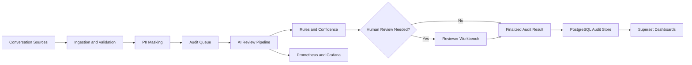
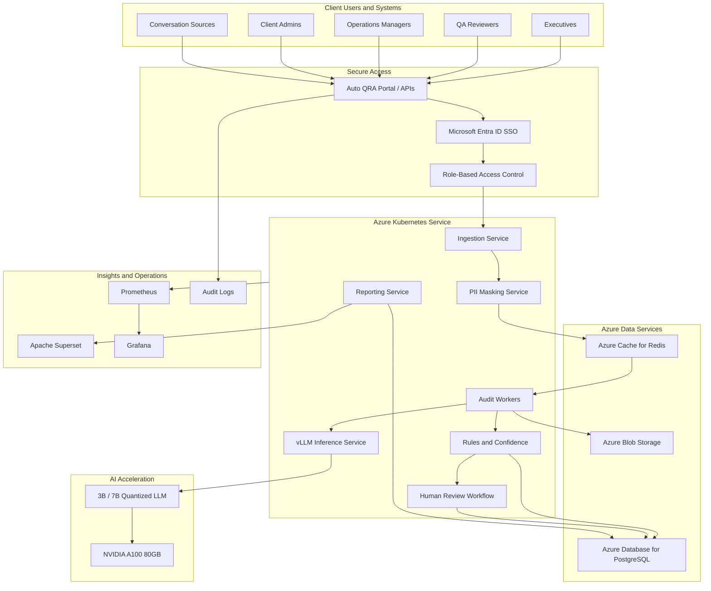
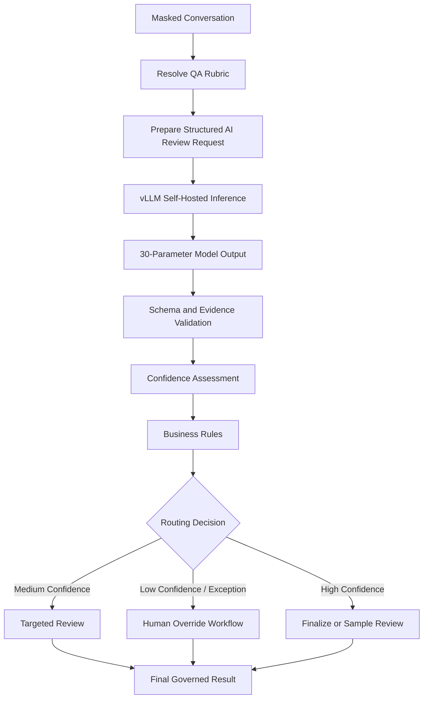
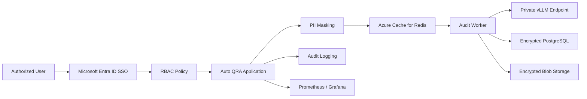
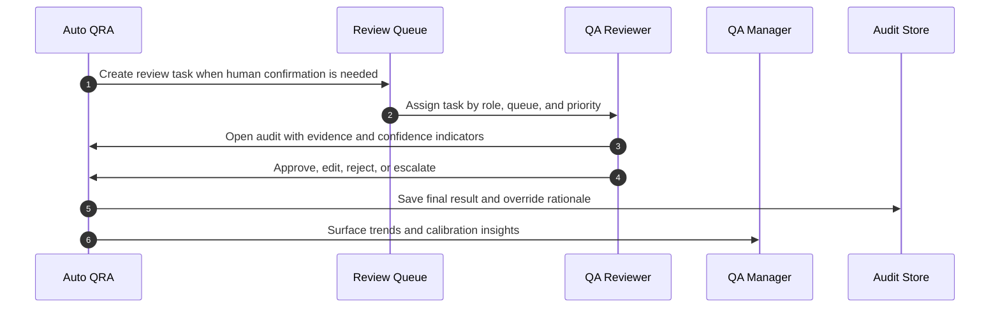
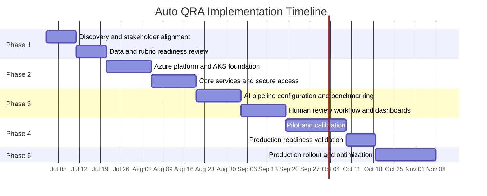
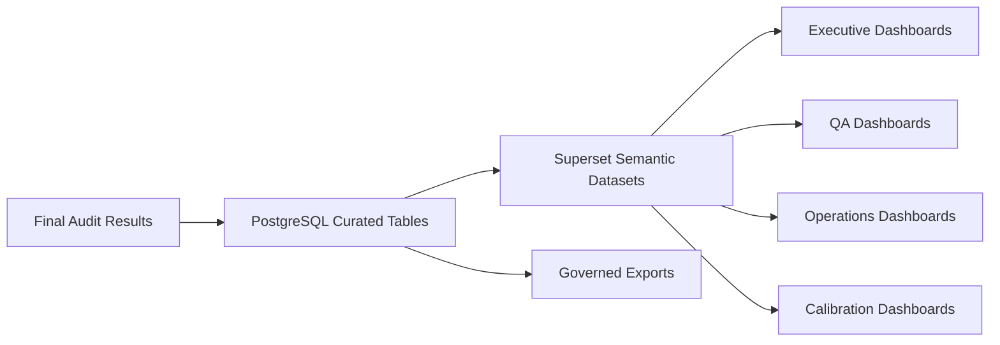

# Auto Quality Review Automation (Auto QRA)
## Client Solution Overview

---

## 1. Cover / Document Information

| Field | Value |
| --- | --- |
| Document Title | Auto Quality Review Automation (Auto QRA) - Solution Overview |
| Document Type | Client Facing Solution Design |
| Version | 1.0 |
| Date | July 2026 |
| Prepared For | Client Executives, IT, Operations, QA, and Business Stakeholders |
| Platform Name | Auto Quality Review Automation (Auto QRA) |
| Target Cloud | Microsoft Azure |
| Container Platform | Azure Kubernetes Service (AKS) |
| AI Inference | Self-hosted LLM via vLLM |
| GPU Acceleration | NVIDIA A100 80GB |
| Reporting | Apache Superset dashboards |
| Monitoring | Prometheus and Grafana |

### Purpose

This document describes the proposed solution design for Auto Quality Review Automation (Auto QRA), an AI-powered platform for auditing customer conversations with human oversight and governed override. It is written for client executives, client IT teams, operations leaders, QA managers, business stakeholders, and implementation sponsors who need a clear understanding of business value, solution capabilities, architecture, operating model, implementation approach, and service expectations.

### Description

Auto QRA is designed to help organizations review customer conversations at scale, apply a consistent 30-parameter quality rubric, produce structured audit results, and preserve human judgment through an override workflow. The platform is deployed on Microsoft Azure using AKS, Azure Database for PostgreSQL, Azure Cache for Redis, Azure Blob Storage, Apache Superset, Prometheus, Grafana, Microsoft Entra ID SSO, RBAC, encryption, PII masking, and audit logging.

This solution overview presents the design at a business and technology level suitable for stakeholder alignment, delivery planning, and client review. It avoids implementation secrets, sensitive prompt details, and delivery-sensitive commentary. Where technical specifics are included, they are limited to the information needed for informed decision-making and responsible operation.

---

## 2. Executive Summary

### Purpose

Auto QRA addresses the need for faster, broader, and more consistent quality review across customer conversations. It uses AI to perform first-pass audit analysis while keeping human reviewers in control for exceptions, low-confidence results, calibration, and business judgment.

### Description

The solution processes customer conversation records, masks personally identifiable information, evaluates each interaction against 30 QA parameters, generates structured findings, calculates confidence indicators, and routes selected cases to human review. Results are stored in governed data services and surfaced through dashboards for executives, QA leaders, operations managers, and authorized reviewers.

Auto QRA is designed for approximately 60,000 audits per month with a target audit latency under 60 seconds under normal operating conditions. It uses a self-hosted LLM served through vLLM, with 3B and 7B quantized model options that can be benchmarked against the client's quality rubric and representative conversation data. The inference tier uses NVIDIA A100 80GB GPU acceleration to provide strong performance capacity for the target workload.

The platform combines AI capabilities with enterprise controls. Microsoft Entra ID enables SSO. RBAC restricts access by role and business need. PII masking reduces sensitive data exposure before inference. Encryption protects data in transit and at rest. Audit logging records key system and user actions. Prometheus and Grafana provide operational monitoring, while Apache Superset supports business reporting and insight.

### Executive Outcomes

| Outcome | How Auto QRA Supports It | Expected Business Benefit |
| --- | --- | --- |
| Expanded QA coverage | Designed for about 60,000 audits per month | More complete visibility into customer interaction quality |
| Faster review cycles | Target latency under 60 seconds | Faster coaching, escalation, and operational response |
| Consistent scoring | Versioned rubric, structured results, and deterministic controls | Reduced reviewer variation and clearer performance trends |
| Human-governed AI | Review queues, override reasons, and audit trail | Maintains accountability and stakeholder trust |
| Enterprise control | Self-hosted inference on Azure with security controls | Stronger governance over data, access, and model operation |
| Actionable reporting | Superset dashboards over curated audit results | Better insight by team, queue, channel, parameter, and trend |

---

## 3. Business Challenge

### Purpose

This section frames the business problem Auto QRA is designed to solve: quality review teams need broader coverage, faster turnaround, consistent scoring, and stronger evidence without removing human oversight.

### Description

Many quality review programs rely on manual sampling. Manual review provides valuable judgment, but it is difficult to scale economically across large conversation volumes. A 30-parameter rubric requires careful reading, evidence capture, policy interpretation, and consistent scoring. As interaction volumes grow, manual-only review can leave coverage gaps, delay coaching, and limit the ability of leaders to identify emerging service or compliance patterns.

Quality review also needs consistency. When different reviewers interpret rubric parameters differently, business reporting becomes harder to compare across teams and time periods. Delayed review cycles can reduce the effectiveness of coaching because feedback reaches agents after the customer issue has passed. Compliance-sensitive findings may also require faster identification and clearer evidence.

Auto QRA is designed as a practical response to these challenges. It performs AI-assisted first-pass review, provides evidence and confidence information, and routes cases to human reviewers when judgment or confirmation is needed. The goal is not to remove QA expertise; it is to focus human expertise where it adds the most value.

### Challenge-to-Solution Mapping

| Business Challenge | Impact | Auto QRA Response |
| --- | --- | --- |
| Limited manual sampling | Quality issues may go undetected | Scale audit throughput to the target monthly volume |
| Slow review turnaround | Coaching and remediation are delayed | Process audits with a sub-60-second target latency |
| Reviewer variation | Scores can be hard to compare | Apply a structured, versioned 30-parameter rubric |
| Manual evidence capture | Reviews take longer and may be inconsistent | Generate structured findings and supporting evidence |
| Sensitive conversation data | Data must be protected throughout processing | Use PII masking, encryption, RBAC, and audit logging |
| Need for accountability | Business decisions require human judgment | Provide human-in-the-loop override and calibration |

---

## 4. Proposed Solution

### Purpose

The proposed solution is Auto Quality Review Automation (Auto QRA), an Azure-hosted, AI-assisted quality review platform that automates first-pass audit analysis while preserving controlled human review.

### Description

Auto QRA ingests customer conversations from approved source systems, validates and normalizes the input, masks PII, places audit work into a queue, and runs the conversation through an AI review pipeline. The AI pipeline evaluates the interaction against 30 QA parameters, produces structured parameter-level outputs, and assigns confidence indicators. Deterministic business rules then enforce governed outcomes such as review routing, evidence requirements, and exception handling.

The solution is deployed as containerized services on Azure Kubernetes Service. The inference layer uses vLLM with self-hosted 3B or 7B quantized model options on NVIDIA A100 80GB GPU acceleration. Structured audit data is stored in Azure Database for PostgreSQL. Azure Cache for Redis supports queueing and responsive asynchronous processing. Azure Blob Storage stores larger artifacts such as masked transcripts, evidence payloads, model artifacts, and export files. Apache Superset provides reporting dashboards, while Prometheus and Grafana provide operational observability.

The platform is right-sized for an efficient Azure footprint while maintaining the core enterprise capabilities needed for security, scale, visibility, and responsible AI operation.

### Solution Principles

| Principle | Meaning for Auto QRA |
| --- | --- |
| Human-governed automation | AI supports review decisions; authorized humans can override outcomes |
| Evidence-led scoring | Audit findings are supported by conversation evidence and structured rationale |
| Secure by design | Identity, access, masking, encryption, and logging are embedded controls |
| Operationally measurable | Volume, latency, availability, agreement, hallucination, and override rates are tracked |
| Model-flexible | 3B and 7B quantized options can be benchmarked and governed over time |
| Business-actionable | Dashboards and workflows are designed for QA, operations, and leadership use |

---

## 5. Value Proposition & Outcomes

### Purpose

This section summarizes the business value Auto QRA is expected to deliver for executives, operations teams, QA organizations, IT, and risk stakeholders.

### Description

Auto QRA converts quality review from a capacity-limited activity into a scalable, structured, and analytics-ready operating capability. By automating the repetitive first-pass review work, the platform allows QA teams to focus on higher-value activities: exceptions, coaching insight, calibration, policy interpretation, and continuous improvement.

The value is strongest where the organization has significant conversation volume, a defined QA rubric, and a need for faster, more consistent feedback. With the target design volume of about 60,000 audits per month, Auto QRA can materially expand review coverage and improve visibility into customer experience quality.

### Business Outcomes

| Stakeholder Group | Value Delivered |
| --- | --- |
| Executive sponsors | Better visibility into quality trends, operating risk, and customer experience performance |
| QA leadership | Higher audit throughput, parameter-level insight, and calibration support |
| Operations managers | Faster identification of coaching opportunities and process gaps |
| Client IT | Azure-native deployment pattern with clear security and observability controls |
| Compliance and risk teams | Traceable review activity, evidence capture, access control, and audit logging |
| QA reviewers | AI-assisted review queue with evidence, confidence, and override workflow |

### Measurable Targets

| Metric | Target |
| --- | --- |
| Monthly audit capability | Designed for about 60,000 audits per month |
| QA parameters | 30 parameters per audit |
| Audit latency | Under 60 seconds target |
| Human agreement | Greater than 90% target |
| Hallucination rate | Less than 5% target |
| Security posture | SSO, RBAC, PII masking, encryption, and audit logging |
| Reporting | Superset dashboards for business and operational insight |
| Monitoring | Prometheus and Grafana for health, latency, and capacity |

---

## 6. Solution Capabilities

### Purpose

This section describes the capabilities included in the Auto QRA solution in terms that business, technology, and operations stakeholders can align on.

### Description

Auto QRA provides a complete quality review automation workflow from conversation intake through reporting. It is not only an inference service; it includes workflow orchestration, data controls, reviewer actions, dashboards, and operational monitoring.

| Capability | Description | Business Benefit |
| --- | --- | --- |
| Conversation ingestion | Receives approved conversation records through integrations, APIs, or batch processes | Connects QA automation to existing operational data |
| Input validation | Confirms required fields, source eligibility, and processing readiness | Reduces avoidable failures and improves data quality |
| PII masking | Masks sensitive data before LLM processing | Supports privacy and responsible AI operation |
| AI audit execution | Reviews conversations against 30 QA parameters using a self-hosted LLM | Provides scalable first-pass review |
| Confidence indicators | Assesses reliability signals for model output and evidence completeness | Routes uncertain cases to human reviewers |
| Human override | Enables authorized reviewers to approve, edit, reject, or escalate audit outcomes | Preserves accountable decision-making |
| Audit trail | Records key system events, model versions, reviewer actions, and override reasons | Supports traceability and governance |
| Reporting dashboards | Provides executive, QA, operations, and trend dashboards through Superset | Turns audit results into actionable insight |
| Monitoring | Tracks service health, queue depth, latency, throughput, and GPU performance | Supports reliable operations |
| Role-based access | Uses Microsoft Entra ID SSO and RBAC | Ensures users see and do only what they are authorized to access |

### Capability Flow

---

## 7. Solution Architecture

### Purpose

This section provides a client-friendly architecture view of Auto QRA, showing how user access, application services, AI inference, data services, reporting, and monitoring work together on Azure.

### Description

The solution is structured in layers. Users access the platform through SSO-protected application interfaces. Application services run on AKS and handle ingestion, workflow, review, reporting, rules, and administrative functions. AI inference is self-hosted through vLLM on NVIDIA A100 80GB GPU acceleration. Data services use Azure Database for PostgreSQL, Azure Cache for Redis, and Azure Blob Storage. Observability is provided by Prometheus and Grafana, and business dashboards are delivered through Apache Superset.

### Architecture Notes

| Layer | Role in the Solution |
| --- | --- |
| Access layer | Authenticates users and applies authorization policies |
| Application layer | Orchestrates audit work, review actions, business rules, and reporting APIs |
| AI layer | Performs language understanding and rubric-based review assistance |
| Data layer | Stores workflow state, results, queue messages, and artifacts |
| Insights layer | Provides dashboards, operational monitoring, and audit evidence |
| Security layer | Applies SSO, RBAC, PII masking, encryption, and audit logging throughout the platform |

---

## 8. AI Review Approach

### Purpose

This section explains how Auto QRA applies AI to the quality review process without exposing proprietary prompt content or implementation-sensitive details.

### Description

Auto QRA evaluates each conversation against a client-approved 30-parameter QA rubric. The AI pipeline uses masked conversation evidence, active rubric definitions, approved policy context where applicable, and structured output requirements. The model returns parameter-level findings, evidence references, rationale, uncertainty indicators, and suggested review outcomes. The platform then validates and governs the result through deterministic rules and confidence assessment.

The system supports 3B and 7B quantized model options served through vLLM. Model selection is expected to be validated using representative client data, agreed quality metrics, and target latency. The solution targets greater than 90% human agreement and less than 5% hallucination rate through evaluation, calibration, evidence requirements, and human override.

### AI Review Flow

### Confidence and Human Override

Confidence is used as a routing signal, not as a substitute for business judgment. It considers structured-output quality, completeness of all 30 parameters, evidence support, policy context availability, data completeness, and alignment with deterministic rules. Results that are low confidence, compliance-sensitive, incomplete, or disputed are routed to human review.

| Confidence Band | Typical Meaning | Workflow Treatment |
| --- | --- | --- |
| High | Output is complete, evidence-supported, and rule-aligned | Eligible for finalization or sampling |
| Medium | Output is usable but requires targeted confirmation | Routed to selected human review |
| Low | Output has uncertainty, missing evidence, or disagreement signals | Human review required |
| Exception | Processing, data, privacy, or policy issue prevents reliable automation | Routed to exception handling |

### Human Review Actions

| Reviewer Action | Description |
| --- | --- |
| Approve | Accept the AI-assisted result as the governed audit outcome |
| Edit | Adjust parameter outcomes or comments according to policy |
| Reject | Reject the AI recommendation and provide a reason |
| Escalate | Send the case to a senior reviewer or specialized queue |
| Request information | Hold the result pending additional data or clarification |

---

## 9. Security & Compliance Posture

### Purpose

This section summarizes the security and compliance controls designed into Auto QRA. The goal is to protect sensitive data, restrict access, support auditability, and enable responsible AI operation.

### Description

Auto QRA uses a layered security model. Users authenticate through Microsoft Entra ID SSO. RBAC governs access to dashboards, audit records, review workflows, administration, and reporting. PII masking is applied before model inference to reduce exposure of sensitive information. Data is encrypted in transit and at rest. Audit logs record important system events, user actions, reviewer decisions, and administrative changes.

The solution is designed for a resilient Azure architecture with defined recovery procedures at a high level. Azure services provide durable storage, managed data capabilities, secure identity integration, and operational observability.

### Security Architecture

### Control Summary

| Control Area | Auto QRA Approach |
| --- | --- |
| Authentication | Microsoft Entra ID SSO |
| Authorization | RBAC by role, function, and approved access scope |
| Data protection | PII masking before inference, encryption in transit and at rest |
| Model access | Self-hosted vLLM endpoint within controlled Azure infrastructure |
| Auditability | Audit logs for key workflow, user, and administrative actions |
| Monitoring | Prometheus and Grafana for platform health and operational events |
| Reporting access | Superset access governed by user role and dashboard permissions |
| Recovery posture | Resilient Azure architecture with defined recovery procedures |

---

## 10. Operating Model

### Purpose

This section explains how client teams operate and govern Auto QRA after implementation.

### Description

Auto QRA is most effective when it is embedded into a clear operating model. QA reviewers use the platform to review AI-assisted results, validate evidence, and apply human overrides. Operations leaders use dashboards to understand trends, coaching opportunities, and service quality. Administrators manage users, roles, configurations, approved rubric changes, and operational settings. IT and support teams monitor platform health and coordinate issue resolution.

### Operating Roles

| Role | Responsibilities |
| --- | --- |
| Client QA reviewers | Review assigned audits, validate evidence, approve or override results, provide reason codes |
| Client QA managers | Monitor audit trends, manage calibration, review override patterns, support coaching actions |
| Client operations leaders | Use dashboards to identify service quality patterns and operational opportunities |
| Client admins | Manage user access, role assignment, approved configuration, and business settings |
| Client IT / platform teams | Support identity integration, network access, environment governance, and operational monitoring |
| Delivery team | Configure, implement, integrate, test, and support knowledge transfer |

### Review Workflow

### Operating Cadence

| Cadence | Activity | Participants |
| --- | --- | --- |
| Daily | Review queue health, exceptions, and audit completion | QA operations, support |
| Weekly | Review parameter trends, overrides, and coaching insights | QA managers, operations leaders |
| Monthly | Review quality targets, agreement, hallucination, service levels, and adoption | Steering stakeholders |
| Quarterly | Review access, rubric effectiveness, model performance, and roadmap priorities | Client governance and delivery leadership |

---

## 11. Implementation Approach & Timeline

### Purpose

This section presents a practical implementation approach that moves from alignment and design into build, pilot, production readiness, and scaled operation.

### Description

Auto QRA should be implemented through controlled phases. Each phase produces measurable outputs and decision points. The approach begins with business alignment and data readiness, then moves through solution configuration, integration, AI evaluation, human workflow validation, dashboard development, security validation, pilot operation, and production scale-up.

### Timeline View

### Phase Summary

| Phase | Focus | Key Outputs |
| --- | --- | --- |
| 1. Discovery and alignment | Confirm business objectives, source systems, rubric, and success metrics | Signed-off scope, data readiness plan, stakeholder map |
| 2. Platform foundation | Establish Azure services, AKS, identity, network, storage, and monitoring | Secure technical foundation |
| 3. Core workflow build | Implement ingestion, masking, queueing, AI review, rules, persistence, and review workflow | End-to-end audit execution |
| 4. Reporting and calibration | Build Superset dashboards, validate agreement and hallucination metrics, tune thresholds | Pilot-ready operating model |
| 5. Pilot and production readiness | Run controlled pilot, validate security, performance, and user workflow | Go-live recommendation |
| 6. Production rollout | Scale to target workloads and operational cadence | Production operations and continuous improvement |

---

## 12. Service Levels & Quality Targets

### Purpose

This section defines the service and quality targets used to evaluate Auto QRA performance and readiness.

### Description

Auto QRA has both technical service levels and AI quality targets. Technical service levels focus on availability, latency, audit completion, data durability, and operational visibility. AI quality targets focus on agreement with human review, hallucination control, structured output reliability, and review workflow effectiveness.

### Target Summary

| Category | Target |
| --- | --- |
| Monthly volume | Designed for about 60,000 audits per month |
| QA coverage | 30 parameters per audit |
| Latency | Under 60 seconds target |
| Human agreement | Greater than 90% target |
| Hallucination rate | Less than 5% target |
| Security | SSO, RBAC, PII masking, encryption, and audit logging |
| Monitoring | Prometheus and Grafana dashboards |
| Reporting | Apache Superset business dashboards |
| Recovery posture | Resilient Azure architecture with defined recovery procedures |

### Measurement Approach

| Metric | Measurement Method | Review Cadence |
| --- | --- | --- |
| Completed audits | Count finalized audit records in PostgreSQL | Daily and monthly |
| Audit latency | Measure end-to-end workflow timing | Daily during pilot; ongoing in production |
| Human agreement | Compare AI-assisted results against calibrated human review sample | Weekly during pilot; monthly after stabilization |
| Hallucination rate | Review unsupported or incorrect evidence claims in sampled results | Weekly during pilot; monthly after stabilization |
| Override rate | Track human edits, rejections, and reason codes | Weekly and monthly |
| Queue health | Monitor queue depth and age in Redis | Continuous |
| Service health | Monitor APIs, workers, vLLM, PostgreSQL, Redis, and storage | Continuous |

---

## 13. Reporting & Insights

### Purpose

This section describes the reporting and analytics capabilities delivered through Apache Superset and governed data views.

### Description

Auto QRA reporting turns completed audit results into business insight. Dashboards are designed for executive visibility, QA management, operations improvement, calibration, and platform monitoring. Superset reads curated datasets derived from PostgreSQL audit records and authorized artifacts. Dashboard access is governed by role and business need.

### Dashboard Set

| Dashboard | Audience | Key Questions Answered |
| --- | --- | --- |
| Executive overview | Executives and sponsors | Are volume, quality, latency, and trends on target? |
| QA performance | QA managers | Which parameters, teams, or queues need attention? |
| Operations insights | Operations leaders | What service behaviors, topics, or processes are driving quality issues? |
| Calibration and overrides | QA governance | Where does AI differ from human reviewers and why? |
| Compliance-sensitive findings | Compliance and risk stakeholders | Which findings require attention or evidence review? |
| Platform health | IT and support teams | Are queues, services, data stores, and inference components operating normally? |

### Example Insight Dimensions

| Dimension | Example Use |
| --- | --- |
| Time period | Trend quality scores by day, week, or month |
| Team or queue | Compare quality patterns across operational groups |
| QA parameter | Identify recurring weaknesses in the 30-parameter rubric |
| Confidence band | Understand how many audits require human review |
| Override reason | Improve prompts, rubric definitions, or reviewer guidance |
| Channel | Compare quality results across voice, chat, or other supported sources |
| Agent or supervisor grouping | Support coaching and operational improvement where approved |

### Reporting Flow

---

## 14. Responsibilities

### Purpose

This section provides a professional RACI-style view of responsibilities across the client team and delivery team.

### Description

Successful delivery requires clear ownership across business, operations, IT, security, QA, and implementation teams. The client provides business direction, data access, source system knowledge, user representatives, security requirements, and acceptance decisions. The delivery team provides solution design, configuration, build, integration, testing, documentation, and knowledge transfer.

### RACI-Style Responsibility Matrix

| Activity | Client Business | Client QA / Ops | Client IT / Security | Delivery Team |
| --- | --- | --- | --- | --- |
| Business objectives and success metrics | A/R | C | C | C |
| QA rubric definition and approval | C | A/R | C | C |
| Source data access and validation | C | R | A/R | C |
| Azure environment readiness | I | C | A/R | C |
| Solution architecture and configuration | C | C | C | A/R |
| SSO and RBAC integration | C | C | A/R | R |
| PII masking requirements | C | C | A/R | R |
| AI model benchmarking | C | R | C | A/R |
| Human review workflow design | C | A/R | C | R |
| Dashboard requirements | C | A/R | C | R |
| Security review and approval | C | C | A/R | R |
| Pilot execution | C | A/R | R | R |
| Production readiness decision | A/R | C | C | C |
| Training and knowledge transfer | C | R | C | A/R |

Legend: A = Accountable, R = Responsible, C = Consulted, I = Informed.

---

## 15. Assumptions

### Purpose

This section lists planning assumptions that should be validated during discovery and implementation.

### Description

The solution design assumes that representative customer conversation data, current QA rubric definitions, expected metadata, and appropriate stakeholder availability will be provided for discovery, configuration, benchmarking, and pilot validation. It also assumes the client will support Microsoft Azure deployment, Microsoft Entra ID SSO integration, and the required security and network approvals.

### Assumption Register

| ID | Assumption | Validation Method |
| --- | --- | --- |
| A1 | The client can provide representative conversation samples for benchmarking and pilot testing | Data readiness review |
| A2 | The 30-parameter QA rubric is approved and sufficiently defined for automation | Rubric workshop and sign-off |
| A3 | Microsoft Azure is approved for the target deployment | Client IT and cloud governance confirmation |
| A4 | Microsoft Entra ID is available for SSO integration | Identity integration review |
| A5 | PII masking can be applied before model inference while preserving review usefulness | Masking validation and QA sample review |
| A6 | Client reviewers will participate in calibration and pilot review | Operating model planning |
| A7 | Source systems can provide required metadata and conversation content | Integration assessment |
| A8 | Superset dashboards can be made available to authorized users | Reporting and access review |
| A9 | The selected 3B or 7B quantized model option will be validated against quality and latency targets | Benchmarking and pilot measurement |

---

## 16. Next Steps

### Purpose

This section outlines recommended actions to move Auto QRA from solution overview into implementation planning.

### Description

The next steps focus on confirming business scope, validating data readiness, preparing the Azure platform, configuring AI review logic, and establishing pilot success criteria. These steps should be completed collaboratively between client stakeholders and the delivery team.

### Recommended Next Steps

| Step | Action | Outcome |
| --- | --- | --- |
| 1 | Confirm executive sponsor, business owner, and operational owner | Clear governance and decision paths |
| 2 | Validate source systems, data availability, and transcript quality | Confirm input readiness |
| 3 | Review and approve the 30-parameter QA rubric | Establish automation baseline |
| 4 | Confirm Azure environment, networking, identity, and security requirements | Prepare technical foundation |
| 5 | Define pilot population, success metrics, and review process | Establish measurable pilot plan |
| 6 | Benchmark 3B and 7B quantized model options on representative data | Select right-sized model path |
| 7 | Configure dashboards, monitoring, and support procedures | Prepare operational visibility |
| 8 | Conduct pilot, calibration, and production readiness review | Make informed rollout decision |

### Decision Checklist

| Decision | Required Input |
| --- | --- |
| Pilot scope | Source systems, queues, channels, users, and rubric |
| Model option | Agreement, hallucination, latency, and throughput benchmark evidence |
| Review thresholds | Confidence bands, compliance routing, and sampling policy |
| Reporting launch set | Executive, QA, operations, calibration, and platform dashboards |
| Production rollout | Pilot outcomes, security approval, service readiness, and user training |

---

## 17. Appendix: Glossary

| Term | Definition |
| --- | --- |
| Auto QRA | Auto Quality Review Automation, the AI-powered quality audit platform described in this document |
| AI-assisted review | A review process where AI generates structured recommendations and humans retain override authority |
| AKS | Azure Kubernetes Service, the managed Kubernetes platform used to run containerized workloads |
| Azure Blob Storage | Azure object storage used for artifacts, masked transcripts, exports, and model-related files |
| Azure Cache for Redis | Managed Redis service used for queues, caching, and workflow coordination |
| Azure Database for PostgreSQL | Managed PostgreSQL database used for audit workflow state, results, and reporting data |
| Confidence indicator | A signal used to assess whether an AI-generated audit result should be finalized, sampled, or reviewed |
| Entra ID | Microsoft Entra ID, used for single sign-on and identity management |
| Hallucination | An unsupported or incorrect AI-generated claim that is not grounded in the conversation evidence |
| Human override | A governed workflow that allows an authorized reviewer to approve, edit, reject, or escalate AI-assisted results |
| LLM | Large language model, used by Auto QRA to interpret conversation content and apply review criteria |
| PII | Personally identifiable information, such as names, phone numbers, emails, and account identifiers |
| PII masking | The process of replacing or obscuring sensitive fields before AI processing |
| Prometheus | Monitoring system used to collect operational metrics |
| Grafana | Dashboarding tool used to visualize metrics, service health, and operational status |
| RBAC | Role-based access control, used to restrict actions and views based on assigned roles |
| Superset | Apache Superset, used to create business reporting dashboards |
| vLLM | High-performance LLM serving framework used for self-hosted model inference |
| 3B / 7B quantized model | Model options with approximately 3 billion or 7 billion parameters, optimized through quantization for efficient inference |
| NVIDIA A100 80GB | GPU acceleration used by the Auto QRA inference tier |

---

## Closing Note

Auto QRA provides a secure, scalable, and human-governed approach to quality review automation. It is designed to help the client expand audit coverage, improve consistency, accelerate operational feedback, and maintain responsible control over AI-assisted outcomes within a modern Microsoft Azure architecture.
