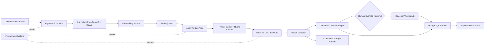
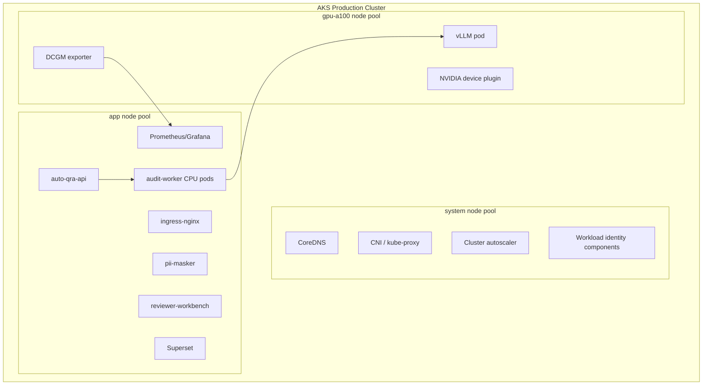
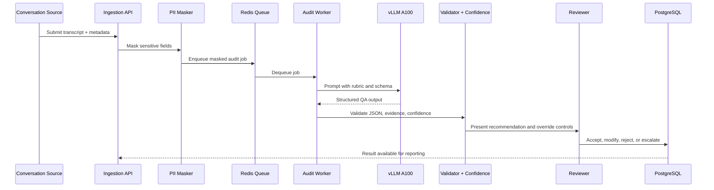
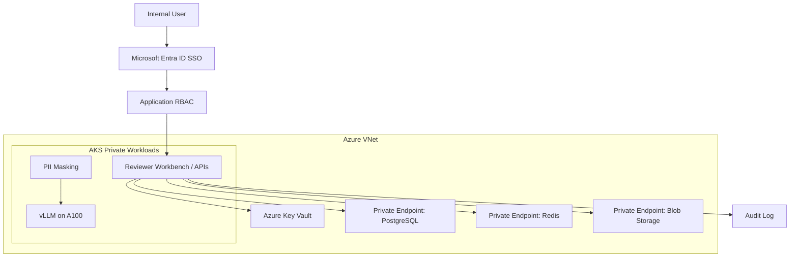
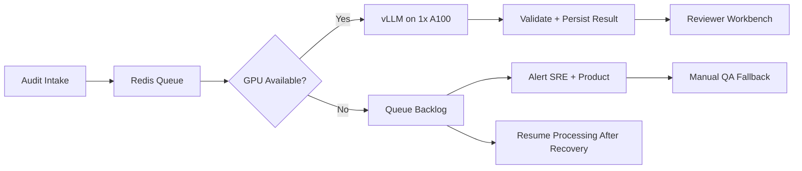
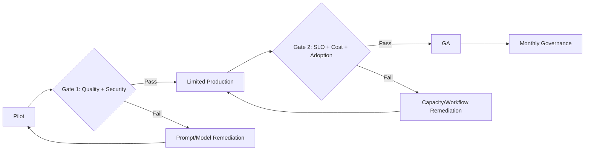
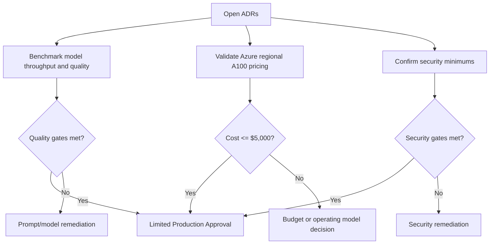

# Auto QRA - Internal Product and Technical Design

## 1. Document Control (Internal v1.2, Confidential Internal)

### Purpose

This document defines the internal product, architecture, operating, security, AI/ML, DevOps, and cost design for Auto Quality Review Automation (Auto QRA) under a hard infrastructure budget ceiling of USD $5,000 per month. It is written for internal leadership, engineering, AI/ML, DevOps, security, and finance stakeholders who need a realistic production design rather than an aspirational reference architecture.

### Description

Auto QRA automates first-pass quality review for customer conversations using a self-hosted large language model served through vLLM on Microsoft Azure. The design evaluates approximately 60,000 audits per month, or about 2,000 audits per day, across 30 QA parameters. Each audit is planned at 3,200 tokens end to end, including transcript input, rubric context, reasoning constraints, structured scoring output, citations, and confidence metadata.

The design is intentionally budget-constrained. The locked infrastructure decision is one production NVIDIA A100 80GB GPU node on Azure Kubernetes Service (AKS). The document does not recommend dual GPU high availability because the USD $5,000 monthly cap cannot credibly fund two A100 production nodes plus managed data, observability, security, and networking services. Non-GPU services are designed to be resilient within the budget; the GPU inference layer remains the primary single point of failure.

### Business Justification

The business case is to increase QA coverage, reduce repetitive manual review, improve scoring consistency, and accelerate coaching feedback while preserving human accountability. The design also supports data control through Azure-native security, private networking, PII masking, encryption, audit logs, and role-based access control.

The business tradeoff is explicit: Auto QRA can meet the target monthly volume and latency goals on a single A100 if workload assumptions and batching performance hold, but it cannot provide full N+1 GPU resiliency under the stated budget. This is a finance and risk decision, not an engineering preference.

### Technical Details

| Field | Value |
| --- | --- |
| Document title | Auto QRA - Internal Product and Technical Design |
| Version | Internal v1.2 |
| Classification | Confidential Internal |
| Status | Budget-constrained architecture baseline |
| Date | July 2026 |
| Cloud | Microsoft Azure |
| Orchestration | Azure Kubernetes Service (AKS) |
| GPU | NVIDIA A100 80GB only |
| Inference | Self-hosted vLLM |
| Model class | 3B or 7B quantized |
| Monthly infrastructure budget | USD $5,000 hard ceiling |
| Volume | 60,000 audits/month; about 2,000/day |
| Token plan | 3,200 tokens/audit |
| QA rubric | 30 parameters |
| Latency target | <60 seconds end to end |
| Quality targets | >90% human agreement; <5% hallucination |
| Human override | Required for production workflow |
| Availability posture | Budget-constrained; target 99.5% service availability |

### Best Practices

| Practice | Application to Auto QRA |
| --- | --- |
| Use locked design assumptions consistently | All cost, capacity, and architecture decisions assume Azure, AKS, A100 80GB, and vLLM. |
| Separate product automation from final accountability | Auto QRA produces structured recommendations; human reviewers retain override authority. |
| Tie cost decisions to architecture decisions | The $5,000 cap directly constrains HA, node count, log retention, and managed service tiers. |
| Use measurable AI gates | Model selection, prompt releases, and automation thresholds require agreement and hallucination evidence. |

### Risks

| Risk | Impact | Current position |
| --- | --- | --- |
| Single production GPU | Inference unavailable during GPU node failure, maintenance, quota issue, or driver issue | Accepted within budget; documented as explicit risk |
| Regional A100 pricing variation | Selected Azure region may exceed envelope | Finance must validate final regional pricing before go-live |
| Quality drift | Human agreement or hallucination target may degrade after rollout | Continuous evaluation and human override required |
| Underestimated operations cost | Logging, egress, and support tooling can exceed plan | Lean observability and monthly FinOps review required |

### Recommendations

| Recommendation | Owner | Timing |
| --- | --- | --- |
| Approve this document as the internal budget-constrained baseline | Leadership | Before pilot funding |
| Validate A100 quota, region, and reservation economics | Infrastructure and Finance | Before production commitment |
| Run a benchmark sprint on target model candidates | AI/ML and Platform | Pilot entry |
| Treat 99.5% as the funded production service availability target | Product and SRE | Architecture approval |

## 2. Executive Summary (include budget & A100 decisions)

### Purpose

This section summarizes the product direction, core architecture, budget posture, and leadership decisions required for Auto QRA.

### Description

Auto QRA is an internal enterprise AI platform that performs automated quality audits of customer conversations. It evaluates each conversation against a 30-parameter rubric, produces structured scores and evidence, assigns confidence, escalates uncertain or risky cases, and records all decisions for human review and auditability.

The architecture is Azure-native and Kubernetes-based. Application services run on AKS. PostgreSQL stores audit metadata and structured results. Redis supports queues, cache, and rate control. Azure Blob Storage stores masked artifacts, exports, and longer-lived evidence. Superset provides business reporting. Prometheus and Grafana provide operational observability. Entra ID provides SSO. RBAC, PII masking, encryption, and audit logging are mandatory controls.

The inference layer is self-hosted vLLM running a quantized 3B or 7B model on exactly one NVIDIA A100 80GB production GPU node. The A100-only decision is locked. The monthly infrastructure budget is capped at USD $5,000. Under that cap, the recommended design cannot include a second production A100 for N+1 high availability. The production architecture is therefore best described as budget-constrained resilient service design, not fully highly available inference design.

### Business Justification

Manual QA programs often audit only a small sample of interactions because each review is labor-intensive. At 60,000 audits per month, Auto QRA enables broader coverage, faster coaching, more consistent scoring, and better trend analytics. The value is not only labor leverage; it is also the ability to detect recurring quality issues earlier and support supervisors with structured evidence.

The strongest business argument for the constrained design is that it delivers a production-capable first-pass automation platform inside a defined budget. The strongest business risk is that availability is intentionally lower than a fully redundant design. Leadership should approve this design only with clear understanding that the GPU layer is a single point of failure.

### Technical Details

| Decision area | Approved direction | Executive implication |
| --- | --- | --- |
| Cloud | Microsoft Azure | Aligns with enterprise identity, networking, security, and procurement |
| Orchestration | AKS | Standard Kubernetes deployment and operations model |
| GPU | 1x NVIDIA A100 80GB production node | Meets capacity target but does not provide GPU HA |
| Model serving | Self-hosted vLLM | Data stays under internal control; requires ML platform operations |
| Model size | 3B or 7B quantized | Benchmark controls final selection |
| Budget | USD $5,000/month hard ceiling | Forces lean managed services and single GPU |
| Availability posture | Target 99.5% service availability | Best effort toward 99.9% only for non-GPU layers |
| Human override | Mandatory | Automation supports decisions; humans can correct outcomes |
| Security | Entra ID, RBAC, PII masking, encryption, audit logs | Enterprise control baseline |

### Best Practices

| Executive practice | Implementation |
| --- | --- |
| Approve constraints explicitly | Record the $5,000 cap, one-A100 design, and availability tradeoff in ADRs. |
| Govern AI with measurable gates | Move from pilot to GA only when human agreement and hallucination targets are met. |
| Require financial telemetry | Track cost per audit, GPU utilization, and monthly spend from day one. |
| Preserve human accountability | Require review queues, override reasons, and reviewer attestation. |

### Risks

| Risk | Executive concern | Mitigation |
| --- | --- | --- |
| A100 outage | Production audit automation pauses | Queue audits, fall back to manual QA, repair or replace GPU node |
| Budget pressure | Cost may exceed cap in higher-cost Azure regions | Validate regional pricing and use reservation/savings plan economics |
| Model underperformance | Quality targets may not be reached | Benchmark 3B and 7B quantized models before GA |
| User trust | Reviewers may reject automation if explanations are weak | Require citations, confidence, and override workflows |

### Recommendations

Leadership should approve the design as a cost-contained production baseline for pilot and limited production, not as a premium HA architecture. The go/no-go decision for GA should be based on measured latency, quality, cost, operational stability, and review team adoption. If leadership later requires 99.9% end-to-end availability including inference, the budget must be reopened for a second A100 production node and related capacity.

## 3. Locked Decisions / ADR Summary table (model, prompt, automation threshold, infra class, GPU=A100, budget=$5k)

### Purpose

This section records the locked decisions and open architecture decision records that govern the design.

### Description

The following ADR summary is the control plane for the document. Any future proposal that changes cloud, orchestration, GPU class, budget, inference hosting, human override, or security baseline must be treated as a formal ADR change, not an implementation detail.

### Business Justification

The program involves many stakeholder groups. A clear decision table prevents architecture drift, inconsistent financial assumptions, and accidental expansion beyond budget. It also gives finance and leadership a common reference for tradeoffs.

### Technical Details

| ADR ID | Topic | Locked / proposed decision | Status | Rationale | Change authority |
| --- | --- | --- | --- | --- | --- |
| ADR-001 | Cloud | Microsoft Azure | Locked | Aligns with enterprise identity, networking, security, and procurement | CIO / Architecture |
| ADR-002 | Orchestration | Azure Kubernetes Service | Locked | Required for containerized app, vLLM, GPU scheduling, and operational consistency | Platform Architecture |
| ADR-003 | GPU | NVIDIA A100 80GB only; 1x production node under $5k | Locked | Provides 80GB memory for 3B/7B quantized inference and batching | Leadership / Finance |
| ADR-004 | Budget | USD $5,000/month infrastructure hard ceiling | Locked | Program funding constraint | Finance / Sponsor |
| ADR-005 | Inference | Self-hosted vLLM | Locked | Data control, predictable serving, no third-party model API dependency | AI/ML Architecture |
| ADR-006 | Model | 3B or 7B quantized | Locked range; final model open | A100 can handle both; final choice depends on quality and throughput | AI/ML |
| ADR-007 | Prompt | Rubric-grounded structured prompt with JSON schema output | Proposed | Improves explainability and validation | AI/ML + Product |
| ADR-008 | Automation threshold | High-confidence recommendation only; human override required | Locked | Controls quality risk and preserves accountability | Product + QA |
| ADR-009 | Infrastructure class | Budget-constrained production, not full HA inference | Locked | Dual A100 HA cannot fit $5k | Leadership / Finance |
| ADR-010 | Availability | 99.5% service target; best effort toward 99.9% non-GPU layers | Locked | Matches funded architecture | Product + SRE |
| ADR-011 | Data platform | Azure Database for PostgreSQL, Azure Cache for Redis, Azure Blob Storage | Locked | Meets data, queue, cache, and artifact requirements | Architecture |
| ADR-012 | Security baseline | Entra ID SSO, RBAC, encryption, audit logs, PII masking | Locked | Required for enterprise use | Security |

### Best Practices

| Practice | Control |
| --- | --- |
| Decision traceability | ADRs reference benchmark evidence, cost model, and risk acceptance. |
| Explicit ownership | Each locked item has an accountable business or technical owner. |
| No silent upgrades | Adding GPU HA, premium managed services, or longer log retention requires budget review. |
| Quality-linked model change | Model or prompt changes require evaluation against human agreement and hallucination gates. |

### Risks

| Risk | Consequence |
| --- | --- |
| ADR bypass | Teams may make local choices that exceed budget or weaken controls. |
| Ambiguous automation threshold | Reviewers may treat recommendations as final decisions. |
| Prompt drift | Quality metrics may become incomparable across releases. |

### Recommendations

Maintain ADRs in the repository with this document. Require architecture, finance, and security review for any change that affects cost, availability, model behavior, data exposure, or human review obligations.

## 4. Business Objectives & Success Metrics

### Purpose

This section defines the measurable business outcomes Auto QRA must deliver.

### Description

Auto QRA is intended to improve quality review coverage and consistency while reducing manual effort on routine first-pass scoring. The platform should help QA teams review more interactions, focus human attention on exceptions, and produce better analytics for supervisors and process owners.

### Business Justification

The program is justified when the cost of automation plus human review produces better coverage, faster feedback, and more consistent scoring than manual sampling alone. Success must be measured across quality, operations, adoption, and finance rather than only model accuracy.

### Technical Details

| Objective | Metric | Target | Measurement source | Gate |
| --- | --- | ---: | --- | --- |
| Increase QA coverage | Audits processed per month | 60,000 | PostgreSQL workflow tables | Limited production |
| Maintain turnaround | End-to-end audit latency | p95 <60s | Prometheus workflow metrics | Pilot and GA |
| Preserve review quality | Human agreement | >90% | Reviewer comparison sample | Pilot exit |
| Control hallucination | Unsupported finding rate | <5% | Human adjudication and eval set | Pilot exit |
| Reduce manual load | Share of audits not requiring deep manual rework | >60% after pilot | Reviewer workbench | Limited production |
| Maintain accountability | Override availability | 100% of results | Product workflow audit logs | GA |
| Control cost | Infrastructure spend | <=USD $5,000/month | Azure Cost Management | Monthly |
| Keep operations stable | Service availability | 99.5% | SLO dashboard | GA |
| Improve coaching cycle | Time from interaction to QA result | Same day | Workflow timestamps | Limited production |
| Protect sensitive data | Unmasked PII in logs/prompts | Zero known high-severity events | DLP checks and log scans | Always |

### Best Practices

| Practice | Implementation |
| --- | --- |
| Balance AI and workflow metrics | Track human agreement, hallucination, latency, and reviewer acceptance together. |
| Use stratified samples | Compare model output against humans across teams, channels, languages if applicable, and issue types. |
| Measure cost per audit | Divide monthly infrastructure cost by completed audits and trend over time. |
| Review false positives and false negatives | Quality issues should be classified by rubric category and prompt version. |

### Risks

| Risk | Business impact | Mitigation |
| --- | --- | --- |
| Automation overtrust | Incorrect recommendations may influence coaching | Human override and reviewer attestation |
| Low reviewer adoption | Benefits may not materialize | Training, transparent evidence, clear override UX |
| Hidden manual rework | Cost savings may be overstated | Measure rework time and disagreement reasons |
| Metric gaming | Teams may optimize for pass rates rather than quality | Audit sampling and governance review |

### Recommendations

Use a monthly executive scorecard with four lenses: business value, AI quality, operating health, and cost. Do not expand to GA unless the product can show both quality evidence and budget compliance for a sustained limited-production period.

## 5. Scope / Out of Scope

### Purpose

This section defines what the initial Auto QRA release will and will not deliver.

### Description

The scope is deliberately focused on first-pass quality audit automation for conversation transcripts, structured scoring, confidence, evidence, human review, reporting, and operations. It does not include broad contact center transformation or fully autonomous employment, compliance, or disciplinary decisions.

### Business Justification

A bounded scope makes the $5,000 infrastructure cap workable and reduces AI governance risk. It also allows the organization to prove value through a measurable use case before expanding into more complex workflows.

### Technical Details

| In scope | Description |
| --- | --- |
| Transcript ingestion | API or batch ingestion of conversation text and metadata |
| PII masking | Masking before prompt construction and storage of model-facing artifacts |
| 30-parameter QA rubric | Structured scoring for agreed QA parameters |
| vLLM inference | Self-hosted 3B or 7B quantized model on 1x A100 80GB |
| Confidence scoring | Composite score based on model output, rubric fit, evidence coverage, and validation |
| Human override | Reviewer can accept, modify, reject, or escalate results |
| Audit logging | Immutable record of system, model, and human decisions |
| Reporting | Superset dashboards for QA, operations, and leadership |
| Observability | Prometheus and Grafana for service and model health |
| Security | Entra ID SSO, RBAC, encryption, Key Vault, Private Link where budget permits |

| Out of scope | Reason |
| --- | --- |
| Fully autonomous final QA closure | Human override is required |
| Dual A100 production HA | Cannot fit the $5,000 monthly ceiling |
| Real-time agent assist | Latency and product workflow differ from post-interaction audit |
| Voice transcription engine | Assumes transcript text is supplied by upstream systems |
| Workforce management integration | Future phase after QA workflow proof |
| Custom model training from scratch | Too expensive and unnecessary for the first release |
| Premium enterprise SIEM ingestion at high volume | Logging must remain lean under budget |
| Multi-region active-active design | Not fundable under current budget |

### Best Practices

| Practice | Scope control |
| --- | --- |
| Keep audit automation separate from upstream transcription | Avoid coupling release dates to call recording and speech systems. |
| Treat human override as product scope | Do not defer review UX or audit logging. |
| Use the minimum managed service tier that meets risk | Upgrade only after budget approval or measured pressure. |
| Use phased rollout | Scope expands only after gates are passed. |

### Risks

| Risk | Impact |
| --- | --- |
| Scope creep into real-time use cases | GPU and latency budget may fail. |
| Attempting to absorb transcription | Adds cost, latency, and privacy complexity. |
| Deferring reviewer workflow | AI output becomes difficult to trust and govern. |

### Recommendations

Approve the first release as post-interaction QA automation with mandatory human override. Treat adjacent use cases as backlog candidates that require separate cost and risk analysis.

## 6. Solution Architecture (Azure/AKS/A100) + Mermaid

### Purpose

This section describes the end-to-end solution architecture on Azure.

### Description

Auto QRA is composed of ingestion services, security and masking services, audit workflow services, vLLM inference, storage services, review workflow, reporting, and observability. The AKS cluster is the runtime boundary for application and inference workloads. Managed Azure services provide database, cache, storage, identity, secrets, and networking capabilities.

### Business Justification

The architecture balances cost control and enterprise readiness. AKS supports GPU scheduling and standard DevOps patterns. Azure managed services reduce operational burden without requiring premium tiers. Self-hosted vLLM keeps model inference and audit data inside the enterprise environment.

### Technical Details

| Component | Azure / platform choice | Primary responsibility | Budget note |
| --- | --- | --- | --- |
| AKS | Managed Kubernetes | Runs APIs, workers, vLLM, Superset, Prometheus, Grafana | Use lean node pools |
| GPU node | 1x A100 80GB-capable node | Hosts vLLM inference | Largest cost line |
| PostgreSQL | Azure Database for PostgreSQL Flexible Server | Stores metadata, results, users, workflow state | Small/burstable tier initially |
| Redis | Azure Cache for Redis | Queue, cache, distributed locks, rate limiting | Basic or Standard tier |
| Blob Storage | Azure Blob Storage | Masked artifacts, exports, evidence bundles | Lifecycle policies required |
| Identity | Entra ID | SSO and group-based access | Existing enterprise capability |
| Secrets | Azure Key Vault | Secrets, keys, certificates | Private access where feasible |
| Networking | VNet, Private Link, ingress-nginx | Private service access and controlled ingress | Avoid premium ingress unless mandated |
| Reporting | Superset | QA and leadership dashboards | Run inside app pool |
| Observability | Prometheus/Grafana | Metrics, alerts, SLOs | Keep log ingestion lean |

### Best Practices

| Practice | Implementation |
| --- | --- |
| Isolate model serving | Use taints, tolerations, and node selectors for the A100 node. |
| Use private dependencies | Connect PostgreSQL, Redis, Blob, and Key Vault over private networking where budget and service tier allow. |
| Validate all model output | Enforce JSON schema and deterministic post-processing before persistence. |
| Store masked artifacts | Do not store raw prompt or raw transcript in model artifacts unless explicitly approved. |

### Risks

| Risk | Impact | Mitigation |
| --- | --- | --- |
| vLLM pod or GPU failure | Audit processing pauses | Queue work, alert, restart, manual fallback |
| Redis outage | Queue processing delays | Managed Redis, retry policy, idempotent jobs |
| PostgreSQL bottleneck | Result persistence delays | Connection pooling, indexes, retention |
| Blob growth | Cost pressure | Lifecycle management and compression |

### Recommendations

Deploy a minimal but production-grade Azure architecture with one A100 inference node, small app and system node pools, and managed data services. Prove throughput and quality before increasing service tiers.

## 7. Deployment Architecture on AKS (node pools: system, app, gpu-a100) + Mermaid

### Purpose

This section defines the AKS deployment topology and node pool design.

### Description

The AKS cluster uses three logical node pools: system, app, and gpu-a100. The system pool hosts Kubernetes system services and core controllers. The app pool hosts APIs, workers that do not require GPU, Superset, observability components, ingress-nginx, and scheduled jobs. The gpu-a100 pool contains exactly one A100 80GB production GPU node dedicated to vLLM.

### Business Justification

Separating node pools improves operational control without adding unnecessary compute cost. The design protects the GPU from unrelated workloads and keeps smaller services on lower-cost CPU nodes. It also makes the budget tradeoff visible: only the GPU node is expensive enough to prevent N+1 under the cap.

### Technical Details

| Node pool | Minimum count | Maximum count | Workload | Sizing posture | Notes |
| --- | ---: | ---: | --- | --- | --- |
| system | 2 | 2 | Kubernetes system pods | Small general purpose | Keeps cluster stable during app changes |
| app | 2 | 3 | APIs, CPU workers, UI, Superset, monitoring | Small general purpose, autoscale if needed | Scale only when queue or CPU pressure proves need |
| gpu-a100 | 1 | 1 | vLLM inference | A100 80GB-capable Azure VM | No N+1; single point of failure |

| Kubernetes control | Decision |
| --- | --- |
| Namespace strategy | `auto-qra-prod`, `observability`, `ingress`, `security` |
| GPU isolation | Taints and tolerations on `gpu-a100`; no non-vLLM workloads |
| Pod disruption budgets | Required for API, worker, workbench, Superset, Prometheus; vLLM PDB is best effort because only one replica exists |
| Horizontal scaling | APIs and CPU workers can scale; vLLM remains one replica |
| Deployment method | Helm or Kustomize through CI/CD |
| Secrets | Azure Key Vault via Workload Identity and CSI driver |
| Image source | Azure Container Registry Basic |

### Best Practices

| Practice | Implementation |
| --- | --- |
| Pin GPU workloads | Use node selectors and tolerations for vLLM. |
| Set resource requests | Reserve CPU and memory to avoid noisy-neighbor failures. |
| Use readiness probes | Prevent traffic to pods that cannot serve or validate dependencies. |
| Keep app pods stateless | Persist state in PostgreSQL, Redis, or Blob Storage. |
| Control rollouts | Use canary or blue-green for APIs; use benchmarked rolling process for vLLM. |

### Risks

| Risk | Impact | Mitigation |
| --- | --- | --- |
| GPU driver mismatch | vLLM fails to start | Pin NVIDIA device plugin, CUDA image, and tested vLLM image |
| Node pressure on app pool | API or worker latency increases | Autoscale app pool within budget buffer |
| Prometheus disk growth | Storage and node pressure | Short retention, remote export only if funded |
| Single vLLM pod | No zero-downtime model restart | Schedule maintenance windows and queue work |

### Recommendations

Use a private or restricted AKS cluster with three node pools exactly as described. Keep gpu-a100 count at one unless the monthly budget is formally increased.

## 8. AI Pipeline & Confidence / Human Override

### Purpose

This section defines how Auto QRA converts conversations into governed QA recommendations.

### Description

The AI pipeline masks PII, builds a rubric-grounded prompt, calls vLLM, validates structured output, scores confidence, applies business rules, and sends all results through a human override-capable workflow. The system never treats model output as inherently final. Human reviewers can override scores and must provide reason codes for changes.

### Business Justification

The product succeeds only if review teams trust the output. Trust requires evidence, confidence, escalation, and the ability to correct the system. Human override also reduces legal, compliance, and employee-relations risk by preventing the model from becoming an unreviewed decision-maker.

### Technical Details

| Pipeline stage | Function | Control |
| --- | --- | --- |
| Intake | Validate source, tenant, required metadata | Schema validation and RBAC |
| PII masking | Redact names, account numbers, emails, phone numbers, addresses, protected identifiers | Masking version logged |
| Prompt construction | Combine transcript, QA rubric, scoring rules, examples, and output schema | Prompt version controlled |
| Inference | Generate structured scores and evidence through vLLM | A100 GPU metrics and timeouts |
| Output validation | Enforce JSON schema, required fields, score ranges, evidence references | Invalid outputs retried or escalated |
| Confidence scoring | Combine model confidence, evidence coverage, rubric completeness, validation quality | Threshold controls |
| Business rules | Apply deterministic overrides, severity logic, and escalation criteria | Versioned rules |
| Human override | Reviewer accepts, edits, rejects, or escalates | Override reason required |
| Persistence | Store final score, model recommendation, reviewer action, versions, and audit trail | PostgreSQL and Blob evidence |

| Confidence band | Suggested handling | Automation status |
| --- | --- | --- |
| >=0.85 | Present as high-confidence recommendation | Human override still available and required in workflow |
| 0.70-0.84 | Send to standard reviewer queue | Not auto-accepted |
| 0.50-0.69 | Send to senior QA review | Requires explicit adjudication |
| <0.50 | Escalate as low-confidence / possible prompt failure | No automated scoring reliance |
| Any critical rule violation | Escalate regardless of score | Deterministic control |

| Quality metric | Definition | Target |
| --- | --- | ---: |
| Human agreement | Share of sampled model recommendations matching adjudicated human score within agreed tolerance | >90% |
| Hallucination rate | Share of findings with unsupported evidence or invented facts | <5% |
| Schema validity | Share of outputs passing JSON and business validation | >99% |
| Evidence coverage | Share of scored parameters with cited transcript evidence or explicit not-observed rationale | >95% |
| Override rate | Share of recommendations materially changed by reviewers | Declining trend after prompt stabilization |

### Best Practices

| Practice | Implementation |
| --- | --- |
| Use structured outputs | Require JSON schema with scores, reasons, evidence spans, and confidence. |
| Keep prompts versioned | Store prompt template, rubric version, model version, and parameter set. |
| Separate scoring from policy | Deterministic business rules should be outside the LLM when possible. |
| Sample continuously | Compare model output to human review across live production cases. |

### Risks

| Risk | Impact | Mitigation |
| --- | --- | --- |
| Hallucinated evidence | Reviewer trust and compliance risk | Evidence validation, human review, sampling |
| Overly permissive threshold | Incorrect recommendations pass too easily | Conservative thresholds and pilot gates |
| Prompt regression | Quality drops after release | Prompt versioning and eval suite |
| Bias or inconsistent scoring | Fairness and HR risk | Stratified review and governance |

### Recommendations

Start with conservative automation handling. Optimize first for trust, agreement, and hallucination control; then increase throughput of high-confidence recommendations as evidence improves.

## 9. Security Architecture (Entra ID, Key Vault, Private Link) + Mermaid

### Purpose

This section defines the security architecture for identity, access, secrets, networking, data protection, and auditability.

### Description

Auto QRA processes sensitive conversation content and quality findings. Security controls must apply before, during, and after model inference. The baseline includes Entra ID SSO, group-based RBAC, Azure Key Vault, encryption at rest and in transit, PII masking, audit logs, private networking, and least privilege access through workload identities.

### Business Justification

Security is a condition of adoption. QA data can contain customer information, employee performance indicators, regulated identifiers, and commercially sensitive operational details. A breach or uncontrolled exposure would undermine business value and create compliance risk.

### Technical Details

| Control area | Design |
| --- | --- |
| Authentication | Entra ID SSO with conditional access inherited from enterprise policy |
| Authorization | Application RBAC mapped from Entra ID groups |
| Secrets | Azure Key Vault accessed through Workload Identity |
| Network | VNet-isolated AKS, private endpoints for managed services where enabled |
| Ingress | ingress-nginx behind Azure Load Balancer; App Gateway only if separately funded or mandated |
| Encryption in transit | TLS for all external and internal service communication where supported |
| Encryption at rest | Azure-managed encryption for PostgreSQL, Redis, Blob, disks, and backups |
| PII protection | Mask before prompt construction; block raw PII in logs and traces |
| Audit logs | Record user actions, model versions, prompt versions, overrides, exports, and admin changes |
| Admin access | Just-in-time privileged access where enterprise tooling supports it |

| Role | Allowed actions | Restricted actions |
| --- | --- | --- |
| QA Reviewer | View assigned audits, accept/edit/reject recommendations, add override reasons | Change rubric, model, prompt, or system config |
| QA Lead | Review escalations, manage reviewer queues, view team dashboards | Access secrets or infrastructure |
| Product Owner | View metrics, configure business thresholds through approved workflow | Direct database writes |
| AI/ML Engineer | Manage prompt/model versions in non-prod, view eval metrics | View raw production PII unless approved |
| SRE / DevOps | Deploy services, monitor health, manage cluster operations | Modify QA scores |
| Security | Review audit logs, access reports, and policy events | Modify model outputs |
| Finance | View cost dashboards | Access audit content |

### Best Practices

| Practice | Implementation |
| --- | --- |
| Least privilege | Grant role-specific access only. |
| Mask early | Remove PII before prompt construction and model inference. |
| Log safely | Use structured logs without raw transcript or prompt content. |
| Use private paths | Prefer Private Link for managed data services. |
| Rotate credentials | Use managed identities and Key Vault rotation policies. |

### Risks

| Risk | Impact | Mitigation |
| --- | --- | --- |
| PII in prompts or logs | Privacy and compliance incident | Masking, DLP scans, log guards |
| Overbroad RBAC | Unauthorized access to audit outcomes | Group review and access recertification |
| Cost pressure on security tooling | Reduced retention or scanning depth | Prioritize critical logs and controls |
| Public exposure misconfiguration | Data exfiltration risk | Private endpoints, network policies, ingress review |

### Recommendations

Security should approve the first production release only after validating RBAC mappings, PII masking effectiveness, audit log coverage, private endpoint configuration, and incident response runbooks. Any reduction in these controls for cost reasons requires explicit risk acceptance.

## 10. Capacity & Performance on 1x A100 (math for 60k audits)

### Purpose

This section validates whether one A100 80GB node can support the target volume and latency.

### Description

The target workload is modest in request rate but meaningful in token volume. The key capacity question is not average requests per second; it is whether the single A100 can process peak audit batches within the <60s latency target while leaving enough operational headroom for retries, prompt variance, and maintenance.

### Business Justification

The single A100 decision is what makes the $5,000 budget possible. Capacity math must be clear enough for leadership and finance to understand that the design is feasible for throughput but exposed on availability.

### Technical Details

| Workload input | Value |
| --- | ---: |
| Monthly audits | 60,000 |
| Days/month assumption | 30 |
| Daily audits | 2,000 |
| QA parameters per audit | 30 |
| Tokens per audit | 3,200 |
| Monthly tokens | 192,000,000 |
| Daily tokens | 6,400,000 |
| Average audits/hour | 83.3 |
| Average audits/minute | 1.39 |
| Peak multiplier | 3x |
| Peak audits/hour | 250 |
| Peak audits/minute | 4.17 |

| Capacity formula | Result |
| --- | ---: |
| Average tokens/hour | 6,400,000 / 24 = 266,667 |
| Average tokens/second | 266,667 / 3,600 = 74 |
| Peak tokens/second at 3x | 74 x 3 = 222 |
| Required average audit completion | 1.39 audits/minute |
| Required peak audit completion | 4.17 audits/minute |
| Per-audit token budget | 3,200 tokens |
| Maximum latency target | <60 seconds |

| Conservative throughput scenario | Effective mixed throughput | GPU busy time/day | Peak feasibility |
| --- | ---: | ---: | --- |
| 7B quantized conservative | 300 tokens/sec | 6,400,000 / 300 = 21,333 sec = 5.9 hours | Meets 222 tokens/sec peak with limited headroom |
| 7B quantized expected | 500 tokens/sec | 12,800 sec = 3.6 hours | Meets peak with better headroom |
| 3B quantized expected | 800 tokens/sec | 8,000 sec = 2.2 hours | Strong throughput headroom |

The table uses effective mixed throughput, not ideal benchmark tokens/sec. It accounts for prompt prefill, generation, batching inefficiency, validation, and request orchestration. Actual throughput must be measured with the production prompt, 30-parameter output schema, target context length, concurrency settings, and Azure A100 SKU.

| Latency budget component | Target allocation |
| --- | ---: |
| API validation and auth | 1-2s |
| PII masking | 2-5s |
| Queue wait at normal load | 0-10s |
| Prompt construction | 1-3s |
| vLLM inference | 15-40s |
| Output validation and confidence | 2-5s |
| Persistence and publish | 1-3s |
| Total target | <60s |

| vLLM setting | Initial recommendation |
| --- | --- |
| Model | 7B quantized if quality gain over 3B is material; otherwise 3B quantized |
| Quantization | 4-bit or equivalent validated quantization |
| Batching | Enable continuous batching |
| Max concurrency | Benchmark-driven; start conservative and increase |
| Timeout | Set below workflow timeout to allow retry/escalation |
| Output format | Structured JSON with schema validation |
| GPU memory target | Leave operational headroom; avoid running at sustained >90% memory |

### Best Practices

| Practice | Implementation |
| --- | --- |
| Benchmark with real prompts | Synthetic short prompts will overstate throughput. |
| Track queue age | Queue age is the strongest early warning for latency breach. |
| Use continuous batching | Improve GPU utilization across small audit requests. |
| Control output length | Long explanations can consume latency and budget. |
| Keep retries bounded | Retry invalid outputs once, then escalate. |

### Risks

| Risk | Impact | Mitigation |
| --- | --- | --- |
| Peak load above 3x | Queue grows and p95 latency breaches | Rate limits and priority queues |
| 7B too slow after real prompt | Latency target at risk | Fall back to 3B or reduce output verbosity |
| Quantization harms quality | Human agreement may fall | Compare 3B/7B and quantization variants |
| GPU maintenance window | Backlog accumulates | Schedule low-volume maintenance and manual fallback |

### Recommendations

Proceed with one A100 for pilot and limited production, subject to benchmark confirmation. The capacity plan is credible for 60,000 audits/month if effective throughput is at least 300 mixed tokens/sec and peak traffic remains near the 3x planning assumption.

## 11. Cost Model — $5,000 Monthly Envelope (detailed table; must sum <=5000)

### Purpose

This section provides the monthly infrastructure cost model that fits the hard USD $5,000 ceiling.

### Description

The cost model is a budget envelope, not a procurement quote. Azure regional pricing, committed-use discounts, taxes, support contracts, enterprise agreements, and data retention policies can change actual spend. The envelope intentionally uses lean service tiers and assumes active FinOps management. It does not include personnel, enterprise support, security operations staffing, reviewer labor, or upstream transcription.

### Business Justification

The budget ceiling is the most important non-functional constraint. The architecture must be financially credible without hiding the availability tradeoff. The design uses one production A100 and lower-cost managed services to keep monthly infrastructure spend at or below USD $5,000.

### Technical Details

| # | Cost item | Assumption | Monthly estimate (USD) |
| ---: | --- | --- | ---: |
| 1 | 1x A100 80GB GPU node | A100-capable Azure VM, 730 hours/month, reservation/savings-plan target economics | 3,100 |
| 2 | AKS system + app CPU nodes | Small general-purpose nodes, 2 system + 2 app, autoscale kept within cap | 260 |
| 3 | Managed disks | OS disks, small persistent volumes for monitoring and app data | 130 |
| 4 | Azure Database for PostgreSQL | Flexible Server, burstable/small tier, modest storage and backup | 210 |
| 5 | Azure Cache for Redis | Basic or Standard small tier depending on private networking requirement | 90 |
| 6 | Azure Blob Storage | Hot tier for artifacts plus lifecycle to cool/archive/delete | 80 |
| 7 | Azure Container Registry | Basic tier | 5 |
| 8 | Networking | Load Balancer, public IP, NAT, Private Link/private DNS, ingress-nginx | 190 |
| 9 | Azure Key Vault | Secrets, keys, certificate operations | 25 |
| 10 | Monitoring/logging | Prometheus/Grafana in-cluster plus lean Log Analytics ingestion | 220 |
| 11 | Backups/snapshots | PostgreSQL backup expansion, storage snapshots, retained exports | 100 |
| 12 | Egress and data operations | Limited internal exports, dashboard usage, storage transactions | 150 |
| 13 | Contingency reserve | Price variance and small operational overages | 350 |
|  | **Total planned monthly infrastructure** | **Must remain at or below hard ceiling** | **4,910** |

| Budget rule | Position |
| --- | --- |
| Hard ceiling | Do not exceed USD $5,000/month infrastructure without sponsor approval. |
| GPU economics | If selected-region on-demand A100 cost exceeds the GPU envelope, use reservation/savings-plan pricing or the design does not meet 24/7 production within budget. |
| Dual GPU HA | Not fundable under the ceiling. |
| Premium ingress | Avoid Azure Application Gateway unless separately funded or mandated by security. |
| Redis tier | Use Basic if acceptable; use small Standard only if required for operational resilience or networking. |
| PostgreSQL tier | Start small/burstable; scale only based on measured CPU, connection, I/O, and storage pressure. |
| Logs | Keep lean retention and controlled cardinality; avoid high-volume raw log ingestion. |
| Non-prod | Use spot or scheduled shutdown only for non-prod if risk-accepted; do not depend on spot for production GPU. |

| Cost saver | Expected effect | Risk |
| --- | --- | --- |
| ingress-nginx instead of premium ingress | Saves hundreds per month | Requires careful maintenance and security review |
| ACR Basic | Low image registry cost | Fewer enterprise features |
| Small PostgreSQL tier | Keeps database spend low | May require upgrade if query load grows |
| Basic/Standard small Redis | Keeps queue/cache cost low | Lower resilience than premium tiers |
| Lean Log Analytics | Prevents monitoring cost creep | Shorter forensic retention |
| Blob lifecycle policies | Controls artifact growth | Requires clear retention policy |
| Superset in app pool | Avoids separate BI hosting | Shares CPU resources |

### Best Practices

| Practice | Implementation |
| --- | --- |
| Create Azure budgets | Alerts at 50%, 75%, 90%, and 100% of monthly cap. |
| Tag all resources | Use `app=auto-qra`, `env=prod`, `owner`, `cost-center`, and `data-classification`. |
| Review GPU utilization | Low utilization suggests schedule or batching opportunities; high utilization suggests capacity risk. |
| Control logs by design | Reject raw prompt/transcript logging and high-cardinality labels. |
| Reforecast monthly | Compare actual spend, audit volume, and cost per audit. |

### Risks

| Risk | Financial impact | Mitigation |
| --- | --- | --- |
| A100 regional price higher than estimate | Budget breach | Validate pricing before deployment and secure commitment discount |
| Log ingestion growth | Budget creep | Sampling, retention controls, metric-first observability |
| Storage retention expansion | Increased Blob and backup costs | Lifecycle policies and data retention governance |
| App pool autoscaling | Compute spend exceeds envelope | Budget-aware autoscaling limits |

### Recommendations

Finance, platform, and product should approve the $4,910 envelope with an explicit requirement that monthly Azure Cost Management reports are reviewed during pilot and limited production. If actual A100 pricing cannot be held near the modeled amount, the program must either reduce operating hours, accept non-24/7 production, secure committed pricing, or increase budget.

## 12. HA / DR under budget constraints (honest tradeoffs)

### Purpose

This section defines the funded high availability and disaster recovery posture.

### Description

The Auto QRA architecture is resilient for non-GPU services within a lean budget, but it is not end-to-end highly available. The GPU inference layer uses one A100 production node and is therefore a single point of failure. The appropriate availability posture is budget-constrained service availability with a target of 99.5% overall and best effort toward 99.9% for non-GPU layers.

### Business Justification

A second A100 production node would materially improve inference availability but would likely break the $5,000 monthly ceiling before adding database, Redis, storage, monitoring, and networking costs. The business must choose between strict budget compliance and full inference HA. This design chooses strict budget compliance because that is the locked decision.

### Technical Details

| Layer | HA posture | Budget-constrained design | Residual risk |
| --- | --- | --- | --- |
| Ingress/API | Multiple replicas on app pool | Kubernetes service, readiness probes, PDBs | App pool node pressure |
| Workers | Multiple CPU worker pods | Horizontal scaling within app pool | Queue backlog if GPU unavailable |
| GPU inference | Single A100 node and vLLM pod | Restart and node repair only | Single point of failure |
| PostgreSQL | Managed service backups; optional zone redundancy only if budget allows | Small tier with backups | Lower RTO/RPO than premium HA |
| Redis | Basic or small Standard tier | Retry and idempotent queues | Cache/queue outage delays |
| Blob Storage | Azure-managed durability | Lifecycle and backups for critical exports | Access outage or policy misconfig |
| Superset | App pool deployment | Restore from config and database | Dashboard outage |
| Observability | In-cluster Prometheus/Grafana | Short retention and alerts | Monitoring impact during cluster issue |

| Availability target | Funded position |
| --- | --- |
| Overall Auto QRA service | 99.5% target |
| Non-GPU app/API layers | Best effort toward 99.9% |
| GPU inference layer | No HA target beyond repair/restart under one-node design |
| RPO | PostgreSQL backup target <=24h unless higher tier funded |
| RTO for non-GPU service | Hours depending on managed service recovery |
| RTO for GPU failure | Dependent on Azure node recovery/quota; could exceed target during regional capacity issue |

| Failure scenario | Expected behavior | Operator action |
| --- | --- | --- |
| vLLM pod crash | Kubernetes restarts pod; queue waits | Alert, inspect GPU logs, redeploy if needed |
| A100 node failure | Inference stops; jobs remain queued | Open Azure support path, replace node, communicate delay |
| PostgreSQL outage | Intake may degrade or pause | Fail closed for writes, restore managed service |
| Redis outage | Queue operations fail | Pause intake or use degraded persistence-backed queue if implemented |
| Blob outage | Artifact storage delayed | Retry and mark artifacts pending |
| AKS control plane issue | Existing pods may run; deploys unavailable | Avoid changes until control plane recovers |

### Best Practices

| Practice | Implementation |
| --- | --- |
| Design for graceful backlog | Audits should queue rather than disappear during GPU outage. |
| Make jobs idempotent | Retries must not duplicate final audit records. |
| Publish status | Product and operations need clear degraded-mode messaging. |
| Test restore | Run PostgreSQL and configuration restore tests before GA. |
| Keep manual fallback | QA must be able to operate when automation is paused. |

### Risks

| Risk | Consequence |
| --- | --- |
| GPU quota shortage during failure | Replacement may be delayed. |
| Backlog after outage | SLA breach and reviewer load spike. |
| Lower managed service tiers | Recovery features may be limited. |
| Budget pressure | Teams may defer DR testing, increasing recovery risk. |

### Recommendations

Document this as a formal risk acceptance: the funded design targets 99.5% service availability and accepts GPU single-point-of-failure risk. If 99.9% end-to-end availability becomes mandatory, fund a second A100 production node, more resilient managed service tiers, and expanded observability retention.

## 13. Monitoring, Alerting, Ops

### Purpose

This section defines how Auto QRA will be operated in production.

### Description

Operations focus on workflow completion, latency, AI quality, GPU health, cost, and security. Prometheus collects metrics from application services, vLLM, Kubernetes, Redis exporters, PostgreSQL exporters where feasible, and NVIDIA DCGM Exporter. Grafana provides dashboards. Alertmanager routes actionable alerts to on-call teams.

### Business Justification

Auto QRA is a decision-support workflow. Silent failure is unacceptable because missed audits, delayed reviews, or unsupported model findings can affect customers, employees, and compliance posture. Monitoring protects service reliability, reviewer trust, and budget discipline.

### Technical Details

| SLO / metric | Target | Alert threshold |
| --- | ---: | --- |
| Audit completion latency | p95 <60s | p95 >60s for 15m |
| API availability | >=99.5% | 5xx >2% for 10m |
| Queue age | <60s normal | Oldest job >300s |
| vLLM request failures | <1% | >3% for 10m |
| GPU utilization | Healthy under load | >95% for 10m or <10% while queue grows |
| GPU memory | <90% sustained | >95% for 5m |
| PostgreSQL connections | <80% max | >90% for 10m |
| Redis memory | <75% | >85% |
| PII masking failures | 0 high-severity escapes | Any high-severity event |
| Monthly spend | <=USD $5,000 | Forecast >90% before day 24 |

| Dashboard | Audience | Panels |
| --- | --- | --- |
| Executive Health | Leadership, Product | Monthly audits, latency SLO, agreement, hallucination, cost per audit |
| Operations Overview | SRE, DevOps | API errors, queue depth, worker state, dependency latency |
| vLLM and GPU | AI/ML, Platform | tokens/sec, waiting requests, batch size, GPU utilization, memory |
| Quality Review | QA Leads | confidence bands, overrides, disagreement reasons, escalations |
| Security | Security | SSO failures, RBAC denials, PII masking events, audit log health |
| FinOps | Finance, Product | month-to-date spend, forecast, GPU utilization, storage growth |

| Runbook | Trigger | First action |
| --- | --- | --- |
| GPU unavailable | vLLM health down or DCGM error | Confirm pod, node, driver, and Azure VM health |
| Latency breach | p95 audit latency >60s | Check queue age and vLLM waiting requests |
| Quality regression | Agreement below threshold | Stop prompt rollout and review sample |
| Budget breach forecast | Spend forecast >USD $5,000 | Freeze scaling and identify cost driver |
| PII event | Masking escape detected | Contain, revoke access if needed, notify security |

### Best Practices

| Practice | Implementation |
| --- | --- |
| Alert on symptoms | Prioritize latency, failure rate, queue age, and PII events. |
| Use recording rules | Reduce expensive Prometheus queries. |
| Limit metric cardinality | Avoid raw user IDs, transcript IDs, or free text as labels. |
| Keep runbooks short | Each critical alert needs a first 15-minute response path. |
| Review weekly during pilot | Tune thresholds after observing real traffic. |

### Risks

| Risk | Impact | Mitigation |
| --- | --- | --- |
| Alert fatigue | Operators ignore signals | Actionable alerts only |
| Costly log ingestion | Budget pressure | Metrics-first operations and lean logs |
| Missing AI quality alerts | Bad outputs persist | Quality dashboards and sampled review |
| Incomplete runbooks | Longer incidents | Tabletop tests before GA |

### Recommendations

Make monitoring and runbooks production readiness gates. Do not launch limited production without dashboards for latency, queue age, vLLM health, GPU health, budget, and quality.

## 14. Rollout Plan (Pilot → Limited → GA) with gates

### Purpose

This section defines the phased rollout plan and promotion gates.

### Description

Auto QRA should roll out in controlled phases: pilot, limited production, and general availability. Each phase increases volume and business reliance only after quality, latency, security, operations, and cost gates are met.

### Business Justification

The phased rollout reduces risk from model behavior, workflow adoption, and infrastructure assumptions. It also gives finance actual spend data before the platform is treated as a stable production capability.

### Technical Details

| Phase | Volume | Users | Objective | Exit gate |
| --- | ---: | --- | --- | --- |
| Pilot | 2,000-5,000 audits/month | Small QA group | Prove model quality, workflow, security | Agreement >90%, hallucination <5%, no critical security gaps |
| Limited production | 15,000-30,000 audits/month | Selected teams | Prove operations, cost, adoption, latency | p95 <60s, spend forecast <=$5k, override workflow stable |
| GA | Up to 60,000 audits/month | Full target audience | Scale within budget | Monthly governance and SLO compliance |

| Gate | Required evidence | Owner |
| --- | --- | --- |
| Model gate | Eval set, human comparison, hallucination analysis | AI/ML |
| Security gate | RBAC test, PII masking test, audit log review, private access review | Security |
| Ops gate | Dashboards, alerts, runbooks, backup restore test | SRE / DevOps |
| Finance gate | Azure spend forecast, cost per audit, reservation validation | Finance |
| Product gate | Reviewer workflow acceptance, override taxonomy, training | Product / QA |
| Leadership gate | Formal acceptance of GPU SPOF and 99.5% target | Sponsor |

### Best Practices

| Practice | Implementation |
| --- | --- |
| Freeze prompt during gate tests | Avoid changing prompts while measuring quality. |
| Use adjudicated samples | Human reviewers must agree on gold labels. |
| Test degraded mode | Simulate GPU outage and validate backlog/manual fallback. |
| Train reviewers | Ensure override reasons are consistent. |
| Track actual spend | Use live cost data before GA. |

### Risks

| Risk | Impact | Mitigation |
| --- | --- | --- |
| Pilot sample too easy | GA quality disappoints | Stratify sample by channel, issue type, and team |
| Skipping limited production | Operational risks emerge at full volume | Require phase gates |
| User resistance | Reviewers bypass system | Training and workflow feedback |
| Budget surprise | GA exceeds cap | Finance gate with month-to-date data |

### Recommendations

Use the rollout gates as hard controls. Do not let schedule pressure override agreement, hallucination, security, latency, or cost gates.

## 15. Risks & Mitigations (budget, single GPU, quality)

### Purpose

This section consolidates the primary risks and mitigations.

### Description

The highest risks are budget pressure, single-GPU availability, and AI quality. These risks are manageable for a constrained first production release if they are acknowledged and governed. They are not eliminated by the current design.

### Business Justification

Leadership needs a clear risk register to decide whether the value of broader QA automation justifies the funded availability and quality posture. Engineering and operations need the same register to prioritize controls.

### Technical Details

| Risk | Probability | Impact | Mitigation | Residual risk |
| --- | --- | --- | --- | --- |
| $5k budget exceeded | Medium | High | Cost envelope, budgets, reservation validation, lean logs | Regional pricing may still break model |
| Single A100 failure | Medium | High | Queue backlog, alerting, runbooks, manual fallback | Inference outage remains |
| A100 quota unavailable | Medium | High | Early quota request and region validation | Region migration may be needed |
| 7B quantized too slow | Medium | Medium | Benchmark and fall back to 3B if needed | Quality may differ |
| 3B quality insufficient | Medium | High | Compare models, improve prompt, use 7B if within latency | May delay GA |
| Hallucination >5% | Medium | High | Evidence validation, confidence thresholds, human override | Manual workload increases |
| Human agreement <90% | Medium | High | Prompt tuning, rubric clarification, model selection | Business value may reduce |
| PII masking failure | Low/Medium | High | Masking tests, DLP scans, log guards | Incident response still required |
| Reviewer adoption low | Medium | Medium | Training, UX feedback, explainability | Benefits delayed |
| Log/monitoring cost growth | Medium | Medium | Retention controls and cardinality review | Reduced diagnostics |

### Best Practices

| Practice | Implementation |
| --- | --- |
| Own each risk | Assign product, engineering, security, finance, or SRE owner. |
| Quantify residual risk | Do not describe single GPU as highly available. |
| Link risk to gates | Pilot and GA cannot pass if quality or security risks are unresolved. |
| Review monthly | Risk posture changes with traffic, spend, and model behavior. |

### Risks

The central meta-risk is miscommunication: treating this design as if it provides enterprise-grade N+1 inference HA would create false expectations. Another meta-risk is optimizing for the budget so aggressively that quality review teams lose confidence due to underinvestment in evaluation, reviewer workflow, or operations.

### Recommendations

Maintain a live risk register and include the single-GPU risk in leadership status reporting. If the organization cannot tolerate inference outages, the correct mitigation is additional budget, not architectural wording.

## 16. Production Readiness Checklist (condensed but useful)

### Purpose

This section defines the minimum checklist required before production launch.

### Description

The checklist is concise but covers product, AI/ML, platform, security, operations, finance, and support readiness. It should be used as a go-live control for limited production and GA.

### Business Justification

Production readiness protects business stakeholders from launching an AI workflow that is fast but ungoverned, inexpensive but unreliable, or secure but unusable. It also creates accountability across teams.

### Technical Details

| Area | Readiness item | Owner | Required for |
| --- | --- | --- | --- |
| Product | 30-parameter rubric approved and versioned | Product / QA | Pilot |
| Product | Human override workflow implemented | Product / Engineering | Pilot |
| Product | Override reason taxonomy defined | QA Leads | Pilot |
| AI/ML | 3B and 7B quantized benchmark completed | AI/ML | Pilot |
| AI/ML | Human agreement >90% on adjudicated sample | AI/ML / QA | Limited production |
| AI/ML | Hallucination <5% on adjudicated sample | AI/ML / QA | Limited production |
| AI/ML | Prompt and model version logging enabled | Engineering | Pilot |
| Platform | AKS node pools configured: system, app, gpu-a100 | DevOps | Pilot |
| Platform | vLLM deployed on A100 with health checks | AI Platform | Pilot |
| Platform | Redis queue idempotency validated | Engineering | Limited production |
| Data | PostgreSQL schema, indexes, backups validated | Engineering / DBA | Pilot |
| Data | Blob lifecycle policy configured | DevOps | Limited production |
| Security | Entra ID SSO and RBAC tested | Security | Pilot |
| Security | PII masking validation passed | Security / AI/ML | Pilot |
| Security | Key Vault and workload identity configured | DevOps / Security | Pilot |
| Security | Audit logs reviewed for required events | Security | Limited production |
| Ops | Prometheus/Grafana dashboards live | SRE | Pilot |
| Ops | Critical alerts routed and tested | SRE | Limited production |
| Ops | GPU outage runbook tested | SRE / AI Platform | Limited production |
| Finance | Azure budget alerts configured | Finance / DevOps | Pilot |
| Finance | Spend forecast <=USD $5,000 | Finance | Limited production |
| Support | Reviewer training completed | Product / QA | Limited production |
| Governance | Single-GPU risk accepted | Leadership | GA |

### Best Practices

| Practice | Implementation |
| --- | --- |
| Treat checklist as evidence-based | Each item needs proof, not verbal status. |
| Separate pilot and GA criteria | Early learning is acceptable; unmanaged production risk is not. |
| Include finance in readiness | Budget compliance is a production requirement. |
| Retest after major changes | Model, prompt, GPU image, and schema changes can affect readiness. |

### Risks

| Risk | Impact |
| --- | --- |
| Checkbox compliance | Teams mark items complete without evidence. |
| Missing owner | Readiness gaps persist until launch pressure. |
| Skipping restore tests | DR assumptions remain unproven. |

### Recommendations

Use this checklist in a formal go-live review. Keep evidence links in the release record, including benchmark reports, security test results, dashboard screenshots, cost reports, and signed risk acceptance.

## 17. Internal Recommendations & Open ADRs

### Purpose

This section provides final internal recommendations and identifies open decisions.

### Description

Auto QRA is feasible as a budget-constrained Azure AKS service using one NVIDIA A100 80GB GPU node and self-hosted vLLM. It is not feasible to provide dual-A100 production HA within the USD $5,000 monthly infrastructure ceiling. The design should proceed only with explicit acceptance of this distinction.

### Business Justification

The recommended path allows the organization to realize meaningful QA automation value quickly while limiting monthly infrastructure spend. It also keeps leadership aware of the funded risk boundary and avoids overpromising availability.

### Technical Details

| Recommendation | Rationale | Decision needed |
| --- | --- | --- |
| Proceed with 1x A100 production pilot | Capacity math supports 60,000 audits/month if benchmarks confirm throughput | Approve pilot funding |
| Keep the $5k budget visible in all architecture reviews | Cost is a locked constraint, not a preference | Finance sign-off |
| Use 99.5% as the funded service availability target | Single GPU prevents credible 99.9% end-to-end claim | Leadership risk acceptance |
| Benchmark 3B and 7B quantized models | Final model should balance quality, latency, and cost | AI/ML recommendation |
| Launch with conservative confidence thresholds | Trust is more important than early automation rate | Product and QA approval |
| Require human override in every workflow | Preserves accountability and reduces AI risk | Product requirement |
| Keep observability lean but complete | Budget does not allow uncontrolled log growth | SRE and FinOps approval |
| Use ingress-nginx unless premium ingress is mandated | Saves cost under the cap | Security review |

| Open ADR | Options | Recommended next step |
| --- | --- | --- |
| Final model | 3B quantized vs 7B quantized | Run benchmark with production prompt and adjudicated sample |
| Prompt format | Single-pass scoring vs staged extraction/scoring | Start single-pass; evaluate staged approach if hallucination exceeds target |
| Confidence threshold | 0.85 high-confidence vs stricter threshold | Start at 0.85 and tune after pilot |
| PostgreSQL HA tier | Small non-zone redundant vs zone-redundant if budget allows | Start small; upgrade only if cost envelope remains safe |
| Redis tier | Basic vs Standard | Choose based on private networking and queue resilience needs |
| Log retention | 14, 30, or 90 days | Use 14-30 days detailed logs, longer aggregate metrics if affordable |
| Ingress | ingress-nginx vs managed gateway | Use ingress-nginx unless security mandates gateway funding |

### Best Practices

| Practice | Implementation |
| --- | --- |
| Keep recommendation language precise | Say "budget-constrained" and "single GPU" plainly. |
| Make open ADRs time-bound | Resolve before GA, not during incident response. |
| Keep finance in the loop | Cost decisions are architecture decisions in this design. |
| Preserve auditability | Every model, prompt, threshold, and override must be traceable. |

### Risks

| Risk | Impact |
| --- | --- |
| Leadership expects HA without funding it | Incident dissatisfaction and credibility loss |
| Model choice made on throughput alone | Quality targets missed |
| Security control reductions made informally | Compliance exposure |
| Cost optimization reduces reviewer trust | Lower adoption and weaker business case |

### Recommendations

Approve Auto QRA as a budget-constrained internal production design on Azure AKS with one A100 80GB GPU node. Move into pilot only after A100 quota and pricing are validated. Move into limited production only after human agreement exceeds 90%, hallucination is below 5%, p95 latency is below 60 seconds, and the month-to-date Azure forecast remains at or below USD $5,000. Reopen the budget if leadership requires end-to-end 99.9% availability or GPU N+1 high availability.
