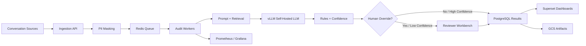

# Auto Quality Review Automation (Auto QRA)
## Product and Technical Design Package

| Field | Value |
| --- | --- |
| Document Title | Auto QRA Product and Technical Design Package |
| Version | 1.0 |
| Status | Architecture Review Ready |
| Classification | Internal — Confidential |
| Date | July 2026 |
| Preferred Cloud | Google Cloud Platform |
| Inference | Self-hosted LLM via vLLM |
| Target Models | 3B or 7B Quantized |
| Container Platform | Docker (Kubernetes Future Ready) |

---

### Purpose

This package is the authoritative Product and Technical Design baseline for Auto QRA. It is written for executive sponsorship, architecture review boards, product management, engineering, AI/ML, DevOps, security, and infrastructure teams. The content is implementation-ready and suitable for gated delivery from pilot through production.

### Description

Auto QRA automatically audits customer conversations against a 30-parameter QA rubric using a self-hosted large language model. The platform replaces repetitive first-pass manual QA while preserving human override, governance, and auditability. The design prioritizes data control, predictable latency, measurable AI quality, and enterprise security.

### Business Justification

Manual QA typically reviews a small sample of interactions, creating coverage gaps, inconsistent scoring, and delayed coaching. At approximately 60,000 audits per month, Auto QRA enables scalable, consistent first-pass review with structured evidence, confidence scoring, and human-in-the-loop exception handling.

### Document Structure

| Part | File | Sections | Focus |
| --- | --- | --- | --- |
| 1 | [01-executive-and-business.md](01-executive-and-business.md) | 1–12 | Executive summary, strategy, scope, risks |
| 2 | [02-requirements-personas-flows.md](02-requirements-personas-flows.md) | 13–19 | Requirements, personas, stories, workflows |
| 3 | [03-solution-architecture-ai.md](03-solution-architecture-ai.md) | 20–32 | Architecture, AI pipeline, confidence, override |
| 4 | [04-ops-security-capacity.md](04-ops-security-capacity.md) | 33–46 | Monitoring, security, capacity, cost, scaling |
| 5 | [05-devops-apis-governance.md](05-devops-apis-governance.md) | 47–65 | DevOps, APIs, schema, KPIs, governance, appendix |

### How to Read This Package

| Audience | Start Here | Then Review |
| --- | --- | --- |
| Executive Leadership | Sections 1–7, 45, 58 | Sections 10, 47, 64 |
| Product Management | Sections 5–7, 13–19, 58 | Sections 31, 57, 64 |
| Engineering | Sections 20–26, 55–56 | Sections 48–51, 33–36 |
| AI/ML Teams | Sections 25–30, 52–54, 60 | Sections 27–28, 42–43 |
| DevOps / SRE | Sections 22–24, 33–36, 48–50 | Sections 40, 46, 63 |
| Security / Compliance | Sections 37, 61–62 | Sections 9–10, 35, 63 |
| Infrastructure | Sections 22–24, 41–46 | Sections 38–40 |

### Baseline Operating Parameters

| Parameter | Target / Assumption |
| --- | --- |
| Monthly audit volume | 60,000 |
| Daily average | ~2,000 |
| QA parameters per audit | 30 |
| Average input tokens | 2,500 |
| Average output tokens | 700 |
| Average total tokens | 3,200 |
| Monthly token volume | ~192,000,000 |
| Target latency | < 60 seconds |
| Target availability | 99.9% |
| Target human agreement | > 90% |
| Target hallucination rate | < 5% |
| GPU candidates | NVIDIA L40 48GB / A100 80GB |
| Data store | PostgreSQL |
| Queue / cache | Redis |
| Object storage | Google Cloud Storage |
| Reporting | Apache Superset |
| Monitoring | Prometheus + Grafana |
| AuthN / AuthZ | SSO + RBAC |
| Security controls | PII masking, encryption at rest/transit, audit logging |

### High-Level Solution View

### Table of Contents — All 65 Sections

#### Part 1 — Executive and Business (Sections 1–12)

1. [Executive Summary](01-executive-and-business.md#1-executive-summary)
2. [Business Background](01-executive-and-business.md#2-business-background)
3. [Problem Statement](01-executive-and-business.md#3-problem-statement)
4. [Business Objectives](01-executive-and-business.md#4-business-objectives)
5. [Vision](01-executive-and-business.md#5-vision)
6. [Product Strategy](01-executive-and-business.md#6-product-strategy)
7. [Success Metrics](01-executive-and-business.md#7-success-metrics)
8. [Stakeholders](01-executive-and-business.md#8-stakeholders)
9. [Assumptions](01-executive-and-business.md#9-assumptions)
10. [Risks](01-executive-and-business.md#10-risks)
11. [Scope](01-executive-and-business.md#11-scope)
12. [Out of Scope](01-executive-and-business.md#12-out-of-scope)

#### Part 2 — Requirements, Personas, and Flows (Sections 13–19)

13. [Functional Requirements](02-requirements-personas-flows.md#13-functional-requirements)
14. [Non Functional Requirements](02-requirements-personas-flows.md#14-non-functional-requirements)
15. [User Personas](02-requirements-personas-flows.md#15-user-personas)
16. [User Stories](02-requirements-personas-flows.md#16-user-stories)
17. [Acceptance Criteria](02-requirements-personas-flows.md#17-acceptance-criteria)
18. [Process Flow](02-requirements-personas-flows.md#18-process-flow)
19. [Product Workflow](02-requirements-personas-flows.md#19-product-workflow)

#### Part 3 — Solution Architecture and AI Design (Sections 20–32)

20. [Solution Architecture](03-solution-architecture-ai.md#20-solution-architecture)
21. [Component Diagram](03-solution-architecture-ai.md#21-component-diagram)
22. [Infrastructure Architecture](03-solution-architecture-ai.md#22-infrastructure-architecture)
23. [Deployment Architecture](03-solution-architecture-ai.md#23-deployment-architecture)
24. [Networking Architecture](03-solution-architecture-ai.md#24-networking-architecture)
25. [AI Pipeline](03-solution-architecture-ai.md#25-ai-pipeline)
26. [Data Flow](03-solution-architecture-ai.md#26-data-flow)
27. [Prompt Engineering Strategy](03-solution-architecture-ai.md#27-prompt-engineering-strategy)
28. [Retrieval Strategy](03-solution-architecture-ai.md#28-retrieval-strategy)
29. [Business Rules Engine](03-solution-architecture-ai.md#29-business-rules-engine)
30. [Confidence Scoring](03-solution-architecture-ai.md#30-confidence-scoring)
31. [Human Override Workflow](03-solution-architecture-ai.md#31-human-override-workflow)
32. [Exception Handling](03-solution-architecture-ai.md#32-exception-handling)

#### Part 4 — Operations, Security, and Capacity (Sections 33–46)

33. [Monitoring Strategy](04-ops-security-capacity.md#33-monitoring-strategy)
34. [Observability](04-ops-security-capacity.md#34-observability)
35. [Logging Strategy](04-ops-security-capacity.md#35-logging-strategy)
36. [Alerting](04-ops-security-capacity.md#36-alerting)
37. [Security Architecture](04-ops-security-capacity.md#37-security-architecture)
38. [Disaster Recovery](04-ops-security-capacity.md#38-disaster-recovery)
39. [Backup Strategy](04-ops-security-capacity.md#39-backup-strategy)
40. [High Availability](04-ops-security-capacity.md#40-high-availability)
41. [Capacity Planning](04-ops-security-capacity.md#41-capacity-planning)
42. [Performance Estimation](04-ops-security-capacity.md#42-performance-estimation)
43. [GPU Sizing](04-ops-security-capacity.md#43-gpu-sizing)
44. [Infrastructure Sizing](04-ops-security-capacity.md#44-infrastructure-sizing)
45. [Cost Estimation](04-ops-security-capacity.md#45-cost-estimation)
46. [Scaling Strategy](04-ops-security-capacity.md#46-scaling-strategy)

#### Part 5 — DevOps, APIs, Governance, and Appendix (Sections 47–65)

47. [Production Rollout](05-devops-apis-governance.md#47-production-rollout)
48. [CI/CD Pipeline](05-devops-apis-governance.md#48-cicd-pipeline)
49. [DevOps Strategy](05-devops-apis-governance.md#49-devops-strategy)
50. [Release Management](05-devops-apis-governance.md#50-release-management)
51. [Testing Strategy](05-devops-apis-governance.md#51-testing-strategy)
52. [AI Evaluation Framework](05-devops-apis-governance.md#52-ai-evaluation-framework)
53. [Prompt Versioning](05-devops-apis-governance.md#53-prompt-versioning)
54. [Model Versioning](05-devops-apis-governance.md#54-model-versioning)
55. [API Specifications](05-devops-apis-governance.md#55-api-specifications)
56. [Database Schema](05-devops-apis-governance.md#56-database-schema)
57. [Reporting Dashboard Requirements](05-devops-apis-governance.md#57-reporting-dashboard-requirements)
58. [Product KPIs](05-devops-apis-governance.md#58-product-kpis)
59. [Operational KPIs](05-devops-apis-governance.md#59-operational-kpis)
60. [AI KPIs](05-devops-apis-governance.md#60-ai-kpis)
61. [Governance](05-devops-apis-governance.md#61-governance)
62. [Compliance](05-devops-apis-governance.md#62-compliance)
63. [Production Readiness Checklist](05-devops-apis-governance.md#63-production-readiness-checklist)
64. [Future Roadmap](05-devops-apis-governance.md#64-future-roadmap)
65. [Appendix](05-devops-apis-governance.md#65-appendix)

### Section Content Standard

Every section in this package includes:

| Subsection | Intent |
| --- | --- |
| Purpose | Why the section exists for the program |
| Description | What the topic covers in business and technical terms |
| Business Justification | Why investment or design choice matters |
| Technical Details | Implementation-ready specifics, formulas, schemas, configs |
| Best Practices | Industry and enterprise AI operating guidance |
| Risks | Residual and delivery risks |
| Recommendations | Decision-ready guidance for architecture and delivery |

### Diagram Inventory

The package includes Mermaid diagrams for:

- Vision / roadmap and stakeholder views
- Process flows, swimlanes, and product state machines
- Solution, component, infrastructure, networking, and deployment architectures
- Kubernetes-oriented deployment views
- AI pipeline, data-flow, and API sequence diagrams
- Confidence, override, and exception decision flows
- CI/CD, HA, security, and ER diagrams

### Size and Export Guidance

| Metric | Approximate Value |
| --- | --- |
| Total words (Parts 1–5) | 60,000+ |
| Estimated Microsoft Word pages @ ~350–400 words/page | 145–175+ pages |
| Numbered sections | 65 |
| Mermaid diagrams | 28+ |

To export for Word/PDF review:

1. Use the prebuilt combined file: [Auto-QRA-Design-Package-Combined.md](Auto-QRA-Design-Package-Combined.md) (~67,000 words; ~170–190 Word pages).
2. Or regenerate with `bash docs/auto-qra/scripts/build-combined.sh`.
3. Render Mermaid diagrams (GitHub, Mermaid Live, or Pandoc + mermaid filter).
4. Apply corporate styles for headings, tables, and captioning.
5. Use [00-document-control.md](00-document-control.md) as front-matter for architecture board submission.

### Recommended Next Decisions

| Decision | Recommendation |
| --- | --- |
| Model class | Benchmark 3B vs 7B quantized on golden QA set; prefer quality-first if latency holds |
| GPU class | Start with L40 N+1 if benchmarks meet p95 < 60s; keep A100 as upgrade path |
| Rollout mode | Shadow → Assisted review → High-confidence automation |
| Automation policy | Auto-finalize only high-confidence, non-compliance-critical audits initially |
| Platform path | Docker on GCP now; Kubernetes-ready manifests from day one |

### Document Control

| Version | Date | Change Summary | Owner |
| --- | --- | --- | --- |
| 1.0 | July 2026 | Initial complete Product and Technical Design Package | Product Management / Enterprise Architecture |

### Best Practices

- Treat this package as a living baseline; change via architecture decision records (ADRs).
- Gate production expansion on AI KPIs (agreement, hallucination, override rate) and operational SLOs.
- Keep prompt, model, and rubric versions independently releasable.
- Never bypass PII masking before LLM inference.

### Risks

- Architecture approval without golden-set AI evaluation can create false confidence.
- Scope creep into real-time coaching or multi-model orchestration before MVP stability.
- Cost and latency assumptions depend on measured vLLM throughput, not theoretical peaks.

### Recommendations

1. Use this package as the architecture review board submission packet.
2. Approve pilot scope against Sections 11–12 and rollout gates in Section 47.
3. Validate GPU and cost models in Sections 43–45 with a 2-week benchmark sprint.
4. Require production readiness checklist (Section 63) sign-off before GA.
